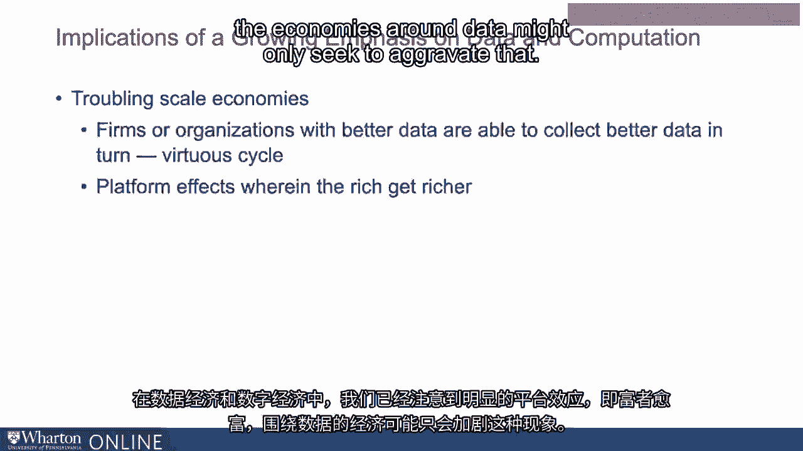

# 沃顿商学院《AI For Business（AI用于商业：AI基础／市场营销+财务／人力／管理）》（中英字幕） - P111：10_AI的竞争影响经济学.zh_en - GPT中英字幕课程资源 - BV1Ju4y157dK

 It's important as well to think about the competitive implications of a growing emphasis。

 on data and computation for algorithmic decision making。

 So we've talked about there being troubling scale economies in a sense with data where。

 firms or organizations with better data are able to collect better data in term， kind。

 of a virtuous cycle。 We've already noticed in the data economy and the digital economy significant platform。

 effects were in the rich get richer and the economies around data might only seek to aggravate。

 that。

 We do see we have been seeing in the last decade or so growing concentration and growing market。

 share around a relatively small set of tech intensive data rich firms and the economics。

 of machine learning have the potential to amplify that further。

 A byproduct of that is that another thing we've seen in recent years is that the pendulum。

 of public opinion has begun to swing a little bit around how we feel around the data assets。

 that are owned by these companies。 The use of our personal data perhaps to make recommendations or develop products。

 So there's been a little bit of a shift in public opinion and the opinions of policymakers。

 as well around these types of data relationships。 And so there's been some initiatives around things like data portability which are legislative。

 initiatives that make it such that platforms are required to provide users access to their。

 data in a way that they can shift it to other platforms or networks more easily。

 There are more and more leaders who are campaigning on the questions around whether tech should。

 be more heavily regulated， whether there are serious concerns around tech being as big。

 as it is in terms of firms， of firm size and power。

 There are people who are now leaders who are now campaigning around the question of data。

 ownership and whether data should really belong to these platforms， whether they should。

 belong to the users that provided these data。

 So there's a growing number of competitive implications， policy implications and of course。

 regulatory implications that arise from the shift towards data and computation in the。

 machine learning economy。 Thank you。 [BLANK_AUDIO]。

