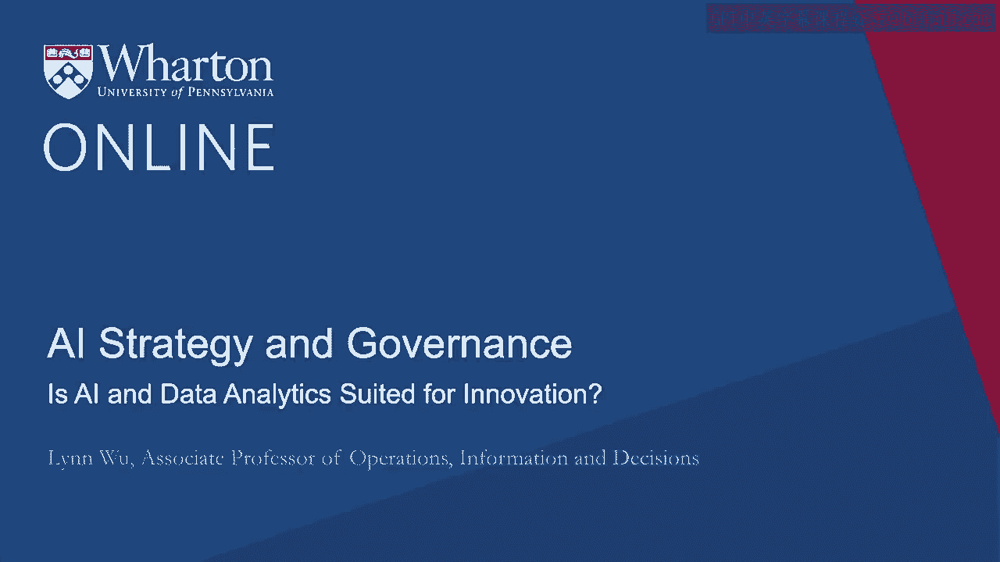
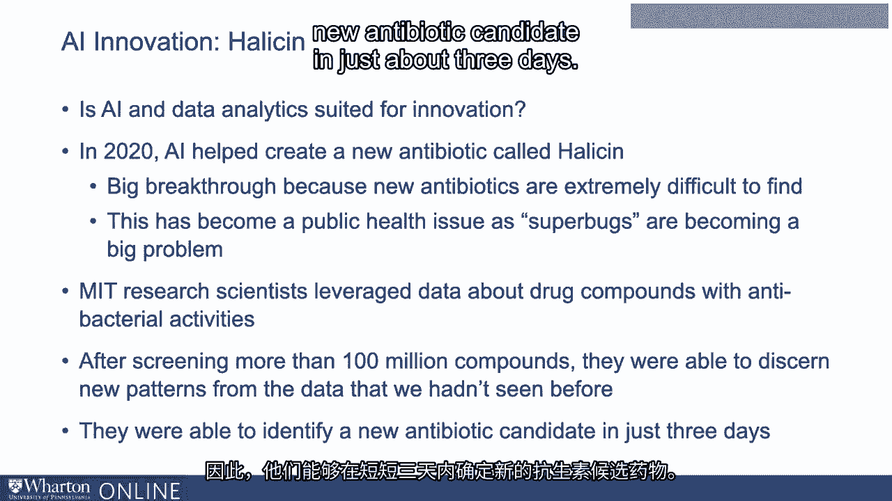
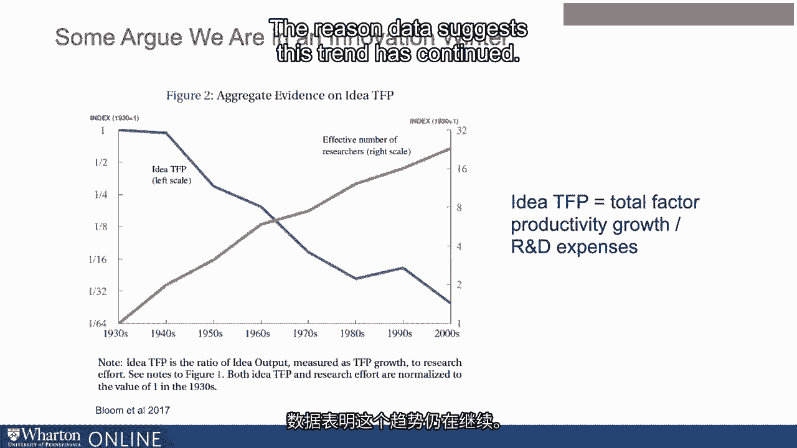

# 沃顿商学院《AI For Business（AI用于商业：AI基础／市场营销+财务／人力／管理）》（中英字幕） - P115：14_AI和数据分析适合创新吗.zh_en - GPT中英字幕课程资源 - BV1Ju4y157dK

 My name is Lin Wu。 I'm associate professor at the Wern School with the operation information。

 decisions department。 My expertise lies on AS effects on organizations specifically from。

 innovation's perspective。 In this video， we're going to talk about whether AI and data analytics is suited for innovation。

 You've probably heard a lot of interesting news in the last couple years about AI-driven。

 innovation。 The most famous one was in 2020。 AI has created， helped created， a new antibiotics。

 called halosine。 This is a big breakthrough because antibiotics， especially new antibiotics。

 is extremely difficult to find。 It has become a big public health issue as this superbox。

 are becoming a big problem。 So about 2020， a bunch of MIT research scientists have leveraged。

 data about all kinds of data compound， their antibacterial activities， et cetera。 And after。

 screening more than 100 million compounds， they were able to discern new patterns on the。

 data that we haven't seen before。 As a result， they were able to identify new antibiotics。

 in just about three days。 Halosine is unique in several aspects。 First， it's discovered。

 through AI platforms with eight aid of scientists。 Number two， not only is it very effective， the。

 halosine is also distinct from other types of antibiotics in its chemical structure and。

 is also tolerated in human body。

 A couple years ago， IBM Watson has famously used their technology to discover new type。

 of healthcare innovation as well。 In this case， Watson was able to digest about 23 million。

 medical papers across many different disciplines to find information about a tumor suppressor。

 known as P53。 Okay。 P53 is important because it is associated with half of almost all， cancers。

 So in a short amount of time， Watson was able to digest all these papers， finding。

 hidden patterns in this data and to identify six previously unknown proteins that interact。

 with P53。 This feat would have taken researchers more than six years to accomplish while Watson。

 did it just under a few weeks。 And this is not just in healthcare industry， not just in， drug。

 not just in compound discovery。 This is also in product design。 For example， Autodesk。

 was trying to design a new type of chassis。 So what they did is they added many sensors。

 to a chassis that can measure stresses， the strings， the temperatures， displacements on。

 all the other things that are associated with chassis， okay， and to make chassis work。 And。

 all these sensors are very cheap， okay， and they can deploy many， many sensors on this， chassis。

 After the sensor is installed， a stunt car driver then drove this car and really。

 tried to push a system。 Okay。 So they can accelerate really hard， they break very hard。

 steer as hard as possible。 After about 20 million data points， AI with eight of scientists came。

 up with a new chassis。 Okay。 If you look at this picture of a chassis， it doesn't really look like。

 a car。 It looks like a bone with a mammoth。 But notice the asymmetry in this car。 The left-hand。

 side and the right-hand side are not mirrors of each other。 Typically you see the left-hand side。

 and right-hand side of the car to be very much the same。 And this is because that if you look at。

 this data， it was found that the car turns much more often in one direction than the other。

 So of course， one side would have to tolerate more strains。

 more stress and more displacements than the other side。 And that's why you have a symmetry before。

 So even in the realms of arts and science， which is。

 what we think is very human act。 And we see that AI can produce art that we may be interested in。

 by and hang in our living room wall。 So if you take a look at this photo on top。

 it's a beautiful photo。 And then you combine it with Steary Night from Van Gogh and you have a beautiful just position。

 of these two photos。 And then create a brand new photo that has element of the Steary Night。

 And you can do that for many other famous paintings， putting your photo and combine it with another。

 famous painting。 AI can combine these elements to produce a beautiful painting that I personally would。

 have would choose to hang in my living room wall。 So I just gave you some great examples about AI。

 driven innovation。 However， if you look at this graph produced by Nicholas Boone and。

 a co-authors in 2017， that you see a different picture because some have argued that not only。

 have we not seen great innovations coming out， but on average， we have seen innovation decline。

 So this is how you read this graph。 The green lines are， you can think of as how much money。

 resources we are invested in R&D。 And the blue line is you can think of it as per capita spent。

 basically how much innovation per capita has been produced。 You can see that we have spent a lot。

 more money and resources measured by effective number researchers in the green line。 But if you。

 look at the productivity from that resource investment， the blue line has shown that our。

 per capita investment， our per capita innovation outcome has gone down quite a bit。

 And this is a pretty long trend from 1930 to 2000。 And the reason data suggests this trend。

 has continued。 So what is going on here？ Why do we see so many AI driven innovation。

 but somehow they do not show up in our productivity and innovation and statistics。

 This is a very interesting phenomena。 And this gets a central question of what AI can do and cannot。

 do for innovation。 In our next video， I'm going to explain what AI is suitable for and not suitable。

 for various type of innovation activities。 [BLANK_AUDIO]。

