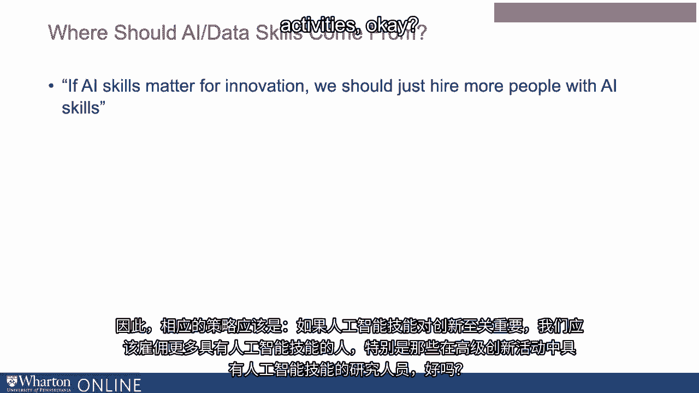
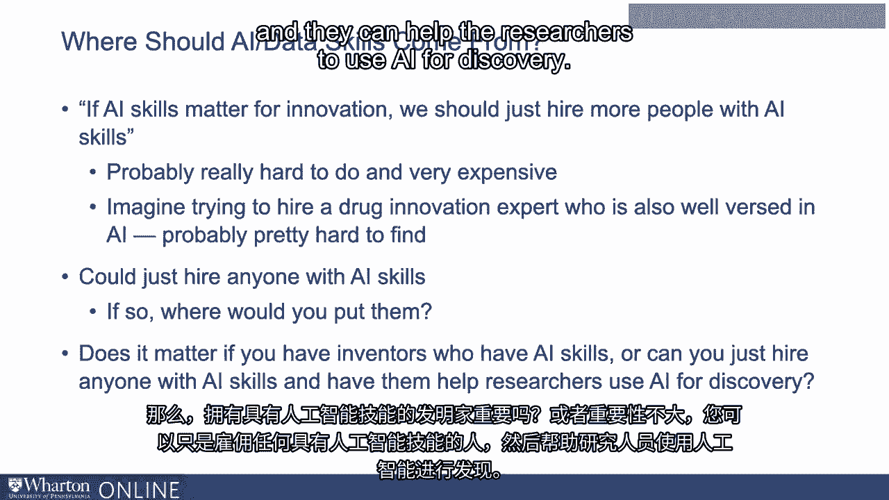
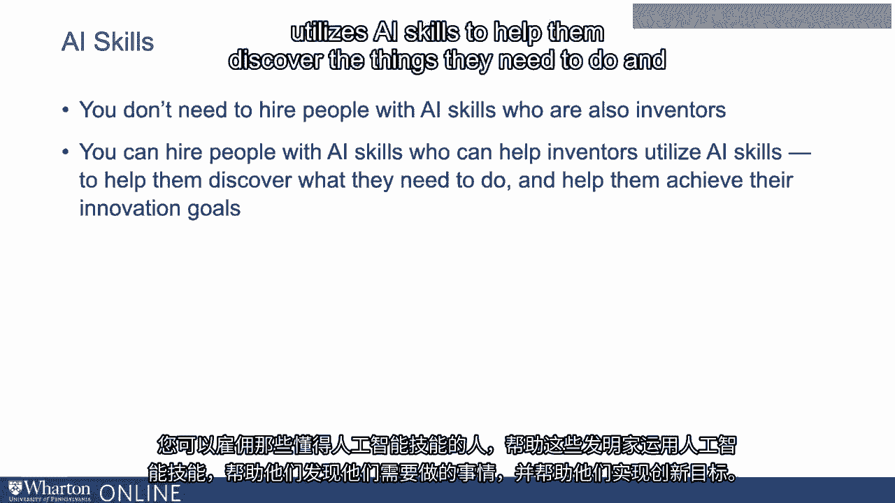
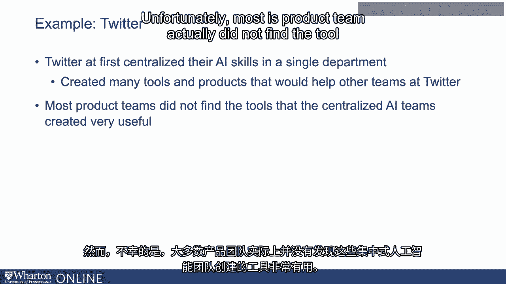
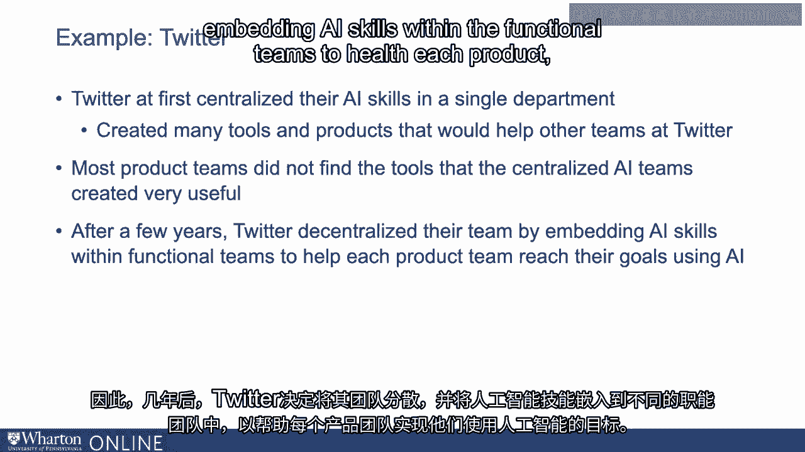
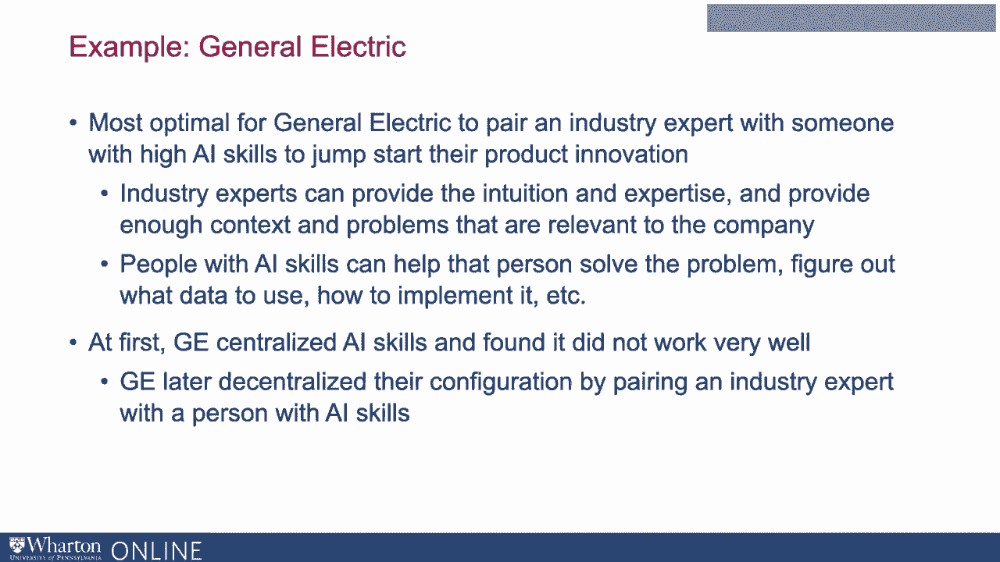
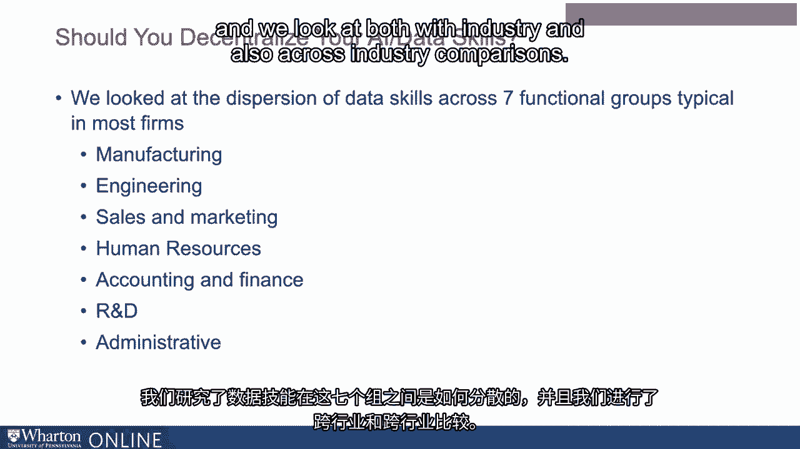
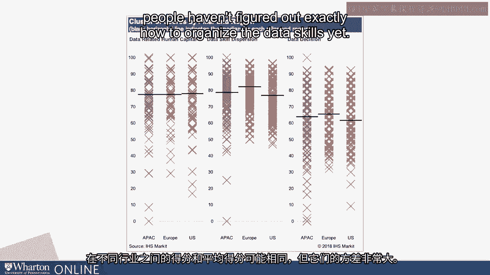

# 沃顿商学院《AI For Business（AI用于商业：AI基础／市场营销+财务／人力／管理）》（中英字幕） - P120：19_员工分散.zh_en - GPT中英字幕课程资源 - BV1Ju4y157dK

 In our last video， we learned about the effective AI or innovation。

 Specifically， we looked at how your firms should structure your innovation to receive。

 the most benefit from analytics and AI。 We find that AI analytics can complement decentralized innovation to improve the firm's ability。

 to create recombination innovation。 In this video。

 we're going to talk about what kind of skills should the firm pay attention， to。

 Where should this data analytics skill come from and how do you organize the skills to。

 best facilitate innovation for your firm？ On one hand。

 AI skills and data analytics skills are in high demand。 As you see in the prior slide。

 you see the AI skills and data skills has increased dramatically， over time。

 especially in the last 10 years。 On one hand， the corresponding strategies should be well。

 If AI skills matter for innovation， we should hire more people with AI skills， especially。

 AI skills for researchers who are at the heart of innovation and activities。

 That's probably really hard to do and very expensive。

 We're hiring a drug innovation expert and we're also really well-versed in AI。

 That's probably pretty hard to find and if you find them， it's probably very expensive。

 to hire them。 Or you can hire anyone with AI skills。

 If so， where would you put them？ So what does it matter to have inventors who have AI skills？

 Or it doesn't matter， you can hire any AI skills and they can help the researchers to。

 use AI for discovery。 So we actually look at this precisely。 In our research。

 here we looked at inventors who also have AI skills。

 We also look at the general non-inventors who also have AI skills in the firm。

 We look at which type of employees contribute more to AI output and AI productivity。

 Interesting you see that， you know， on AI skills and inventors， it's large but it's very。

 and also very high。 So we can't really tell the fact of that。

 But the good news is that if you look at the AI skills for non-inventors， it's a pretty。

 strong effect， almost as large as the inventor with AI skills， but it's much stronger in。

 the sense that they're very as low。 On the first hand。

 we can't really tell if AI skills in an inventor really matters， but。

 we can tell precisely that AI skills for non-inventors really matter。

 So the good news is that you don't need to hire people with AI skills who are also inventors。

 You can hire people who knows AI skill and help these inventors utilize AI skills to。

 help them discover the things they need to do and help them to achieve the innovation。

 goals。 So okay， good news that you can hire AI skills broadly。

 It doesn't have to be people who are in research who have strong skills in both。

 Should AI skill be concentrated in a single department or should they be embedded within。

 different functional departments？ This is an interesting question because IT， traditionally。

 information technology departments， are often concentrated in a single department。

 managed by CIO or managed by a head of technologies。

 And that's generally how firms manage their IT resources and IT departments。

 Should a same configuration apply for applying or managing AI skills？

 Or should firm decentralized AI skills embed them into specific functional teams， specific。

 product teams， specific functional departments？ Well。

 this is not an obvious answer to have because firms tend to do this both ways。

 For example， Twitter first centralized their AI skills in a single department， just like。

 you know how you organize IT skills。 And they created many interesting tools and products and they believe that these tools。

 can help teams at Twitter。 Unfortunately， most of these products team actually did not find the tool that these。

 AI， the centralized AI teams have created to be very useful。 So after a few years。

 Twitter decided to decentralize their team by embedding AI skills。

 within the functional teams to help each product reaching their goals using AI。

 And this is not just for tech companies， general electric， also experienced something similar。

 On a conversation with the head of research at general electric， the person told me that。

 it's actually most optimal for general electric to pair an industry expert with someone with。

 high data and AI skills to jumpstart their product innovation。

 The industry experts can provide intuition and expertise in providing enough context and。

 problems that are relevant to the company。 People with AI skills can help the person solve the problem。

 figure out what data to， use， how to implement it。

 So this is very important to have a contextual knowledge。 AI is a general purpose technology。

 It can be used to solve the problem， but you need to define a problem well。 So at first， again。

 GE has centralized AI skills and they find it not to work very well。 The solution。

 the product they develop is beautiful， but again， they're not very useful， for their product teams。

 So later， GE also decentralized their configuration by pairing the expert with a person with AI。

 skills。

 So we actually look at this phenomenon more detail。

 So this is just specific to GE or specific to Twitter。

 We actually looked at the dispersion of data skills across seven functional groups。

 These are functional groups are typical in those offerings。

 We looked at the manufacturing department， engineering， sales and marketing， human resources。

 being number four， five accounting and finance， six R&D， and seven administrative。

 So these seven functions that's often occurring in all firms， we looked at how data skills。

 are dispersed across the seven groups。 And we looked at both within the street and also across industry comparisons。

 And we looked at generally how this is distributed。 Again。

 we service about 600 firms and look at dispersion questions and their corresponding。

 survey responses as a following。 The question is to what extent do you use data analytics in each of the following groups？

 We asked them to say frequently or not frequently for each of the seven functions。

 And we also looked at globally， all firms globally or just US firms， just European firms。

 and just Asia firms。 You can't see there's a huge heterogeneity in across different countries。

 across different， regions of the world。 So it's not very obvious that data skills should be dispersed and data should be concentrated。

 And this is dispersion scores by industry。 So basically， if you have very high dispersion score。

 that means your data skills are distributed， quite evenly across seven functions。

 If you're just dispersion scores very low， that means you're highly concentrate your。

 data skill in a single or one or two departments。 So this is a median data dispersion score by industry。

 We'll look at various industries out there when classified into each。

 The highest being the management of companies and enterprises， 86。4% of these firms are having。

 a highly dispersed score， meaning that data skills are highly dispersed across different。

 functions within the firm。 We see healthcare and social systems industry having a very low score。

 meaning that their， skills or AI skills are still relatively concentrated into a few departments。

 There's definitely industry differences。 And this is the cluster of scored by region。

 You can see that for data dispersion in the middle column， you can see that Europe is actually。

 more dispersion in the US and APAP is APAP is about the middle。

 You can also see the other type of data related capital， the right hand side data related human。

 capital， they're pretty much the same across regions。 And you can see data decisions。

 Europe is being a little high and the US being a little low。

 There's definitely cluster of scores by regions and across different industries。

 And if you look at these scores， the average may be the same。 The variance of them is very。

 very large。 So it shows you there's definitely a heterogeneity。

 People haven't figured out exactly how to organize the data skills yet。

 So we actually look at this phenomena and we examined to what extent is dispersion actually。

 beneficial for firms。 So we actually find that our canonical example with Twitter and general electric is correct。

 in a sense that when firms disperse their AI and their skills across different functions。

 meaning by embedding them into different functions or product teams， these firms are。

 far more effective or far more productive than firms that did not do this。

 On average， a one center deviation above the mean and dispersion score are have about。

 3-5% higher enterprise value。 And given the size of those firms in a sample and 3-5% change enterprise value for a medium。

 firm in our sample， so 3-5% change of $10。7 billion is between 320 to $534 million。

 So this is a substantial change。 So again， percentage rise may be low but translating into a large number。

 One percent， three percent， five percent is a huge。 [ Silence ]。

