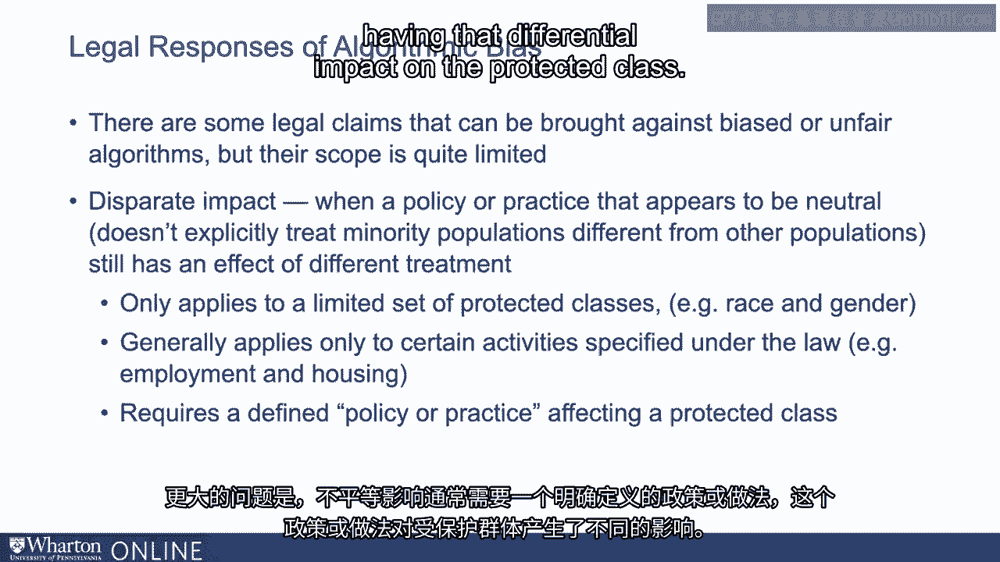

# 沃顿商学院《AI For Business（AI用于商业：AI基础／市场营销+财务／人力／管理）》（中英字幕） - P124：23_算法偏见和公平.zh_en - GPT中英字幕课程资源 - BV1Ju4y157dK

 I'm Kevin Werback， a professor of Legal Studies and Business Ethics at Wharton， and I work。

 on issues of ethics and responsibility around AI and analytics。 Algorithmic bias and fairness。

 You would think that a major benefit of AI is that it overcomes human biases and blind， spots。

 And you'd be right。 Humans are prone to stereotypes and implicit biases and even explicit discrimination。

 An AI system just looks at the data。 However， it's dangerous and misleading to think AI is inherently objective。

 It can actually replicate or even reinforce human biases and produce deep unfairness。

 Algorithmic bias is ethically wrong。 It's harmful to marginalized populations。

 It can lead to backlash from employees， customers， and other stakeholders， and it may even lead。

 to legal consequences。 In 2019， a study came out in science about a major academic hospital in Boston。

 Researchers found that a care management algorithm。

 which referred patients for additional resources， if they were high risk。

 produced systemic racial discrimination。 The average black patient referred by this program had nearly double the number of underlying。

 conditions as the average white patient。 In other words。

 the black patient had to be much sicker in order to receive the equivalent， level of care。

 When the research has changed the algorithm， so that equally sick white and black patients。

 made the cut it nearly tripled the percentage of black patients who qualified。

 This is not a unique problem。 Facial recognition systems have been shown to be less accurate for dark skin faces。

 Hiring algorithms used by companies like Amazon to predict job performance based on resumes。

 have been found to disadvantage women。 Text generation and machine translation systems impose sexist associations and sometimes racist。

 associations。 For example， if you translate from Hungarian， which has gender neutral pronouns。

 there is， no he or she in Hungarian， but if you translate a Hungarian text into English on a major search。

 engine， it will pick he as the pronoun for professor and politician， but she for washes。

 the dishes and assistant。 What is going on here？ First data can embed human prejudice。

 If women traditionally fail to get promoted and enjoy long careers at a company because。

 of rampant sexism， an AI system will find that being female is associated with poor outcomes。

 In the healthcare example， the problem was that the algorithm used previous treatment。

 costs as a proxy for how sick a patient was。 The difficulty was that black people receive worse care on average。

 so less is spent on， them even when they are equally or more sick than a white patient。

 In other cases， the data itself may be biased。 There may simply be fewer examples of minority populations in the training data set resulting。

 in less accurate models that appears to be part of what happened with the facial recognition。

 systems。 And sometimes， even when classifications such as race and gender aren't even in the data。

 set， they influence models through proxies。

 A zip code is just an address marker， but it can be strongly correlated with race or。

 socioeconomic status， for example。 There are a variety of tools to incorporate fairness criteria into the design of algorithmic。

 systems directly or to assess whether they produce discriminatory results。 However。

 they aren't foolproof。 For one thing， there isn't a single definition of fairness。

 The North Point Compass System， which was used to make recommendations for parole， famously。

 made errors more frequently for black prisoners than white ones。 However。

 given two identical prisoners in every respect but race， it would generally， assign the same score。

 In this case， individual and group level fairness， two different ways of measuring fairness。

 were shown to literally be mathematically impossible to achieve simultaneously。

 There had to be choices and trade-offs made。 Systems that are more fair may also be less accurate。

 We have to make choices in the design of these systems。 And in some cases。

 there may not be objective standards of fairness at all。

 How one decides whether a social media news feed discriminates against conservatives， or liberals。

 for example， depends on inherently subjective decisions about what should be the， baseline。

 what fits into those political categories， and so forth。

 It's not that we can't ever evaluate such claims。 We just can't write an objective specification about what a "neutral" news feed would look。

 like because there's no such thing。 Finally， it's not an accident what data gets collected。

 how data is evaluated， or what， questions get asked in the design of algorithms。

 The same human factors that lead to marginalized groups being discriminated against in other。

 contexts still apply here。

 Now there are some legal claims that can be brought against biased or unfair algorithms。

 but their scope is quite limited today。 The major legal category that would apply here is what's called disparate impact when。

 a policy or practice that on its face is neutral。 It doesn't explicitly treat minority populations different from other populations。

 It still could have an effect of different treatment。 That's called disparate impact。

 The problem is that area of the law is typically quite limited。

 It only applies to a limited set of protected classes， like race and gender typically， and。

 it generally applies only to certain activities which are specified under the law。

 In the US that's basically employment and housing。

 And then the bigger problem is that disparate impact generally requires a defined policy。

 or practice that's having that differential impact on the protected class。

 The United States Supreme Court has said that just showing a statistical disparity， just。

 showing that there is an effect that's worse against a protected class isn't enough。

 There has to be some deliberate step that was taken， some policy， and just using an algorithm。

 itself is not enough。 So there's a disconnect between the way the discrimination law is structured and the kinds。

 of issues that come up with algorithmic systems。 In Europe。

 the general data protection regulation has an anti-bias provision in the sections。

 dealing with what are called fully automated processing。

 But that is limited in terms of its context and it's pretty vague。

 It's not entirely clear yet how that could be applied。

 There are a variety of proposals and different jurisdictions for new laws。

 The European Union is considering a major new AI law that they've had a discussion paper， about。

 And in the US there have been proposals for what are called the Algorithmic Accountability。

 Act which would require bias checking techniques。 But these have not yet been widely adopted。

 So how should organizations respond to these challenges？ Well first of all。

 make sure that your training data set is deep and diverse。

 That it has enough examples along different measures of diversity。

 Think about be aware of proxies where something that facially is neutral might actually encode。

 some attributes of a protected class。 Think about what fairness function makes the most sense for your application。

 There are a variety of different ways to mathematically define what a fair algorithm is。

 And different ones might be appropriate in different contexts。

 Test and evaluate your systems based on these metrics。 Again。

 there are now tools out there that will allow you to assess what the impacts are。

 And then finally be aware of hidden historical biases。

 And this is where having diverse teams is critically important。

 If you've got someone in the process who has experienced discrimination themselves， they're。

 just much more likely to be aware and flag something when it comes up in the design of。

 an AI system。 [BLANK_AUDIO]。

