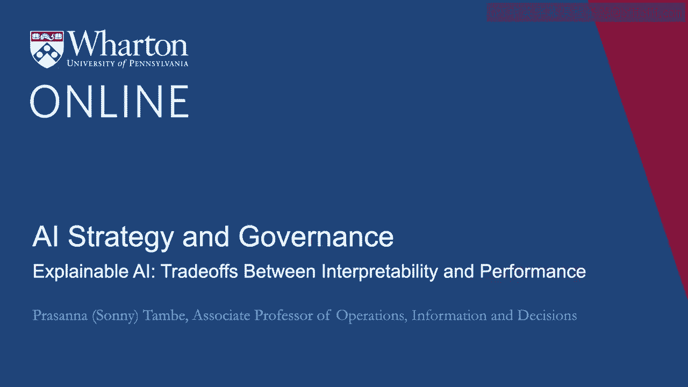
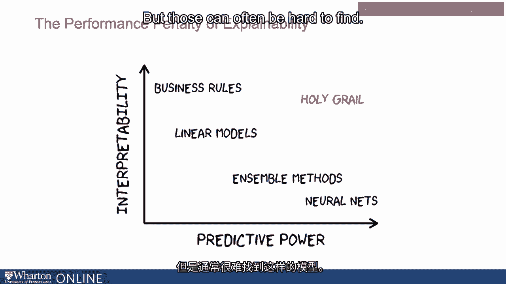
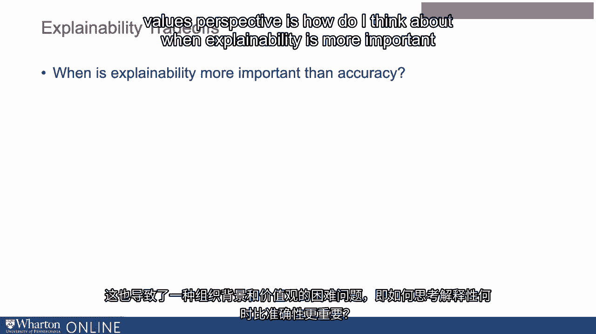
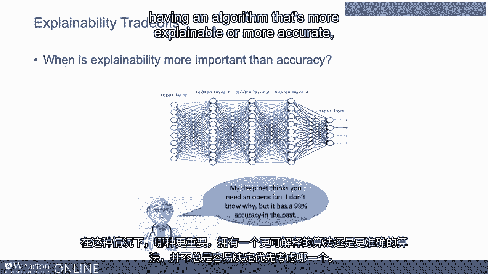

# 沃顿商学院《AI For Business（AI用于商业：AI基础／市场营销+财务／人力／管理）》（中英字幕） - P132：31_解释性与性能之间的权衡.zh_en - GPT中英字幕课程资源 - BV1Ju4y157dK

 Given the fact that explainability is so important for AI use and adoption， why not just make。

 every model explainable？ Well， it turns out that there's generally a trade-off that arises between performance。

 and explainability， especially in complex data environments。

 So there is a performance penalty often when you think about using explainability。

 So one can think of perhaps a trade-off between the predictive power of an algorithm and。

 how explainable it is。 So business rules， as we talked about before， are relatively explainable。

 simple decision， trees or linear models are explainable。

 but they are limited in their predictive power， relative to more complex applications like neural nets。

 As we get to neural nets， they have much higher predictive power， but they are harder， to explain。

 And of course， we'd like to kind of find the sweet spot that arises between maybe having。

 both models that are both highly predictive and explainable， but those can often be hard， to find。

 So when you do have context that you're thinking about an algorithm or use of an algorithm。

 it's often the case that you have to balance questions of precision。

 Do I want this algorithm to be very precise in its prediction？

 But I also perhaps need to be able to justify what the model is doing and why。 So for example。

 in a loan processing or a healthcare context， if I have a very predictive。

 model that's not explainable， that may be unusable。

 And so that's sort of the trade-off that arises with these two factors。

 And also leads to kind of a difficult question from a organizational context of values perspective。

 is how do I think about when explainability is more important than accuracy？

 So for example， in a healthcare context， you may have a system in place that's highly accurate。

 that is recommending treatment for people in a way that has been highly accurate in the， past。

 but also it's not explainable， which is a significant drawback because doctors want。

 to be able to explain to patients why a decision is reached。

 A doctor wants to understand the algorithm if what they're thinking is not consistent。

 or the algorithm is recommending。 And so having a lack of explainability is a major drawback。

 And so in contexts like that， the question of which one is more important， having an algorithm。

 that's more explainable or more accurate， it's not always easy to decide which of those。

 to prioritize。 For instance， there are some contexts clearly where being explainable does not matter。

 If you're thinking about just predicting user clicks or maybe recommending whether to buy。

 or sell a financial asset， it may not matter as much whether the algorithm is explainable。

 It's not the decision is not being made on people， they don't affect people directly。

 so it's not as critical。 But for something like promotions inside an organization。

 it may matter a lot。 So for some contexts， explainability shouldn't matter。 In that case。

 you may want to optimize predictive accuracy， but in some cases， it's going to， matter a lot。

 And then you have that difficult trade-off to make about which matters more for this context。

 and how you think about balancing precision of your predictions or performance of your。

 predictions with the explainability of the model。 [ Silence ]。

