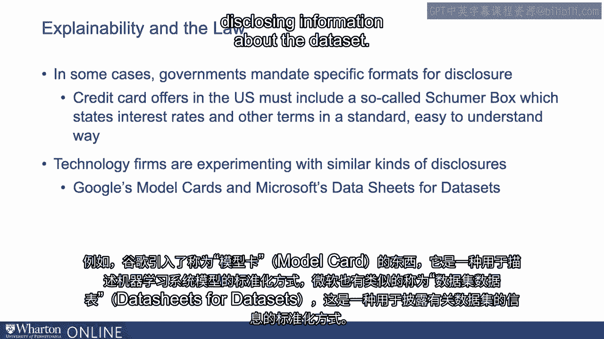
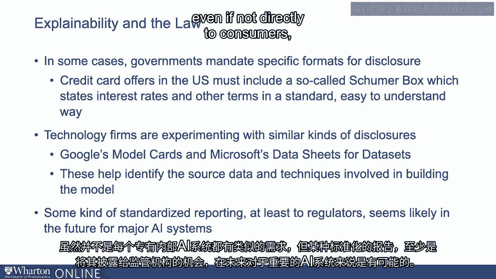

# 沃顿商学院《AI For Business（AI用于商业：AI基础／市场营销+财务／人力／管理）》（中英字幕） - P134：33_解释性和法律.zh_en - GPT中英字幕课程资源 - BV1Ju4y157dK

 Transparency is one of the central concepts in responsible AI。

 There are a number of existing and proposed legal frameworks that would mandate some form of explainability。

 at least in certain circumstances。 If the AI system is a black box。

 there's no way to evaluate whether， for example， it's basing decisions on illegitimate factors。

 such as someone's race or sexual orientation。 And more generally。

 it's hard to assess what went wrong， or even if something did go wrong。

 The most prominent existing model for legal explainability of AI is credit reporting。

 Credit bureaus， which developed in the 1960s， were one of the first major wide-scale applications of data analytics in the economy。

 They rapidly became essential to consumer financial markets in countries like the United States。

 as well as other areas such as hiring that used the credit reporting data to get other indications about candidates。

 But it was clear that the power of credit reports meant an inaccurate report。

 or one that used it in a discriminatory way， could be devastating。 Without regulation。

 there was no way for consumers to evaluate how their credit score fed into decisions。

 When the two laws from the 1970s in the U。S。 the Equal Credit Opportunity Act， E。 Cola。

 and the Fair Credit Reporting Act， Ficro， imposed standards for the legal explainability of credit reports。

 Specifically， that means businesses had to give an adverse action notice whenever they denied someone credit。

 And that meant giving the "principle reasons" for the decision。

 They didn't have to list every reason， nor did they need to give an exact formulation in the algorithm。

 for how each factor contributed to the outcome。 But they did have to give customers some indication of what was driving the adverse decision。

 And that gave those consumers information they could use if they wanted to in order to contest the decision。

 where they thought it was based on some error or based on some inappropriate information。

 That could happen without an unnecessary and unreasonable burden on the companies。

 In some cases， beyond this， governments mandate specific formulas for disclosure。 For example。

 credit card offers in the U。S。 must include a so-called "shoomer box" for the senator who sponsored the legislation that requires it。

 which states interest rates and other terms in a standard， regulated， easy to understand way。

 While there isn't anything analogous yet for AI systems。

 technology firms are experimenting with similar kinds of disclosures。

 Because again， it gives users and in some cases other developers an easier opportunity to understand what is going on。

 Google， for example， has introduced something called Model Cards。

 a standardized way of describing the models for machine learning systems。

 and Microsoft has something similar called "data sheets for data sets。

" which is again a standardized way of disclosing information about the data set。

 These help identify the source data and the techniques that are involved in building the model。

 While it wouldn't necessarily make sense to have something similar for every proprietary internal AI system。

 some kind of standardized reporting， at least some opportunity to have that disclosed to regulators。

 even if not directly to consumers， seems likely in the future for major AI systems。

 Again， if regulators don't know what happened， they can't decide whether something went wrong。

 The European GDPR， General Data Protection Regulation， although it's predominantly a privacy law。

 includes what's usually described as a right to explanation in limited cases。

 So if there is fully automated processing， in other words。

 the machine learning or other algorithmic system is the entire decision about what happens to a person。

 And it's a serious consequence。 It results in someone getting or not getting a loan， a job。

 or some legal consequence。 Will this person be released from prison early？ If all of those are true。

 then there is some indication in GDPR that the implementer of the system needs to provide some information that explains the factors that went into the decision。

 Unfortunately， exactly what this means in practice is not clear。

 The language in GDPR is somewhat general， it's subject to legal interpretation。

 and we don't yet have significant case law about what this means in practice。

 But it does suggest in existing European law， which again applies to any data collected about Europeans anywhere。

 There is some basis for a requirement of explanation。

 and that's likely to be expanded in the future。 In the US。

 at least one federal appeals court case involving teachers in Houston who were fired because of a black box assessment algorithm based on their students test scores。

 found that the absence of explanation was a violation of the constitutional due process that the teachers enjoyed。

 The teachers had no way to challenge their dismissal because they just knew it was based on an algorithm。

 They didn't know what the algorithm did with the test scores。

 That eliminated the ability they had before when dismissal decisions were not based on the algorithm。

 and so the court said their due process rights were violated。

 The algorithm had to be disclosed or its use had to be eliminated。

 which was ultimately the result in the settlement of the case。 Now that's not a law in the US。

 but it's an indication that there is more movement towards explanation requirements under different legal theories。

 Similarly， in any case where legal liability needs to be assigned。

 such as for example accidents involving autonomous vehicles。

 investigators need to and typically are able to get access to data from the computer vision systems involved to understand exactly what happened。

 How did the system behave and why？ What did it think it was seeing or not seeing on the road？

 So there is a mechanism that is required for explanation when there are requirements after the fact for accident investigation。

 The Algorithmic Accountability Act， which I mentioned earlier， a proposed law in the US。

 as well as the white paper in the European Union suggesting new AI legislation both propose a requirement for formal impact statements before high risk AI systems are deployed。

 High risk means systems with a significant possibility of causing illegal discrimination。

 injury or major financial consequences if something goes wrong。 In those cases。

 an algorithmic impact statement would force companies or government agencies to explicitly identify how the systems are working。

 As with the early credit reporting laws， there is a long way to go in figuring out exactly how those are implemented and an appropriate balance between sufficient explanation and sufficient flexibility for companies with a recognition that technically it's difficult to explain exactly what's going on in。

 for example， a deep learning system。 But again， the law is moving more in this direction。

 So when you have the opportunity internally to get more of an understanding of the explanation of your system's conduct。

 you should try to do so。 Now， some proposals for these algorithmic impact statements require disclosure to the public。

 But even if they don't， companies are probably going to be required to show regulators they took required steps and assessed or addressed possible harm before they happen when they turned up in the impact assessment。

 So again， it's worth getting out ahead of this if you can and thinking about what mechanisms you have for explainability。

 These potential legal requirements will also drive researchers and vendors to develop better techniques and tools for explainable AI。

 There are many solutions today， but there will be more and better solutions in the future。

 Some of the power of AI is its ability to find connections that humans don't。 However。

 being able to understand better how AI systems make decisions， what happened will benefit everyone。

 It has been a pleasure talking with you and sharing these insights about AI， the law and ethics。

 Good luck on the rest of this program and in your implementation of these kinds of techniques in your organization。

 Thank you。

