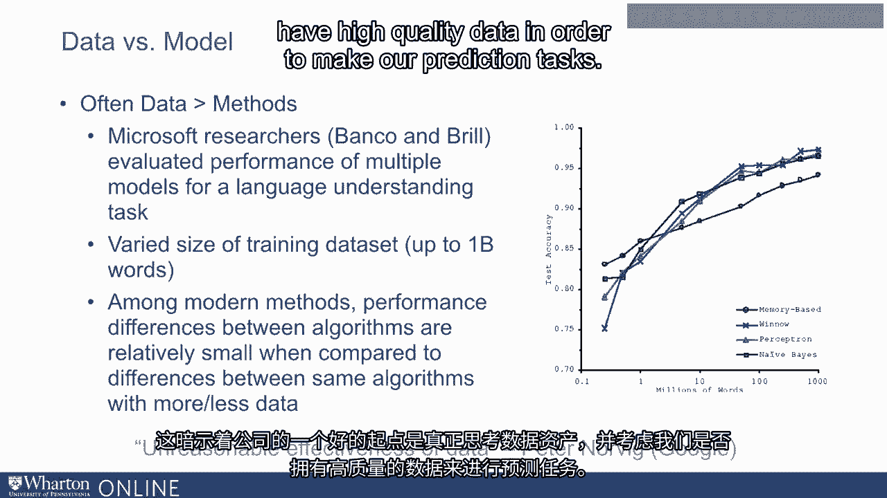

# 沃顿商学院《AI For Business（AI用于商业：AI基础／市场营销+财务／人力／管理）》（中英字幕） - P13：12_模型选择入门.zh_en - GPT中英字幕课程资源 - BV1Ju4y157dK

 Given that there are many different machine learning algorithms out there。

 how do we decide which machine learning algorithm to use for any given task？ Now in practice。

 we evaluate different machine learning methods， by looking at their performance on what's called a validation dataset。

 Now given a large training dataset where you have input and。

 output labels for all the entries in this training dataset。

 the idea behind validation is to partition the dataset into a training dataset。

 and a holdout which will be used for validation。 We train our model on the training dataset and once the model is trained。

 we will use that trained model to make predictions on the holdout dataset。

 We then evaluate how accurate are the predictions。

 So if the predictions are more accurate with one model than another。

 then that's the model that we prefer。

 Another variant of this approach is what's known as cross-validation。

 The idea behind cross-validation is to take a dataset and， to create multiple partitions of it。

 For example， we might create 10 partitions of the dataset available。

 We might then initially set aside Partition 1 as our validation dataset。

 and use Partitions 2 to 9 in order to train the model and。

 we test the model on the Partition 1 which was our initial validation dataset。 Next。

 we might use Partition 2 as our validation dataset and， we might train our model on Partitions 1， 3。

 4， 5， 6 and so on。 And then once the model is trained， we evaluate its performance on Partition 2。

 We would repeat this a large number of times with each small validation dataset。

 And that is essentially the idea behind cross-validation。 Ultimately。

 the common theme here is that given a large training dataset。

 the goal is to create some Partition or a holdout out of it so。

 that we train the model on the rest of the data and。

 we evaluate its performance on a holdout dataset which was not used to train the model。 Lastly。

 another important question is whether a company should be investing in。

 better data or better machine learning models。 Both are valuable investments but in practice often we find that data beats methods。

 There was a research study done by Microsoft researchers Banco and。

 Brill where they evaluated the performance of many different machine learning models。

 for a language understanding task。 They created several training datasets for multiple different machine learning models。

 In some cases， the machine learning models had access to a very small dataset。

 with only about say half a million words。 In other cases。

 a machine learning model had access to large datasets with。

 up to a billion words in the training dataset。 When they evaluated the performance of these different machine learning models。

 they found that the performance differences between the different machine。

 learning methods or the machine learning algorithms were relatively small when。

 compared to the difference between the same algorithm with more versus less data。 In short。

 giving a reasonable machine learning algorithm lots of data was better。

 than giving a good machine learning algorithm very little data。

 This is something that Google's computer scientist Peter Norvick often。

 refers to as the unreasonable effectiveness of data。

 What this suggests is that a good starting point for。

 a company is to really think through the data assets and。

 think through whether we have high quality data in order to make our prediction tasks。

 Once that's in place， it is definitely worthwhile to investigate which is the。

 better machine learning model for the task at hand， but generally it all starts with the dataset。

 [BLANK_AUDIO]。

