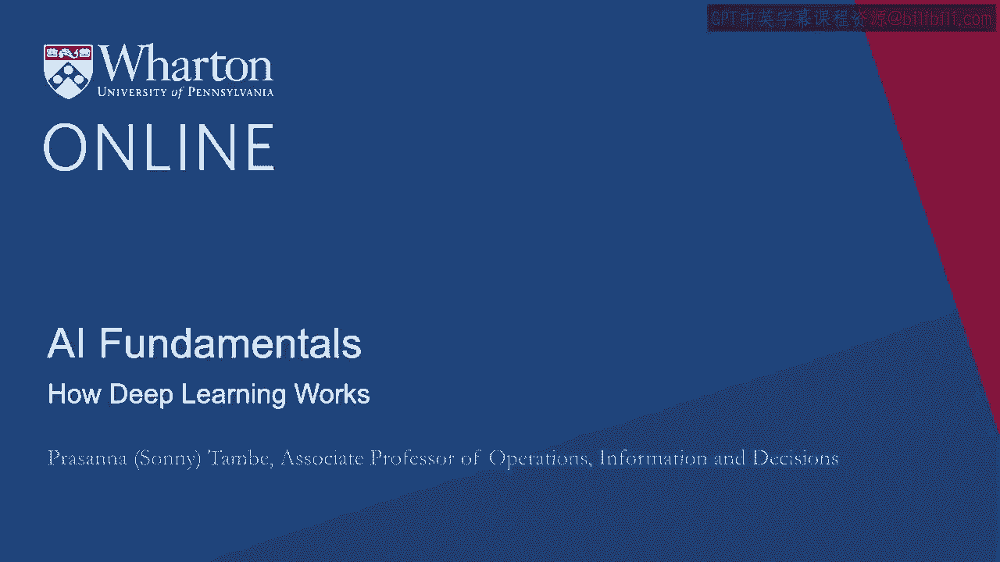
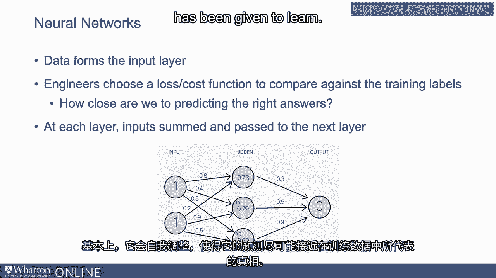
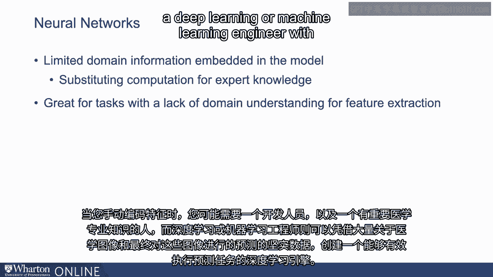

# 沃顿商学院《AI For Business（AI用于商业：AI基础／市场营销+财务／人力／管理）》（中英字幕） - P16：15_深度学习的工作原理.zh_en - GPT中英字幕课程资源 - BV1Ju4y157dK

 How does deep learning work？

 So we've talked about the notion that we can take raw unstructured data and we can directly。

 start to make predictions using deep learning。 We don't have to go through this feature engineering step。

 We don't have to convert it to columns or individual variables or features that can be。

 used for prediction。 Unstructured data， we can start with its raw digital representation。

 The first thing is that any unstructured data we're talking about text， sound， images， they。

 can always be represented in some digital form。 So it might be a spectrogram if it's audio。

 It's an image data can be represented by pixels。 A set of text can be represented by vectors of words and so all of these different types。

 of data can be represented in some kind of raw native digital format。

 The data are then pre-processed in some way to make it standardized for the prediction， task。

 Once the data is standardized， it's then passed into something called a neural network。

 The reason we call this a neural network is that people have found that this is modeled。

 essentially after a neuron。 So a neuron in the brain takes in a number of inputs and then depending on the value of。

 those inputs it decides whether to fire or not。

 Very similarly a neural network in deep learning works very similarly in some way。

 So a neural network that forms the basis of deep learning， the data， this raw native data。

 that we were talking about forms the input layer， it comes into the neural network。

 And just like a neuron， neural networks basically are looking at the data that are coming in。

 and then depending on the value of that data， it's deciding whether or not to fire its output。

 or set its output at a certain level。 So you can imagine a neural network as a series of decision points or nodes or neurons and。

 the input data are coming in one side。 The neural network is composed of a series of layers that are just looking at sort of。

 all different combinations of the input data。 So rather than the input data having to be converted into features。

 the layers in a neural， network are basically automatically trying to figure out what it is about the raw unstructured。

 data that can be combined and recombined to form the most effective features for prediction。

 the most effective combinations for predictions。 So the way this happens is that engineers choose a loss function or a cost function to。

 compare against the training labels。 That's just a way of saying how close are we to predicting the right answers。

 So you have training data in this case， this is data where you know the right answers。

 So let's go back to our medical diagnostic image examples。

 So imagine you have a lot of data on images of people's medical images and you have data。

 on the right answers， which might mean you have data on whether or not the person or。

 the patient actually had the condition as determined by a doctor。 So you have the medical data。

 the medical images and whether or not the person actually， had the condition or not。

 So the neural network is going to try to do is take in this image data， the neural， the。

 layers in the neural network itself are going to try to find the right combinations of that。

 raw pixel data to make a prediction。 That prediction is going to be whether or not the person had the condition。

 Since we already know the right answer from the training data， we can start to compare。

 how often do we make the right decision and how often is it wrong。

 And this is that loss function or a cost function。

 This is telling us how far we are from the truth as represented by the data we have to。

 train the model。 And so what a neural network is going to do then is start to go back and forth。

 arranging， the values on the nodes， the weights into the nodes and so on。

 The different parts of the neural network is going to start to rearrange itself until it。

 gets to a point where the raw input data are getting combined， weighted and passed on to。

 the prediction layer with a minimum of error。 Basically it's going to rearrange itself to the point that the predictions it's making。

 are as close as possible to what the truth is as represented in the training data that。

 has been given to learn。

 Some of the terms you might hear with reference to neural networks are back propagation。

 Back propagation is the process by which the network is tuned。

 So networks should call it feed forward networks back propagation。

 These are terms that refer to the data get passed forward and then different types of。

 information get passed forward and back in the network so that the network can kind of。

 learn from the data how to configure itself in a way that's optimal for making a prediction。

 So back propagation is part of that process。

 The great thing about deep learning or these kind of neural network context is that there。

 is very limited domain information embedded in the model。

 So you're substituting computation for expert knowledge。

 What I mean by that is in this deep learning case what we've done is taken the medical。

 diagnostic image， passed it into the deep learning engine and it's going to learn how to predict。

 whether or not a patient has a condition or not。 With shallow learning with the feature engineering steps we had talked about before there was。

 a step where somebody would have to take the image and then look at how to select and hand。

 code individual features from those images。 Again that's a very time consuming and difficult process。

 This deep learning approach requires much less domain information。

 It does require however a good deal of computation。

 It's great though but for this reason for tasks with a lack of domain understanding for feature。

 extraction。

 So when you're hand coding features where you might have needed a developer as well as。

 somebody who has significant medical expertise with a deep learning approach， a deep learning。

 or machine learning engineer with a lot of solid data on medical images and the predictions。

 that were ultimately made on those images can themselves create a deep learning engine。

 or deep learning engine that can do the prediction task effectively。

 One question that comes up is what is the role of the engineer。

 In the prior case with feature engineering the engineer was important to be able to pull。

 out individual pieces of information。 So again back to the image example。

 An engineer was important to take a raw image and then perhaps pull out features like say。

 capillary width or something like color shade that requires image processing which requires。

 some technical expertise。 Here you don't have that feature engineering anymore so what is the role of the engineer？

 You have raw data being put into the neural network。 So what does the engineer do？

 Well it turns out there's still a number of things that have to be set for a deep learning。

 approach。 These are called hyperparameter values that require engineering knowledge but generally。

 less domain knowledge。 These have names like epochs， batch size， learning rate， regularization。

 activation functions， the number of hidden layers themselves。

 There's a variety of things that engineers have to decide how to set for the network to。

 perform well。 These hyperparameter values have to be managed by the engineer but the workflow ultimately。

 changes。

 So again instead of having feature extraction be an important approach so without deep learning。

 we have a workflow where we have input data like image data and then we have a time consuming。

 process which is pulling out individual columnar variable or features from those kinds of data。

 which are then put into a classification or prediction step and then finally you get， the output。

 In a deep learning approach you don't have that feature extraction step。

 You can just start with the raw unstructured data that is well labeled， put that into the。

 deep learning engine and you get your predictions without having to do any of that feature engineering。

 that's again expensive and uncertain。 Thank you。

