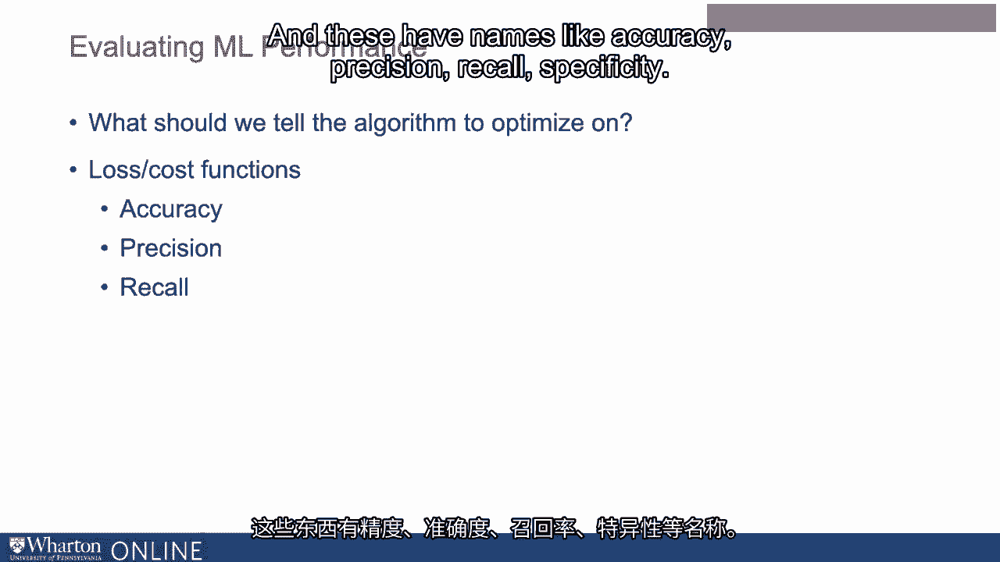
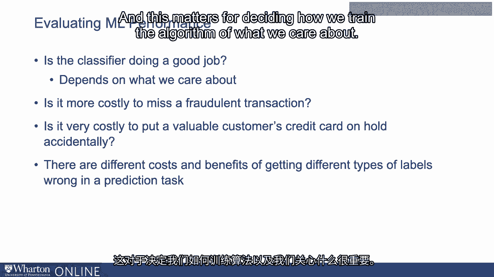

# 沃顿商学院《AI For Business（AI用于商业：AI基础／市场营销+财务／人力／管理）》（中英字幕） - P18：17_评估机器学习性能.zh_en - GPT中英字幕课程资源 - BV1Ju4y157dK

 When we talk about building machine learning algorithms or training machine learning algorithms。

 there are a variety of ways to think about how to judge whether the algorithm is doing。

 a good job or not。 When we build an algorithm， we're trying to teach it to predict based on some labels or。

 examples we give it。 The question arises then， what should we tell the algorithm to optimize on？

 Is it really trying to get as many of the labels right as possible or is it trying to。

 optimize something else？ For example， there may be differing costs and benefits to getting things right versus getting。

 things wrong in a business context。 I'll give you an example in a minute。

 This may influence how we think about building a effective machine learning algorithm。

 When building an algorithm， there are a number of loss functions or cost functions which are。

 the thing that the algorithm is trying to optimize。

 There are a number of things that one might try to optimize on。 These have names like accuracy。

 precision， recall， specificity。

 Why are there so many？ Let's do an example。 Imagine there's an application that's meant to identify fraudulent credit card transactions。

 It's been a popular application of machine learning in recent years。 So。

 trying to identify fraudulent credit card transactions。 In this case。

 you have the actual value you're trying to predict。

 You have some training data which is a dataset where you have the right answers and you're。

 trying to predict in a way that gets as close to those as possible in some way。

 You have the actual values in the training data whether a transaction was fraudulent or。

 whether it was legitimate。 Then you have the predicted value。

 Whether it was fraudulent or legitimate as predicted by the algorithm。

 The question is how do we compare these columns to decide whether we're going to do a good， job。

 Imagine we train the algorithm and it makes a number of predictions and we now have to judge。

 is the classifier doing a good job。 This is a slightly more complicated question than it looks like because it depends on what。

 we care about in this context from a cost and benefit perspective。

 It's not just a matter of getting as many answers right as possible。 For example。

 you might ask is it more costly to miss a fraudulent transaction。

 So one decision you could make is don't mind getting some wrong。

 I just never want to miss a fraudulent transaction。 On the other hand。

 it might be the case that it's very costly to put a valuable customer's。

 credit card on hold accidentally。 And so it turns out that optimizing on these two different types of things。

 One being that you never miss a fraudulent transaction。

 Another being that you never accidentally flag a legitimate transaction is being fraudulent。

 These are competing in some ways and when you're building an algorithm you have to choose which。

 is more costly which has higher benefit。 And these different term specificity precision recall are meant to capture the notion that。

 there are different costs and benefits of getting different types of labels wrong in。

 the prediction task。 And this matters for deciding how we train the algorithm and what we care about。

 In the next section we'll talk about some of these specific loss functions how they're。

 computed and when some of them might be more important than others。 [BLANK_AUDIO]。

