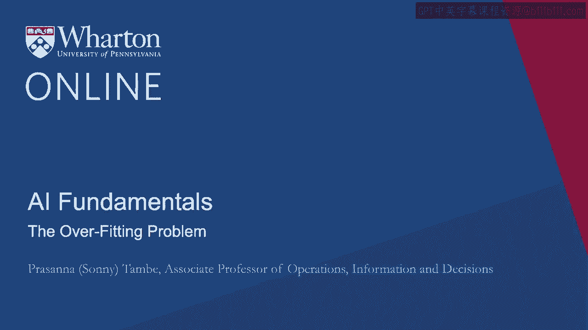

# 沃顿商学院《AI For Business（AI用于商业：AI基础／市场营销+财务／人力／管理）》（中英字幕） - P22：21_过拟合问题.zh_en - GPT中英字幕课程资源 - BV1Ju4y157dK

 As we've talked about， the key to algorithms learning a mapping between the input data。

 and an output prediction or recommendation is the training data。

 This is the data set that the algorithm uses to learn the correct relationship between。

 the input features and the prediction it should make。

 Training data is therefore the key to building algorithms， but we care most really about。

 performance on what's called out-of-sample data。 The whole point is to predict outcomes where we don't already know what's going to happen。

 So for training data， we need data where the answer is already known。

 That's how the algorithm learns。 But really for it to be useful。

 we want it to be able to make predictions on data for， which we don't know the answer yet。

 That's the whole point of prediction。 As we think about this problem。

 we have to think about the overfitting problem。 Overfitting is an important machine learning challenge。

 It is the danger that the model performs really well on the training data。 We give it to train。

 but it doesn't perform nearly as well when we take it to out-of-sample， data。

 when we put it into production， we start to deploy it。 Its performance falls significantly。

 So machine learning engineers often have to deal with this problem。

 They try to avoid fitting the model to the point that it picks up essentially noise in。

 the training data。 They are constantly struggling with this overfitting problem。

 They are trying to balance using the training data to build an accurate model with having。

 a model that still performs well on out-of-sample data。

 So an example I like to use is kind of studying the test versus studying the material。

 So imagine you are studying for a test and you have a lot of sample tests that you have。

 that you can historical or back test from previous years that you can use to help you， study。

 So it could be the case that you can think about studying the material to a point that。

 you take a new test and you perform very well。 There is a level of generality if you learn the concepts。

 if you learn the material using， the old tests， using other things you have。

 you can learn at a level that transfers very， well to any new test you might see。

 You could also go back and study an old test to the point that you would do exceedingly。

 well on that test。 For example， you might memorize the questions exactly the concepts in those questions。

 What that means is that if you were given exactly that test， you would do well， you would do。

 very well。 But if you are given a new test， that knowledge is not going to transfer over as well。

 And this is similar to that training overfitting problem。

 It is using the training data to get the essential relationships out of it but not to the point。

 where you are picking it up at a level of uniqueness that doesn't transfer over to any。

 other data sets or any out-of-sample data that you are using。

 So the challenges are always capturing the relevant aspects of the model versus capturing。

 kind of the idiosyncrasies and the training data。 And this is called the bias variance trade-off。

 Let's talk about an example with customer targeting。

 So let's say we want to run a promotion where we are targeting specific customers to see。

 if they buy a particular item。 And to do that， we are going to have training data based on a small set of customers who we。

 run the promotion on in the past。 We want to use that training data to learn what types of customers in the future or in。

 the larger population should get that promotion。 Which ones are likely to respond to that promotion？

 So what we would like to do is run a model which picks up the relevant attributes of。

 those customers that can be useful for predicting in other customers or in the future who is。

 most responsive。 And this might be related to demographics。

 This might be related to location or other customer attributes。

 Alternatively， we could imagine running the model to the point where it sort of studies。

 the test so to speak。 It kind of goes overboard and learns particular aspects of those customers in the training。

 data set that happened to be relevant in that small data set for responding to the promotion。

 For example， just to use a silly example， in that customer training data set， it might。

 have been the case that everyone with the first name Julie happened to respond to that， promotion。

 So machine learning model that's learning on the training data set could rightly say that。

 having the name Julie is a very good predictor of responding to the promotion in the training。

 data。 But that might have been just a characteristic of a single customer or a small set of customers。

 in the training data。 It may not be real information that's applicable to a larger customer data set。

 So the point is that you want to be able to balance the models such that it's picking。

 up relevant signal in the training data set， the features that actually matter and ignoring。

 the things that happen to be noise in the data set that are not going to transfer over。

 to a new larger data set。 So dealing with overfitting of this type is really one of the most important challenges。

 in the machine learning process。 In the next video。

 we will discuss the role of test data in avoiding this overfitting problem。 Thank you。

 [BLANK_AUDIO]。