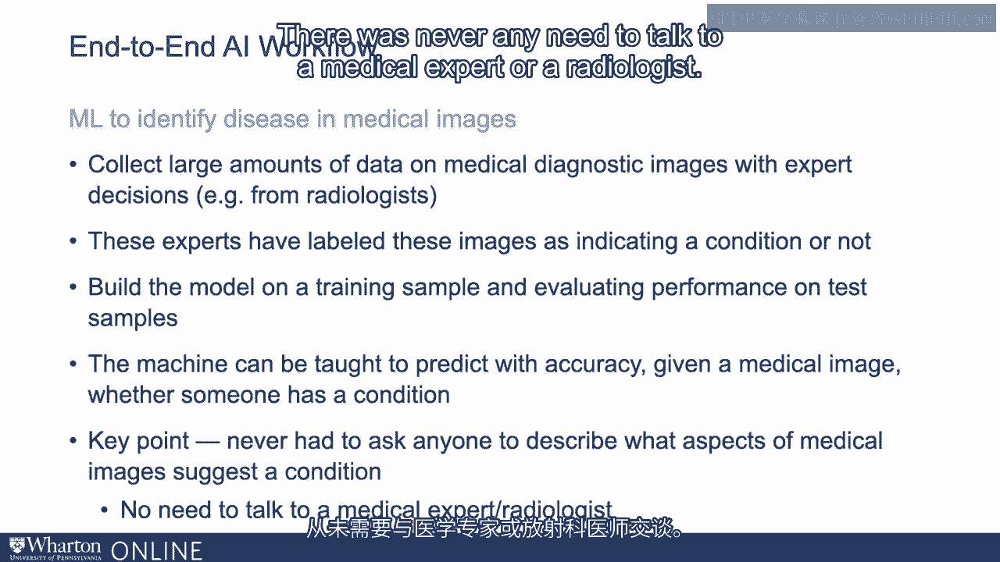

# 沃顿商学院《AI For Business（AI用于商业：AI基础／市场营销+财务／人力／管理）》（中英字幕） - P24：23_端到端工作流程的示例.zh_en - GPT中英字幕课程资源 - BV1Ju4y157dK

 Let's walk through a quick end-to-end example that brings some of these concepts together。

 Let's talk about a case we've talked about before， which is using machine learning or。

 deep learning in particular to identify a particular condition using medical images。

 So step one in this case would be to collect large amounts of data on medical diagnostic。

 images with expert decisions that were made using those images。

 So imagine if you had a database of a lot of x-rays and radiology decisions about what。

 to do in terms of treatment given those images。 So going to a hospital and getting a database like that would be a great place to start to。

 produce perhaps years and years of data on medical diagnostic images and decisions that。

 were eventually made by radiologists on whether or not a person should receive a particular。

 kind of treatment or not。 So that's step one。 Step two is note that these experts。

 radiologists in this case， have labeled these images as。

 whether or not a patient has a condition or not。 So we have a database that is of the right general structure that we need for this kind。

 of prediction task。 We have a lot of image data。 We have a lot of decisions that have been made。

 So we can now use this data to build an algorithm and we can evaluate performance on， the algorithm。

 So what we'll do is take this data。 We might split it up into a training sample and a test sample。

 In the training sample， we can use that image data to feed into a deep learning engine and。

 we can give it the labels created by the radiologists。 The deep learning engine。

 the neural network will then basically run to configure itself。

 such that it can make the most accurate predictions possible in a way that matches up with the。

 decisions that were made by the radiologist and we can use the test data to ensure at。

 various points that the algorithm we're building is performing not just well on the。

 training data but also on other out of sample data sets that we might have access to。

 The machine can be then taught to predict relative accuracy given a medical image whether。

 or not someone has a condition。 So just by going through these few steps。

 take getting the database from say a hospital。 It has the right structure。

 It's got image data and it's got decisions made by experts。

 We divide it up into training and test data。 We use the training data to make predictions。

 We use the test data to ensure that it's still working on out of sample data。 When it works well。

 we can then deploy it and we can have this algorithm taking in images。

 and making predictions or recommendations relatively high degrees of accuracy on whether。

 or not somebody has a condition。 Now a key point here is we never at any point in this process had to ask anyone to sit down。

 and describe what aspects of medical images suggest a condition。

 We didn't need that medical expertise。 It was implicitly contained in the database in those labels but we didn't have to ask。

 anyone to sit down and explain in great detail exactly what a condition would look like on。

 an x-ray or how we should identify it or how we should determine using an image whether。

 or not somebody had a condition。 There was never any need to talk to a medical expert or a radiologist。

 This is really the magic of machine learning is that data and computation are going to end。

 up substituting for a number of different kinds of expertise。 When we do things this way。

 there are a number of advantages。 One is consistency。

 If you think about algorithmic decisions relative to decisions that are delivered by humans。

 algorithms can deliver decisions that are consistent。

 It doesn't matter if it's at the end of a busy day or at the beginning or in the morning。

 It's going to be consistent。 There are obviously scale and speed implications as well because an algorithm that's trained。

 to make a decision accurately can be scaled up to making a lot of decisions relatively， accurately。

 It works really well for some types of tasks。

 If the task can be structured in ways that we've talked about before， given some of the。

 deep learning tools that are now emerging and given the fact that with deep learning you。

 can take raw unstructured data that's labeled and the machine learning algorithm will do， the rest。

 it can actually be a bit faster and cheaper to build these solutions out than。

 to have to sit down and talk to somebody extensively about their expertise。 。 [BLANK_AUDIO]。

