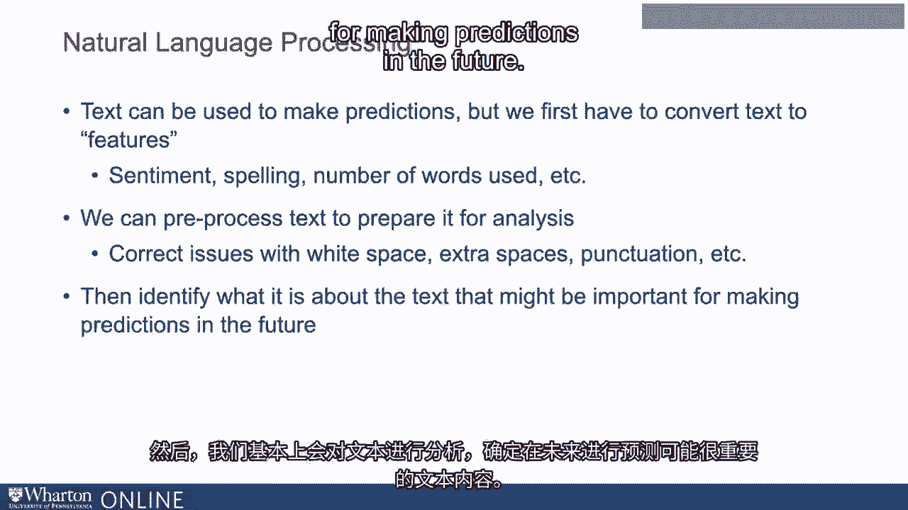
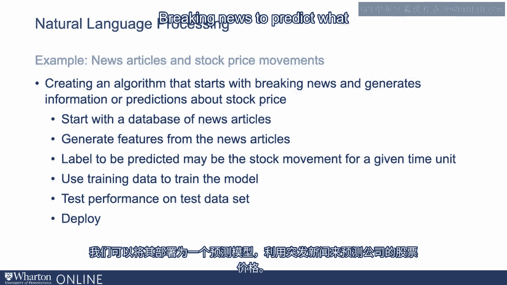

# 沃顿商学院《AI For Business（AI用于商业：AI基础／市场营销+财务／人力／管理）》（中英字幕） - P25：24_自然语言处理.zh_en - GPT中英字幕课程资源 - BV1Ju4y157dK

 As text becomes a more and more valuable form of unstructured data。

 there's been more and more attention paid to natural language processing。 So text can provide。

 of course， valuable signals about markets and about business decisions。 So for example。

 online reviews can tell us a lot about a product。 They can tell us a lot about customers。

 Chatters can tell us online chatter， discussion can tell us a little bit about financial market activity。

 So lots of applications of how unstructured text can tell us something of predictive value for business。

 So text can be used to make predictions， but we first have to convert text into features。

 We have to look at the text and figure out what's important about the text to make predictions or to make decisions。

 So lots of candidates when we think about converting text into different features。

 This includes sentiment， spelling， number of words used in the text。

 So how we do this is we first take the text and pre-process it to prepare it for analysis。

 There's a number of things we can do here in terms of just correcting issues with， say。

 white space or extra spaces or moving punctuation and so on。

 And then we basically take the text and identify what it is about the text that might be important。

 for making predictions in the future。 So the simplest example of a feature in text is just a word。

 So for instance， we might look at which words appear in different text and use that to predict outcomes。

 So for an example， like an online review， we might look at particular words that have meaning。

 for making predictions about anything from product sales to repeat purchases。

 to whether or not a review is deemed helpful or not。

 This is up to us to choose what those words might be， how they're presented。

 It could be sentimental words， positive， negative words。 It could be words about the product。

 If it's a camera， for instance， it might be something about storage or it might be something。

 about the type of format it uses。 Lots of words that we can trigger or unidentify that we can use to make a prediction based。

 on the language in the text。 Instead of single words。

 we can also branch out a little bit and use more complex features。 We can use combinations of words。

 We can use groups of words like two to three words grouped together。

 We can also construct overall measures of things like sentiment。

 So sentiment analysis is one of the most common examples of extracting or creating a feature。

 from text。 This is basically describing whether the word somebody uses in a piece of text， anything。

 again from an online review to a tweet to a Facebook post。

 This is sentiment analysis is going to say something about whether the language used。

 in one of those pieces of text means that somebody is feeling more positive about what。

 they're talking about or more negative about what they're talking about。

 There are other ways to map sentiment in a way that can map to larger sets of emotions。

 not just positive and negative， maybe fear， maybe anger， things of that nature。

 We have these features and we take the text and we have these features like sentiment。

 like what types of words were used。 We could also say think about the length of an online review as a feature。

 We could think about the spelling or the quality of the grammar used in a online review。

 These features once they're extracted from the text then allow us to predict outcomes。

 Sentiment for instance could predict buying behavior。

 And then that's one way in which natural language or language is going to be used in a machine。

 learning algorithm。 So we take the language， we create the features and then we use that for prediction。

 Now deep learning gives us even more flexibility because it can start to combine the text content。

 in richer ways or more meaningful ways than we might be limited to when hand coding these。

 different features。 So deep learning gives us even more flexibility but conceptually it works in much the same way。

 So some examples。 Let's talk about examples like news articles or breaking news and stock price movements。

 So what you might do to think about taking or creating an algorithm that starts with breaking。

 news and generates information or predictions about stock price。

 So imagine we have a database of news articles or breaking news。

 We can then generate features from the news articles。 Things like sentiments。

 things like words that are appearing in the news perhaps names， that are appearing in the news。

 names of countries or political leaders。 The label to be predicted is maybe the stock movement for a given time unit。

 So to make this more precise maybe we're looking at news articles for a particular firm or organization。

 We have breaking news。 We're going to think about the news that's covering that firm。

 You're going to start to generate features that indicate positivity toward the firm or。

 maybe something about a new product release innovation or patent。

 And then the label to be predicted is the stock movement for that firm for a given time， unit。

 So we have this training data now。 We have a lot of data on features extracted from the language from the news covering that。

 firm。 And we have the training labels which is what the stock was doing for that firm as that。

 news was breaking。 We can use that to train the model。

 The model is then going to learn how the language used to refer to that firm in the news might。

 be affecting or at least predicting how stock price is moving。 We'll use that with training data。

 We'll set aside some test data to make sure that the model is performing accurately once。

 we have the model set up in a way that is working well in the test data set。

 We can then deploy that as a prediction model using breaking news to predict what a firm。

 stock price is going to do。 So that's one type of application using text。

 using natural language processing to make， predictions。

 Another common application for natural language processing instead of prediction is taking。

 text or taking language and putting that into groups or topics。

 This is an example of what's called unsupervised learning。

 We're not trying to predict a label or a class or category。

 We're basically trying to take large bodies of text and put them into different groups， or topics。

 So topic modeling is a term used to refer to one approach which takes documents and classifies。

 them by content in a way that makes them easier to interpret。

 So if you had a large database of text messages or emails that were just about different topics。

 you could think about using topic modeling to take maybe a million messages and putting。

 them into five or ten categories or topics that can then be used to better understand how。

 to make decisions based on those topics。 So the topic model will basically tell you about how these documents should be grouped。

 together in a way that makes it easier to take action on them from a business perspective。

 So an example of this approach， going back to our news example is imagine we have lots。

 and lots of incoming breaking news on all types of topics， articles from all different， agencies。

 We want to take these thousands and thousands of news articles that are coming in each day。

 and classify them into areas like business， tech， science or entertainment。

 This kind of classification obviously makes it much easier for consumers to navigate and。

 find topics or articles that are of interest to them。

 And so this is an example of topic modeling or unsupervised learning， taking large amounts。

 of unstructured data and using natural language processing to put these unstructured data into。

 a smaller number of topics that we can act upon in a more convenient way from a consumer。

 perspective or from a business decision perspective。 [BLANK_AUDIO]。

