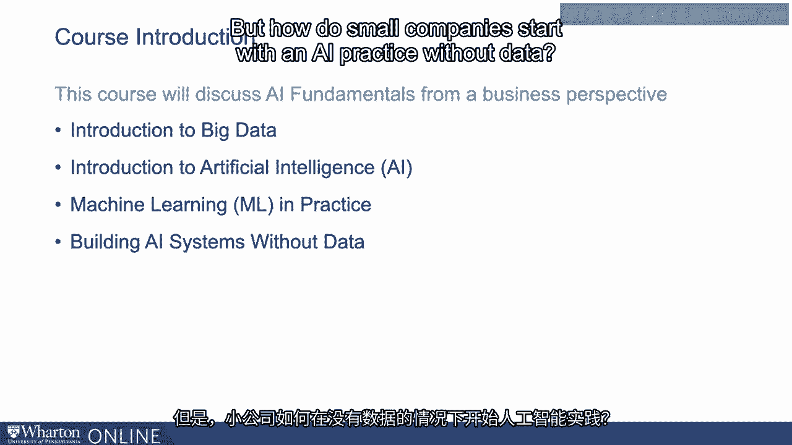

# 沃顿商学院《AI For Business（AI用于商业：AI基础／市场营销+财务／人力／管理）》（中英字幕） - P2：1_课程介绍.zh_en - GPT中英字幕课程资源 - BV1Ju4y157dK

 This course will discuss AI fundamentals from a business perspective。

 We'll begin with an introduction to big data。 Specifically， what exactly is big data？

 How does one work with it？ What types of business questions can big data help you answer？

 We'll then move to an introduction to artificial intelligence。

 We'll talk about what is artificial intelligence， what is machine learning， how are they related。

 and what are the different types of machine learning methods？ Next。

 my colleague Professor Sunny Thambbe will talk about machine learning in practice。

 He'll discuss machine learning visualizations， as well as recent developments such as AutoML that allow。

 non-engineers， non-data scientists to leverage AI to answer business questions in very simple interfaces。

 And finally， I will talk about the role of data in building AI systems。 Specifically。

 modern AI is built on large training datasets， which implies that for companies to have flourishing AI practices。

 they really need to have access to a lot of data。 But how do small companies start with an AI practice without data？

 Or how do companies in general roll out AI in their enterprise without data？

 We'll talk about building AI systems without data in the final module in this course。 [BLANK_AUDIO]。

