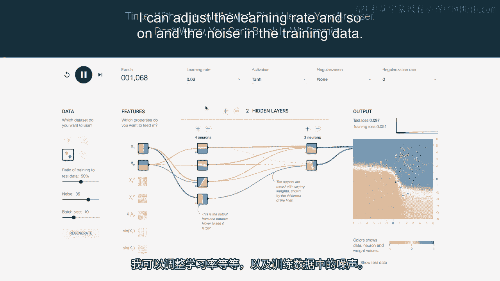

# 沃顿商学院《AI For Business（AI用于商业：AI基础／市场营销+财务／人力／管理）》（中英字幕） - P30：29_TensorFlow游乐场.zh_en - GPT中英字幕课程资源 - BV1Ju4y157dK

 As more and more people are using machine learning， as more and more businesses are。

 using machine learning， there are a growing number of tools to help understand a little。

 better teach how machine learning is working， what the different choices are that you can， make。

 what the trade-offs are。 Here's an example of one which is called TensorFlow Playgrounds。

 A TensorFlow against Google's package here which encapsulates a lot of steep learning。

 logic and there are a number of other options as well。

 Google has been a leader in terms of making some of the tools like this available。

 They have an interest of course in making it as easy as possible or transparent as possible。

 for people to use their software and to understand how the different pieces and elements kind。

 of fit together。 So this is TensorFlow Playground。

 This is one of many tools that are available online to understand how different types of。

 deep learning or machine learning， deep learning work。

 So TensorFlow Playground is essentially just highlighting or illustrating what the different。

 choices are you have with the deep learning networks。 We're talking about deep learning。

 We've talked about how you feed data into the network。 There's neural network that runs。

 learns how to predict。 There's not a lot of domain expertise required but there are a number of hyperparameters that。

 still need to be tuned and adjusted for the network to learn efficiently。

 Learning engineers have to understand how these parameters are best tuned in a way that makes。

 prediction as accurate as possible。 This is just an interface that lets you play with some of those kinds of parameters to get。

 a feel for what they do and how neural networks are how they fit together。

 So we talked about neural networks being composed or deep learning networks being composed of。

 a number of hidden layers。 Here you can adjust or decrease the number of layers。

 This is going to be a deep learning engine that takes a number of points and classifies。

 them or basically draws a boundary which serves as a classifier。

 So one way to think about machine learning or deep learning if you have a set of points。

 is to think about drawing a boundary between them。

 The idea is given points like this， where's the best place I can draw a boundary such that。

 if I said everything on one side of the boundary is category A， everything on the other side。

 is category B that I'd still be as accurate as possible。 Where's the best way to draw that boundary？

 And so this is going to let you start with a number of different point distributions and。

 start to look at how the network performs under different assumptions in different parameter。

 settings。 So in this case， if I can always run the network here and you can change these parameters。

 So if I run the network here， it's going to draw a line and split these points。

 This is a training data set that I'm showing you here。

 So what it's going to learn to do probably is split it somewhere along the diagonal and。

 say that everything on the top right of the diagonal is going to be whatever category。

 blue corresponds to。 Bottom left will be whatever category or is corresponds to。

 And the idea is that whenever I get a point then that comes in this space in the top right。

 it'll be categorized in the future。 It'll be categorized as blue or whatever category that is。

 And same thing with orange here。 So if I run this。

 it'll probably create a line somewhere down the diagonal here。 So it's thinking about it。

 And the main thing to know is that it's basically showing you or illustrating how the deep learning。

 engine is thinking。 It's showing you the output of the layers of each different node in the layer and how they're。

 combined to create the next step。 And so this is， again。

 another -- it's a tool to learn how deep learning engines， how， they're built。

 what different parameters can affect their performance。

 I can start to adjust the activation functions。 I can adjust the learning rates and the noise and the training data。

 So I can make these various adjustments and see how they affect how well the deep learning。

 network learns and how it makes predictions。 [ Silence ]。

