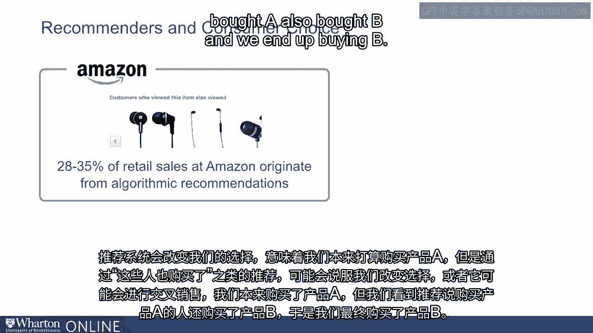
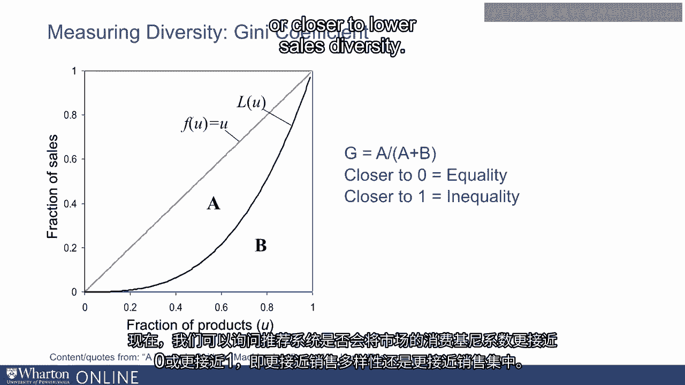
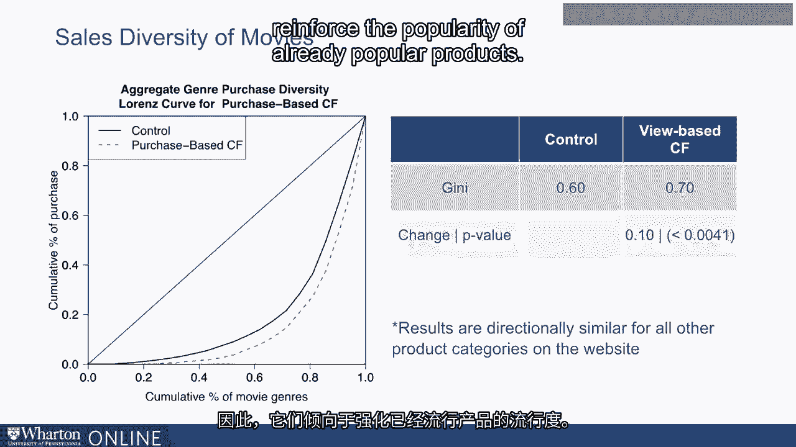
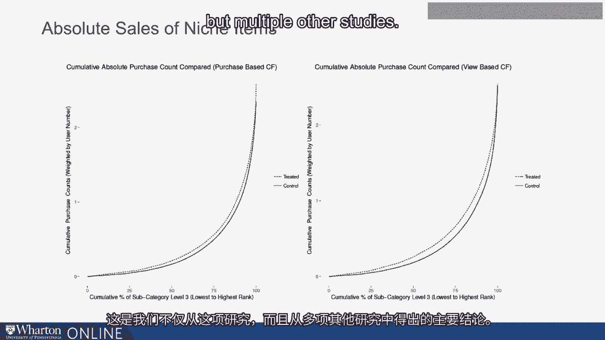

# 沃顿商学院《AI For Business（AI用于商业：AI基础／市场营销+财务／人力／管理）》（中英字幕） - P43：9_个性化对市场的影响.zh_en - GPT中英字幕课程资源 - BV1Ju4y157dK

 In this lecture， we're going to talk about how， recommender systems influence consumer choice and in general。

 have an impact on markets。 Now， recommendation systems influence consumer choice in a variety of settings。

 For example， research has shown that anywhere from 28 to 35 percent。

 of choices people make on retail sites like Amazon are driven by algorithmic recommendations。

 So it's either the recommendation system changing the choice we made。

 meaning we walk in to try and buy product A， but the recommendation system。

 through recommendations such as people who viewed this eventually bought that。

 might actually convince us to change our choice or it might actually cross-sell a product。

 where we bought product A but we saw recommendation people who bought A also bought B and we end up buying B。

 But either way， nearly a third of the choices on Amazon's retail website are attributed。

 to algorithmic recommendations。 Similarly， a study on recommendations at news websites in particular at Google News。

 suggested that algorithmic recommendations increased consumer usage of the website by about 38 percent。

 So people consume more news， spent more time on Google News。

 and it essentially drove a 38 percent increase in usage。

 And another paper by data scientists at Netflix suggests that 80 percent of video hours。

 streamed on Netflix actually originate from algorithmic recommendations。 So in short。

 we have seen that recommendations can drive consumer choice in many settings。 Now。

 what is interesting is that they don't just increase the volume of consumption。

 they also drive changes in what items or products or content are actually consumed。

 There are many theories about how they might influence the choices we make。 Now。

 one theory which actually is dates back to the mid-2000s is called the Longtail Theory。

 It's based on a book called the Longtail by author Chris Anderson。 In the book。

 the author suggested that the internet in general would help drive consumer。

 searches or preferences and purchases from the most popular items to more niche items。

 So in other words， the internet would help drive a shift in demand from blockbuster items。

 towards more niche items。 And in terms of the mechanisms that help make this shift possible。

 one of the key mechanisms was automated recommendations。 Specifically。

 he suggested that the main effect of automated recommendations。

 would be to help move people from the world of hits to the world of niche items。

 And the main reason this might happen is that in the absence of recommendations。

 we might consult lists such as， let's say， blockbuster lists or bestseller lists。

 and we might make our choices based on those lists。

 But recommendations might help drive our attention to items that are closer to our preferences。

 but aren't necessarily very popular。 But the question is， is that really true？

 Especially given that collaborative filtering algorithms recommend items。

 based on what others are consuming， so don't they depend on some information on popularity in order to。

 recommend items。 Now， let's look at whether that happens or not。

 Now， one way we can measure whether purchases are diverse or not。

 is by looking at what is known as the "gini coefficient of consumption。"， Now。

 the "gini coefficient" is a measure of diversity of consumption or of income concentration。

 It's used in a number of different settings。 The way you compute "gini coefficient" is to first draw what is known as the Lorentz curve。

 The Lorentz curve is the curve that you see on the figure that is in dark black。

 and that's labeled "L" of you。 The Lorentz curve denotes the fraction of total sales generated by a certain percentage of products。

 So in other words， what the Lorentz curve over here is indicating is that the bottom 20% of product。

 generate a negligible amount of sales， perhaps less than 1% of sales。 In this figure。

 the bottom 40% of products are generating a little less than 10% of sales。

 The bottom 60% of products are generating roughly about 20% of sales。

 So that's essentially what the Lorentz curve is indicating。

 The diagonal line that you see in the figure is essentially indicating what the Lorentz curve would。

 look like if all products had equal sales。 If all products had equal sales。

 the bottom 20% of products， would generate 20% of sales。

 the bottom 40% of products would generate 40% of sales， and so on。

 Now the Gini coefficient is a measure of the area between the Lorentz curve and that diagonal 45。

 degree line。 If the Gini coefficient is zero， then it implies all products have equal sales。

 If the Gini coefficient is one， it implies one product generated all the sales。

 So now we could ask whether recommender systems move the Gini coefficient in a market closer to zero。

 or closer to one， meaning closer to greater sales diversity or closer to lower sales diversity。

 We actually can study this where we can create a world where there are no recommendations and。

 let's call the Gini coefficient in that market as G0。 And suppose some recommender R is used in。

 that market and the Gini coefficient obtained in that market with that recommender is GI。

 then we can ask whether the recommender system has a diversity bias or a concentration bias。

 by looking at whether GI is less than or greater than G0。 So that is the idea behind this。

 So to test that， we actually partnered with one of the large retailers in North America。

 We partnered， actually with a top five retailer in North America and we ran a field experiment with them in August。

 of 2013 where we ran specifically an AB test where some users were assigned to a group that did not。

 receive any recommendations and some other users were assigned to a group that received recommendations。

 Specifically， we took over 1。3 million users who visited the website and we partitioned them into。

 three groups。 The first group， which we'll call is the control group and about 77% of our user base。

 was assigned to the control group， they received no recommendations。 The second group。

 which is about， 11。5% of the 1。3 million users， they received a view based collaborative filtering recommendation。

 meaning a recommendation that said people who viewed this item also viewed these other items。

 And lastly， the third group received purchase based collaborative filtering recommendations。

 meaning a recommendation of the firm， people who bought this item also bought these other items。

 Next， we looked at how the Gini coefficients differed for these three groups。 So let's look at that。

 On the figure that you see on the slide， in black， we have the Lorentz curve for the control group。

 that received no recommendations。 In dotted red， we have the Lorentz curve for the group that received。

 view based recommendations。 What you will notice is that the market share of the bottom 40% of products。

 dropped significantly after recommendations were turned on。 Similarly， the market share of the。

 bottom 60% of products also dropped significantly after recommendations were turned on。 This can be。

 directly seen in the Gini coefficient measures。 So the Gini coefficient for the group that received。

 no recommendations is 0。6， whereas the Gini coefficient for the group that received recommendations of。

 the firm， people who viewed this product also viewed those products， actually increased to 0。68。

 In other words， sales became more concentrated。 Next， we can see what happens with the purchase。

 based collaborative filter。 In this graph， again， I have the Lorentz curve for the control group in。

 black and the Lorentz curve for the purchase based collaborative filter in dotted red。

 We will see that the result is even more stark this time。 The market share of the bottom products。

 decreased quite dramatically and the Gini coefficient in the world with recommendations。

 increased quite significantly from 0。6 in the control group to 0。7 in the group that received。

 recommendations。 In other words， there is ample evidence that collaborative filters have a significant。

 popularity bias。 They tend to recommend products based on what others are viewing or what others。

 are purchasing。 And therefore， they tend to reinforce the popularity of already popular products。

 Now， there is one caveat to all of this。 In this graph here， I have plotted the absolute sales。

 not the market share of products， but the absolute sales of products before and after recommendations。

 And what is worth noting is that the absolute sales of all products， whether we're talking。

 about the niche products which are on the left side of each of the graphs or the sales of the。

 popular products which are on the right side of the graph。

 the sales of all of the products increase。

 In other words， what is happening is that recommendation systems help all products。

 whether niche or， popular products get discovered。 However。

 they benefit popular products disproportionately。 This is somewhat analogous to the debate on income inequality。

 People talk about income。

 inequality， but if you look at data over the last 25， 30 years， especially say here in the US。

 there is ample evidence that on an absolute scale， the income of all groups， whether we're。

 talking about the rich or the middle class or the poor， all of their income has gone up。

 But on a relative basis， the rich have benefited much more than the poor and that's why there's。

 a debate about income inequality。 So we observe a very similar result where all kinds of products。

 whether popular or unpopular benefit and get discovered more under recommendations。 However。

 the more popular products tend to get discovered and tend to benefit much more than the niche products。

 under collaborative filters。 And that is one of the main findings that we have from not just this study。

 but multiple other studies。 So in short， we find that collaborative filters tend to have a popularity。

 bias。 But in other words， we have found that content based recommenders do not have the same。

 popularity bias。 In short， we have found that content based recommenders can help people find。

 products that are close to their preference。 However。

 those products need not be the most popular items。

 And so there are some pros and cons in terms of using these two designs。 In the next lecture。

 we will look at some of these trade-offs and look at how companies are modifying their designs to。

 benefit from both of these designs of recommendation systems。 [BLANK_AUDIO]。

