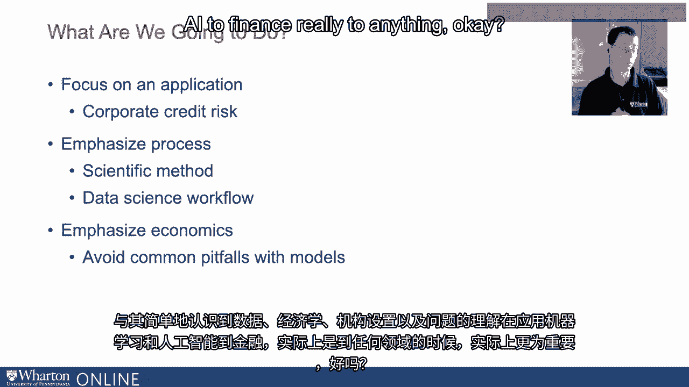
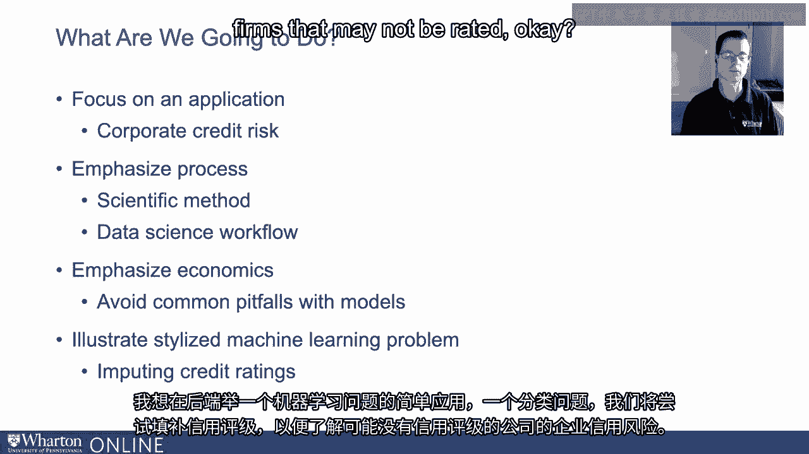
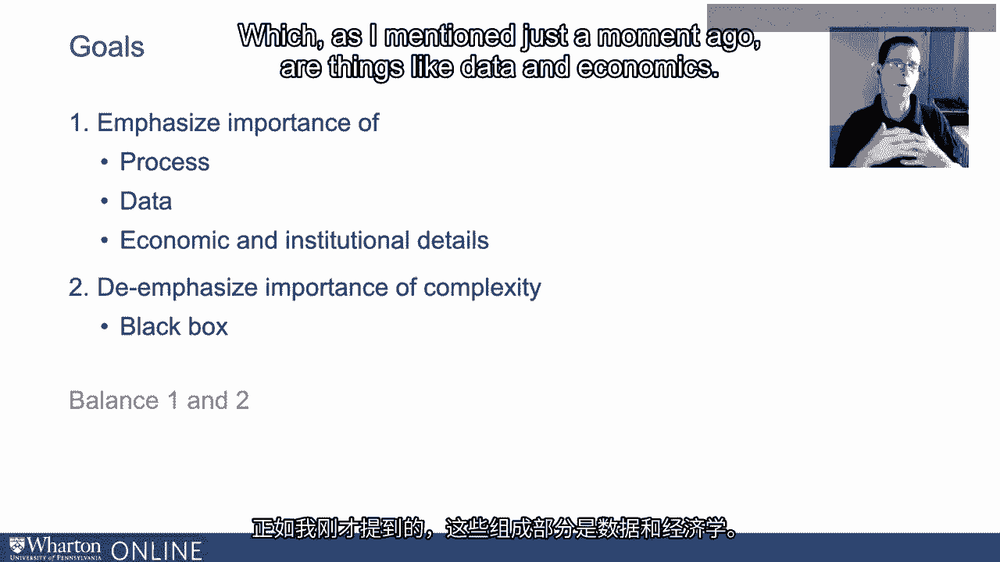

# 沃顿商学院《AI For Business（AI用于商业：AI基础／市场营销+财务／人力／管理）》（中英字幕） - P46：12_简介.zh_en - GPT中英字幕课程资源 - BV1Ju4y157dK

 Hi， my name is Michael Roberts。 I'm the William H。

 Lawrence Professor of Finance here at the Wharton School of the University， of Pennsylvania。

 And in this series of videos， we're going to be talking about finance， machine learning。

 and AI。 So when I think about finance， data， and technology， I think nothing new。

 Finance has long been technology-oriented， data-oriented， as well as model-oriented。 I mean。

 you can go back to the Moody's manuals that date back to the start of the 20th century。

 and data has always played a central role in finance， as has technology as it's progressed。

 So the sort of recent attention that machine learning and AI has received in the popular。

 press is really nothing new in some sense for finance， which has always been on the cutting。

 edge of data technology， as well as modeling。 Now in terms of applications， just Google， finance。

 and machine learning or finance and， AI， you're going to get the phone book。

 And I realize I'm dating myself with that statement， but you're going to get a very long list。

 I've listed just a few sort of common examples in this slide， but the list goes on and on， and on。

 In fact， if you think about it， it's actually very hard to think of an application in finance。

 where data doesn't play a central role。 And depending upon how exactly you define machine learning。

 machine learning， certainly， regression has been around since people were doing it by hand back in the first half of。

 the 20th century。 So given the breadth and scope of the topic， finance， machine learning， and AI。

 what are， we going to do here？ I want to just focus on an application to give a flavor。

 to illustrate its usage and， not in one of the more popular settings that you can find 800 different articles written。

 on。 I want to focus on corporate credit risk。 And what I want to do is I want to emphasize the process in particular the scientific method。

 and the data science workflow。 I want to emphasize the economics。

 the understanding of the economic phenomenon， the economic principles。

 the institutional details behind corporate credit risk。

 So we can avoid some common pitfalls and mistakes that are often associated with blindly pushing。

 data through some complex models， some black boxes and just crossing our fingers and hoping。

 it gives us the right answer to some question on the back end。 In fact。

 I think a lot of the disillusion with AI and machine learning in practice has to。

 do with this sort of over-reliance on the models and the algorithms as a panacea to all。

 problems as opposed to simply recognizing that the data and the economics and the institutional。

 setting and the understanding of the problem are really paramount in any sort of application。

 of machine learning and AI to finance really to anything。

 And I want to illustrate on the back end a simple application of a machine learning problem。

 a classification problem in which we're going to try and impute credit ratings to get a。

 sense of credit risk， corporate credit risk for firms that may not be rated。

 So how are we going to do it？ Well， if you haven't already figured it out。

 it's going to be informal。 I want to have a conversation。

 I've never been a big fan of scripted dialogues。 It just comes across as a bit unnatural to me even though it does come across more clean。

 But we're going to do this unscripted。 So you'll hear me stutter， stammer。

 make mistakes and try and correct myself throughout， hopefully。

 not too often and hopefully not in a distracting manner， but one in which you can easily understand。

 it and sort of subconsciously or consciously engage with in the back of your mind。

 I also want this to be dynamic。 As if you're sitting next to me， we're working at the computer。

 we're reviewing some figures， some models， some data， et cetera。 And in that sense。

 you're able to look into or see into my thought process or the thought。

 process more broadly as I'm conveying it。 And so altogether。

 this sort of informal dynamic approach will hopefully， at least。

 the intent is that it will lead to a more interesting and hopefully a more productive。

 and educational experience。 Cue the background noise。 All right， so what are the goals？ Well。

 the goals are I want to make sure I convey a few of my thoughts regarding empirical analysis。

 or financial analytics。 In particular， I want to be able to emphasize the importance。

 as I mentioned earlier， of， process， specific processes。

 not in the sense that they're going to constrain creativity。

 but that they're going to discipline how we go about analyzing data。

 I want to emphasize the importance of data。 I also want to emphasize the importance of economic and institutional details。

 At the same time， I want to de-emphasize to a degree the importance of complexity， sexy， algorithms。

 buzzwords， really the black box aspect of the process。

 And I want to be careful here because really what I'm trying to do is impart the importance。

 of balance between these two ideals。 The ideals of I have to understand and have domain expertise。

 a clear understanding of， the data and the economics of the phenomenon that I'm studying。

 But I also have to understand the importance or understand how the algorithms or the models。

 are taking that data and spitting out answers to problems in which I'm interested in。

 So I really want to emphasize the balancing of these two aspects。

 Because my experience has been over the last few years is that the AI machine learning。

 component has received an enormous amount of attention， a disproportionate amount of attention。

 In part， for good reason， because there's been great progress， but at the expense of what。

 I believe are equally important components of the overall financial analytics process。

 which as I mentioned just a moment ago are things like data and economics。 [BLANK_AUDIO]。

