# 沃顿商学院《AI For Business（AI用于商业：AI基础／市场营销+财务／人力／管理）》（中英字幕） - P52：18_信用风险信用评级预测.zh_en - GPT中英字幕课程资源 - BV1Ju4y157dK

 All right， so now let's transition into thinking about machine learning in the context of。

 corporate credit risk and in particular in the context of predicting credit ratings。

 So let's be precise as we should be according to the scientific method as to what we're。

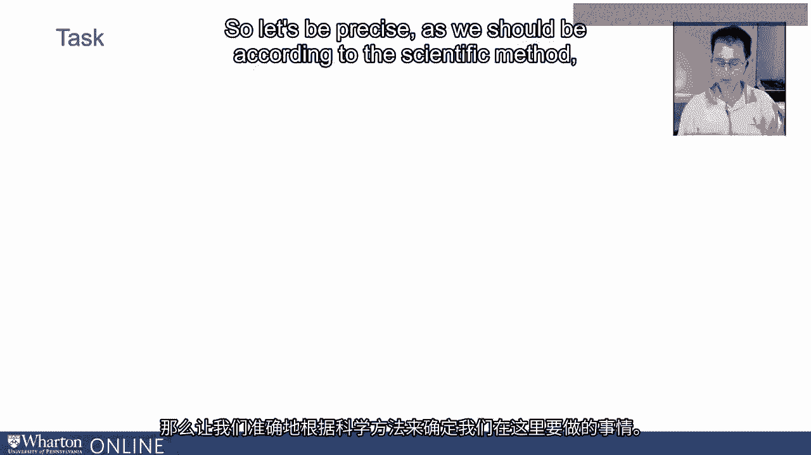

 trying to do here。

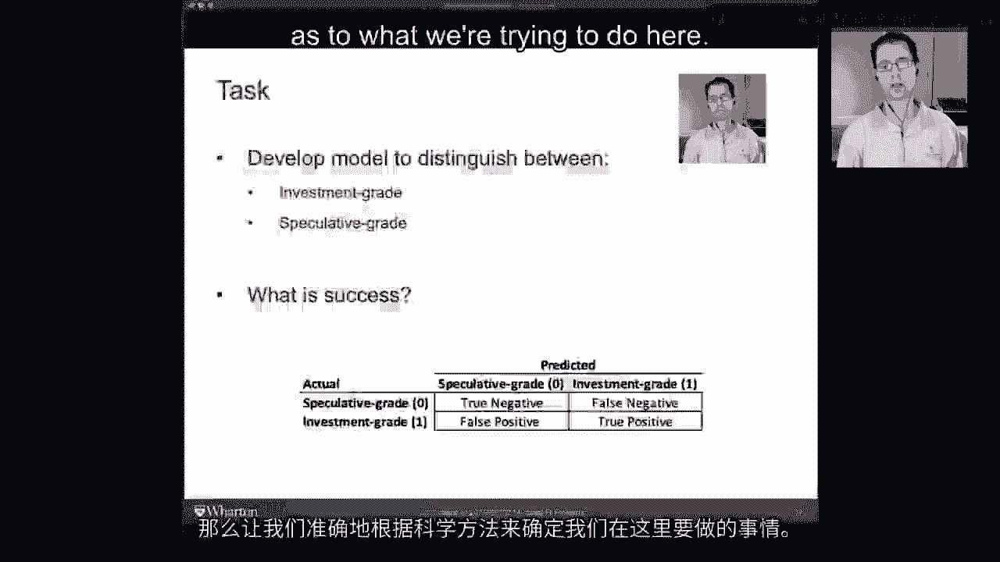

 What I want to be able to do is I want to be able to develop a model that can distinguish。

 between investment grade rated firms and speculative grade rated firms。

 And just to remind you， let me go back a couple of slides and clarify exactly what we mean。

 by investment grade and speculative grade。 Remember。

 this line right here that I'm sort of hovering over， the line between triple。

 B minus and double B plus on the standard and pours or Fitch rating scale or between。

 B double A three and B single A one， that line demarcates investment grade， which corresponds。

 to all companies rated above that line and speculative grade， which corresponds to all。

 companies rated below that line。 So that's what we're trying to do。

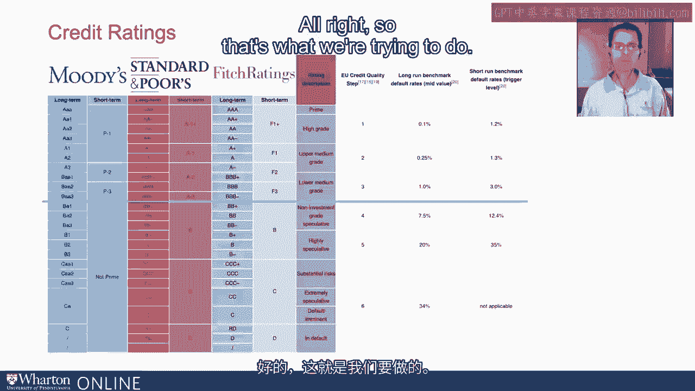

 Now we could be much more precise and develop a model that classifies ratings at the individual。

 notch level。 So we could distinguish but in theory between triple A and double A plus。

 We could write down a model that distinguishes between every single one of these individual。

 ratings。 But let's keep things relatively simple for the time being and just try to allocate to。

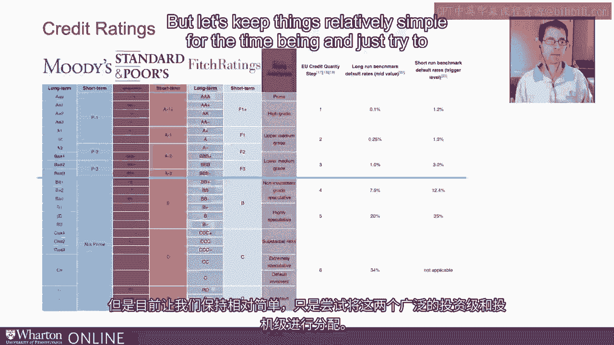

 these two broad buckets of investment grade and speculative grade。

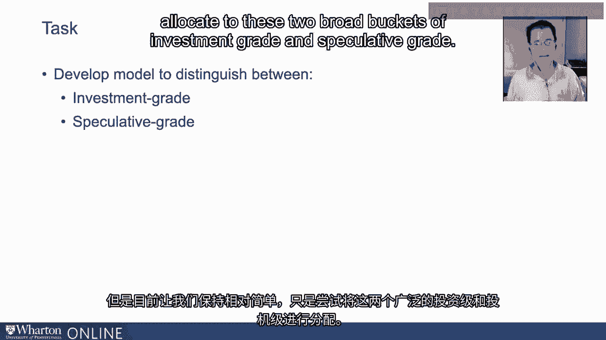

 Now the question is， you know， how are we going to measure success？

 How do we know if our model is doing a good job？ And it's not as easy as you might think。

 So put differently， what's our null hypothesis？ Let's hypothesize here。 One hypothesis is that。

 you know， we have a model that does better than just flipping， a coin。 In other words。

 every time we see an observation that can be either investment grade or speculative， grade。

 we can always just flip a coin。 Hopefully our model does better than that。

 But imagine the following model。 Imagine a model that predicts for every single firm。

 and we're going to be talking about， firms at different points in time。

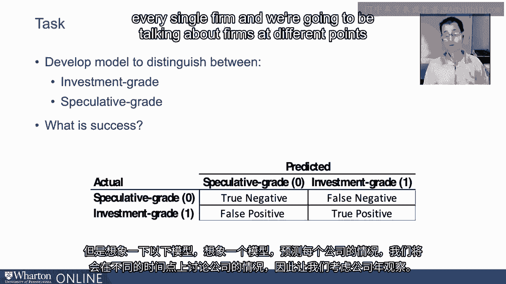

 So let's think about firm year observations， right？ For example。

 Intel in 2014 or AAMD in 2017 or 2018， et cetera。 Let's imagine a model that just predicted investment grade all the time。

 So if we predict that every firm firm year observations， since we'll be following firms， over time。

 but if we， if every single one of our predictions is that the firm we're observing。

 is investment grade， the accuracy rate for classifying investment grade firms will be， 100%。

 Of course， the accuracy rate for classifying speculative grade firms will be zero。

 We'll get every single one wrong because we will classify those speculative grade firms。

 as investment grade。 Now on the one hand， you might look and say， well， we got every。

 we got 100% right on the， investment grade firms。 On the other hand。

 we got none right of the speculative grade firms。 And so this really comes down to clearly。

 clearly defining success。 And in this context， and most classification context。

 that breaks down to what are the costs， of the different types of errors that you can make。

 So let's bring this together into a visual so we can talk about it a little bit more clearly。

 So take a look at the slide and each box on the slide。

 Each row corresponds to an actual observation in the data。

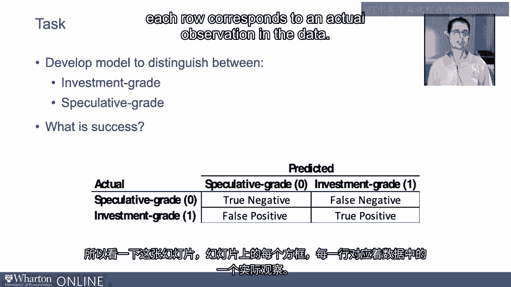

 So every single firm year observation that we'll have in the data， such as Intel in 2014。

 or AMD in 2018， whatever it is， will either be speculative grade or investment grade。

 That's the actual classification。 Our model is going to predict either speculative grade or investment grade。

 And so there's four possible actual predicted combinations that we can see， right？

 We can correctly predict a speculative grade firm that is get what's called a true negative。

 Or we can correctly predict an investment grade rated firm， a true positive。

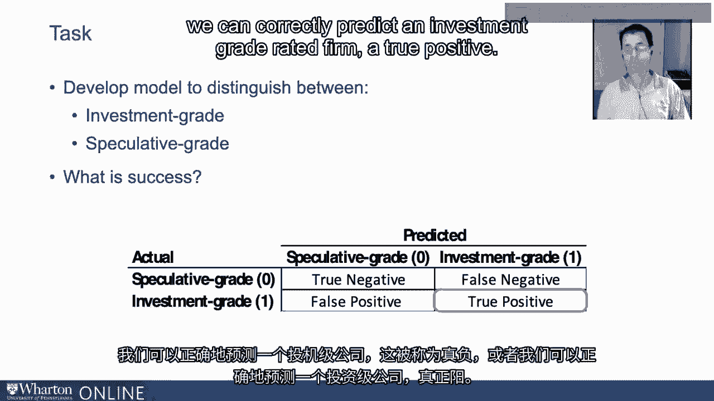

 Now as I said， there's two types of errors。 We can either incorrectly predict speculative grade for an investment grade firm。

 or we can， incorrectly predict investment grade for a speculative grade firm。

 Now I just said with that naive model of always predicting investment grade， we can。

 make our true positive rate 100%， right？ But we're never going to get any of the speculative grade classifications correct。

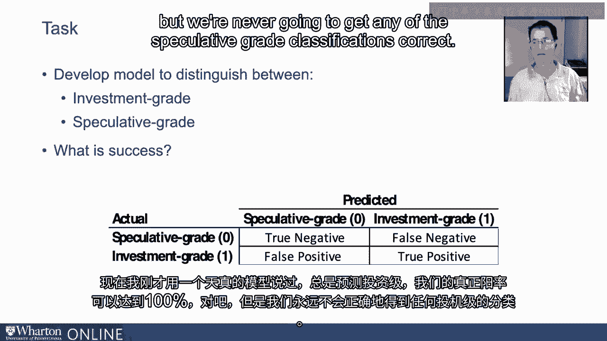

 So what we need to think hard about is what is the cost of making these two errors？

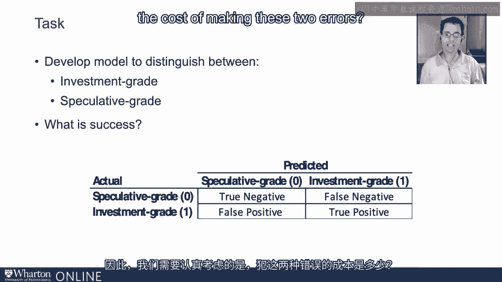

 If they're both the same， if the cost of incorrectly classifying a speculative grade。

 firm is investment grade is the same as the cost of incorrectly classifying an investment。

 grade firm is speculative grade， then we just want to balance the two errors， right？

 Or equivalently the two accuracy rates， the accuracy rates for both classifications。

 If on the other hand it's particularly costly to make one error relative to the other， then。

 we're going to want to put weight on models， more weight on models that avoid those costly， errors。

 All right， let's make this concrete with an example。 Open your bank and your lending money。

 Now if you incorrectly classify a potential borrower as investment grade when they are。

 in fact speculative grade， that can be very costly because you're not going to make enough， money。

 You're going to give that firm very relatively loose terms on the loan， a low interest rate。

 maybe loose covenants， so that you are more likely than not to lose money on that loan。

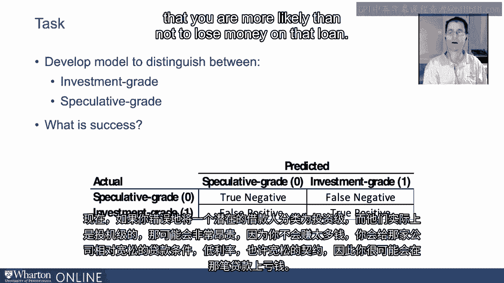

 Whereas if you classify an investment grade firm as speculative grade， well the loss there。

 assuming they take the loan， isn't so bad， right？ Because you'll be charging a relatively high interest rate to a safe firm。

 You're going to make more money。 Now of course there's the argument that if you try and do that you won't get the business。

 in the first place and there's a cost to that as well。

 But one might think that mischaracterizing risky firms as safe could be particularly。

 costly for a lender over any significant amount of time or significant number of deals。

 In which case， the box we're particularly concerned about is are these false negatives。

 We do not want to inaccurately characterize or classify speculative grade firms as investment。

 grade firms。 So we really want to tamp down on those errors。

 For example， but of course， it's not that there are no costs here if we just start charging。

 every safe borrower that comes through the door with really high interest rates。

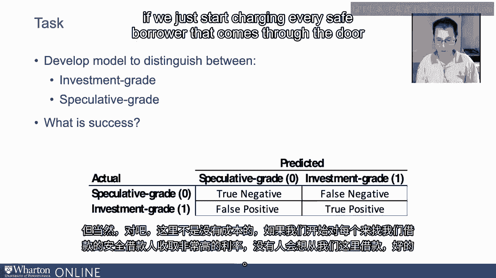

 No one's going to want to borrow from us。 All right。

 So it's just an example to illustrate that there are relative potentially different costs。

 associated with different types of errors。 So which model is a success really depends upon what your objective function is。

 which， needs to be clearly articulated before you start the modeling process。 In other words。

 we need to answer this question。 What is success？ Very clearly and precisely upfront before we dive into the modeling so we know what we're。

 trying to accomplish。 All right。 So let me let me let me summarize this。

 Our goal is to try and develop a model that distinguishes between investment grade and speculative。

 grade。 Success in our example is going to be one that minimizes both errors。

 We're not going to assign more or less weight on any individual layer。

 We're going to see how well we can accurately classify both speculative and investment grade。

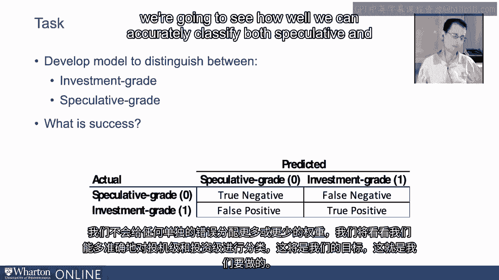

 That's going to be the goal。 That's where we're headed。 All right。

 All right。 All right。 All right。 All right。