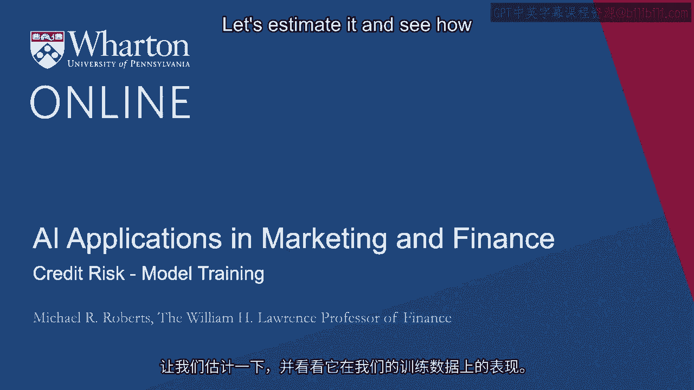
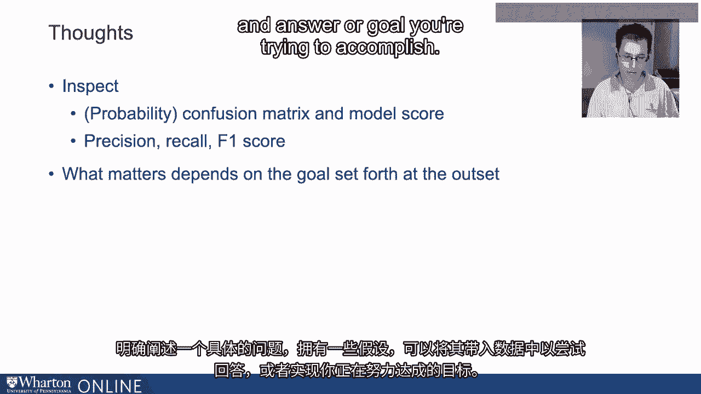

# 沃顿商学院《AI For Business（AI用于商业：AI基础／市场营销+财务／人力／管理）》（中英字幕） - P55：21_信用风险模型训练.zh_en - GPT中英字幕课程资源 - BV1Ju4y157dK

 Okay， so now let's train our model。 Let's estimate it and see how it does on our training data。

 I'm going to use a logit model， which is a relatively elementary model。

 to try and predict speculative grade and investment grade outcomes in our training data。

 training sample。 And the table I'm showing you on the screen is something called the confusion matrix。

 It's exactly what we spoke about in previous videos。

 but these are the actual results from the model。 So remember。

 the rows correspond to actual observations in the data。

 the columns correspond to predictions from the model， a logit model in this case。

 There are in total 8，432 observations in our training data。 And those 8。

432 observations are allocated to these four different possible outcomes， in the following manner。

 Now， the accurate predictions are along the diagonal。 So when a firm is actually expected of。

 struggling today is actually speculative grade， and we predict speculative grade for that firm。

 we're right 3，181 times。 Similarly， when a firm is investment grade。

 and we predict its investment grade， we're right 3，330 times。 We're wrong just under 1。

000 times in both cases。 So when we have an investment grade firm in the data。

 but we predict speculative grade that happens 959 times。

 and similarly for firms that are speculative grade。

 but we predict investment grade that's 962 times。 And I've tallied up the row and column sums around the periphery of the table。

 So I always find the confusion matrix to be， not confusing。

 that's what you thought I was going to say， but I always find it to sort of be the basis for other statistics。

 that I think are more informative。 And so I'm going to convert everything here to probabilities。

 In particular， I'm going to take each number， let me go back。

 I'm going to take each one of these numbers and divide it by 8432。

 to get these four numbers in the middle of the matrix right here。 And then I'm going to， again。

 compute the column sums and the row sums。 So these numbers are telling me probabilities。

 which I think are a little bit easier to interpret。 So we are getting。

 we are predicting speculative grade firms correctly， 37。7% of the time。

 investment grade 39% of the time。 So we， our model has a score， a model score。

 excuse me if you will， of 77。2%。 We are accurately classifying speculative grade。

 and investment grade observations 77。2% of the time。 Now is that good？ Is that bad？ Again。

 it depends upon how costly these errors are， right？ We've got 22。

8% of the time we are making a mistake， but certainly this is significantly better than if we just flipped a coin。

 in which case we'd have somewhere around a 50% accuracy score。

 given the balanced nature of the data。 Half the， almost half the data is investment grade。

 half a speculative grade。 So the model is actually doing well relative to that benchmark。

 but we are making quite a few errors here。 Now， something I wanted to do in light of a previous discussion。

 we had in an earlier video， is I wanted to see what happens。

 if I drop a bunch of what I'll call redundant variables， right？ Originally， we have， in this model。

 there are 11x variables going into predict this outcome。 What happens if I get rid of seven of them？

 And I just focus on the current ratio， interest coverage， debt to EBITDA and debt to assets ratios。

 In other words， I picked one from the liquidity coverage， and two from the leverage ratio category。

 How well would that model do with only four input variables relative to the one with all of them？

 And so here's the probability confusion matrix。 The model score in this case is lower， it's 76。5%。

 but it's only 0。7% worse， than the model with 11 variables。 So， you know。

 is that an important difference？ It may be。 That might be， that 0。7% might be very costly。

 On the other hand， we've got a very parsimonious model， a nice small compact model。

 that is perhaps more likely to predict better out of sample than the larger。

 more highly parameterized model with the 11 inputs。 I mean。

 it doesn't cost us computationally to have the 11 variables versus the four。

 but I am thinking in terms of overfitting on the sample and out of sample prediction。

 when I moved to this more parsimonious model。 And in some sense。

 it's not surprising that it does nearly as well， given the high correlations within each of the credit KPI groups。

 liquidity coverage and leverage ratios。 The last thing I want to talk about in this video are some additional metrics at which we can look。

 right？ We've sort of got some rich data here in terms of the actual and predicted outcomes。

 On the model score， but there's some additional metrics that pop up， quite often。

 especially in binary classification。 The notion of precision。

 which is the probability of a true positive conditional on a positive， prediction。 That is。

 what is the probability of accurately classifying investment grade firms。

 conditional on predicting that the observation was investment grade？

 And you can actually get at this number， which is 76。5%， by taking the number of true positive。

 outcomes， conditional on the total number of predicted positive outcomes。

 Recall is the probability of a true positive outcome。

 but this time conditional on the actual outcome， not the predicted outcome。

 So I would take the number of accurately classified investment grade outcomes and divide。

 them by the total number of investment grade observations in the data to get the recall。

 in this case， 77。6%。 Now， there's a trade-off between precision and recall。 If you improve on one。

 you're going to do worse on another。 There's this push-pull tension between， the two。

 And so there's this additional metric called an F1 score， which is just。

 a fancy name or non-fancy name for what's called a harmonic mean。

 just a weighted average of precision， and recall， which turns out to be about 77。1%。 Look。

 these are just other measures of which to be， aware。

 and which one is more or less important depends upon what exactly you're trying to predict。

 So just some closing thoughts to bring this all together。

 Once we've got our model and it's predicting。

 we want to inspect its confusion matrix， the probability version of the confusion matrix。

 the model score。 But ultimately， whether we look at precision， recall， F1 score。

 or just one specific， number in the confusion matrix， again， always depends upon our goal。

 the cost of making different， types of errors， et cetera。

 So it's critical that at the outside of the outside of this whole exercise。

 we have a very clear goal in mind， which is what the scientific method is really trying to force。

 you to do。 Pin down and clearly articulate a specific question， have some hypotheses that you。

 can take to the data to try and answer or goal you're trying to accomplish。

 [BLANK_AUDIO]。

