# 沃顿商学院《AI For Business（AI用于商业：AI基础／市场营销+财务／人力／管理）》（中英字幕） - P57：23_信用风险误差分析.zh_en - GPT中英字幕课程资源 - BV1Ju4y157dK

 So we've explored a bunch of different models。 We've explored different data to push through those models。

 Another important element of the process is what I call error analysis。

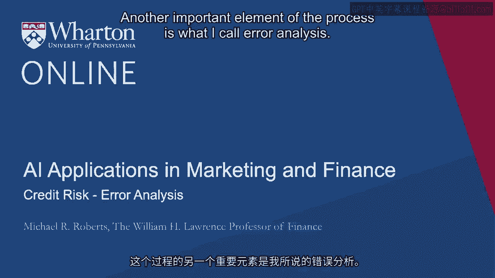

 In other words， where do we go wrong？ How are we misclassifying firms？

 Let's try and understand that。 So what I've done here is I've put up a little table。

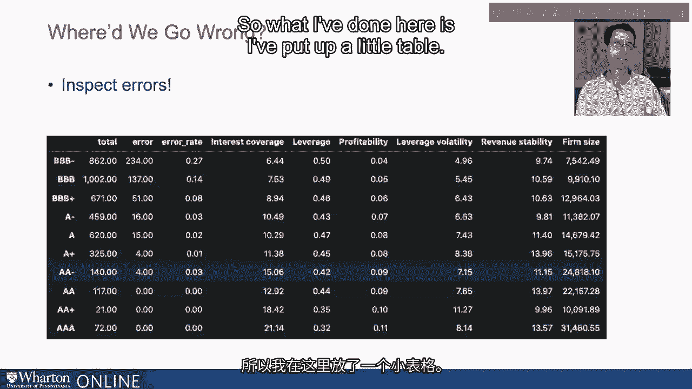

 Each row represents a different rating category from AAA all the way down to or up in the table。

 to B minus， which is the last rating that is still investment grade just before it goes。

 below investment grade。 We've got the total number of observations in this column。

 I've got the number of mistakes or errors。 The error rate。

 which is just the ratio of these two numbers。 And then I've got the average value for each of the input。

 the data input， the input variables。

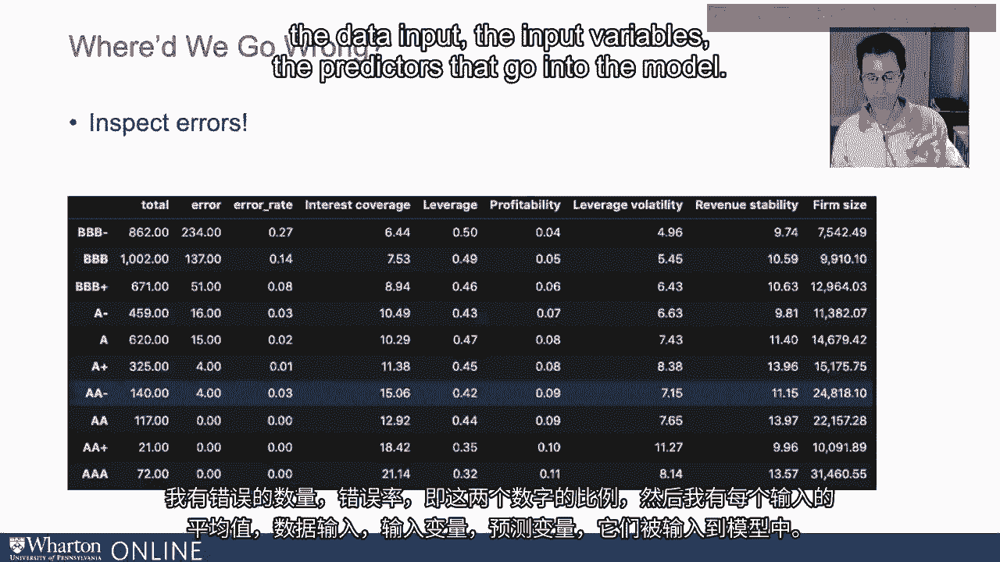

 the predictors that go into the model。 So in this example。

 I'm using the Moody's specification that consists of interest coverage， leverage， profitability。

 leverage volatility， revenue stability， and firm size。

 So for triple B minus rated firms， there were 862 in the training data。

 We mistakenly classified 234 of them as speculative grade for an error rate of 27%。

 Those firms have an average interest coverage ratio of 6。44， leverage ratio of 0。50， profitability。

 of 0。04， volatility of 4。96， and so on。

 So this is just giving us a perspective of where we're making mistakes and classifying。

 and some characteristics of those firms in that bucket， not of the mistakes， but of those。

 firms more broadly。 Okay。 Now， notice we didn't get any of the triple A's incorrect。

 That's good to know because if we're missing triple A， if we're getting those wrong， something。

 must really be wrong with the inputs because they're so far from that investment grade。

 speculative grade boundary。 They should be easy to identify。

 What we did inaccurately classify four double A minuses。

 And so I'm going to take a look at those。 I've got three of them on the screen。

 These are three of the mistakes and they all correspond to all tell Pennsylvania in the， mid 1990s。

 So when I look at the interest coverage ratio of 1110 and I compare it to a double A minus。

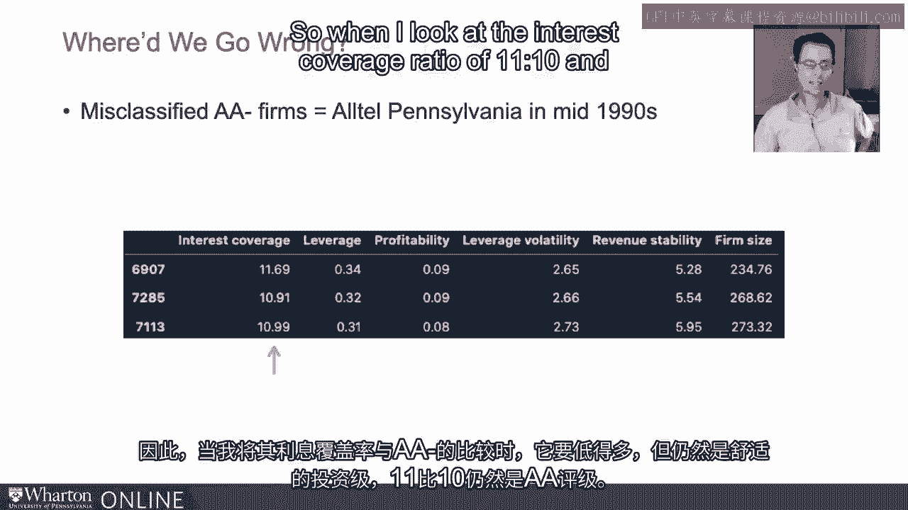

 it's quite a bit lower， but still comfortably investment grade。 1110 is still AA rated。

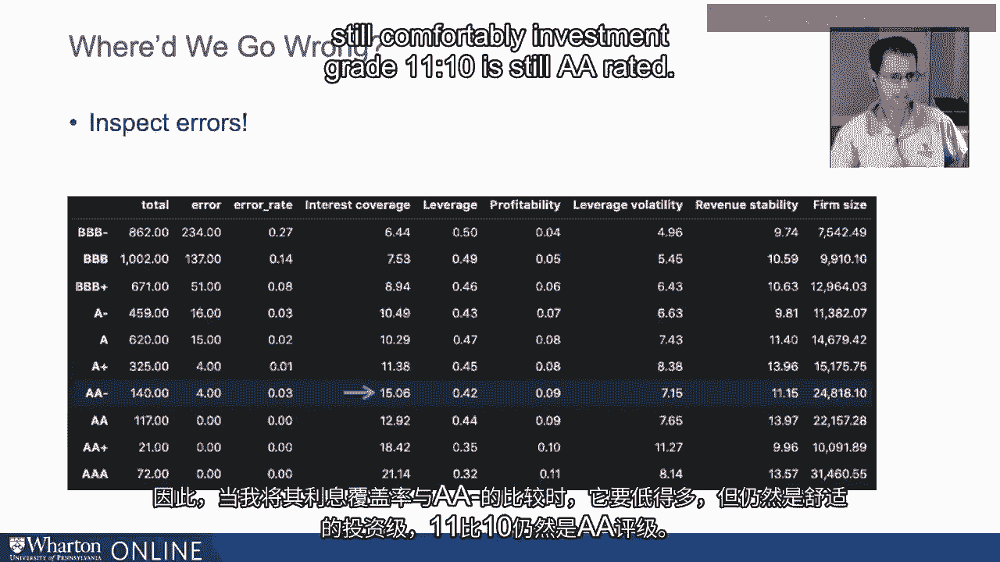

 So I don't think that's the issue。

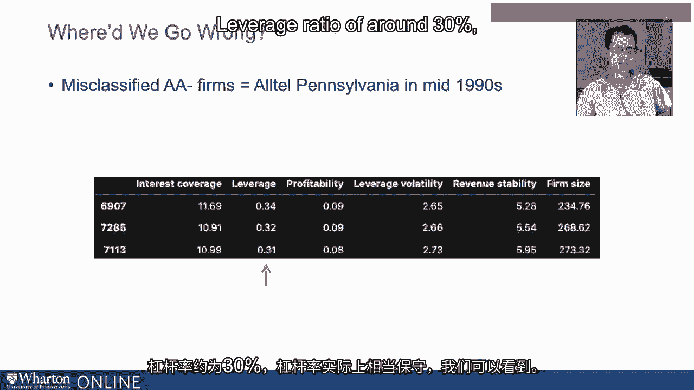

 Leverage ratio of around 30%， the leverage is actually quite conservative， as we can see。

 Profitability is 0。09 again， comfortably in the investment grade range， right？

 In the investment grade firms tend to have higher profitability。

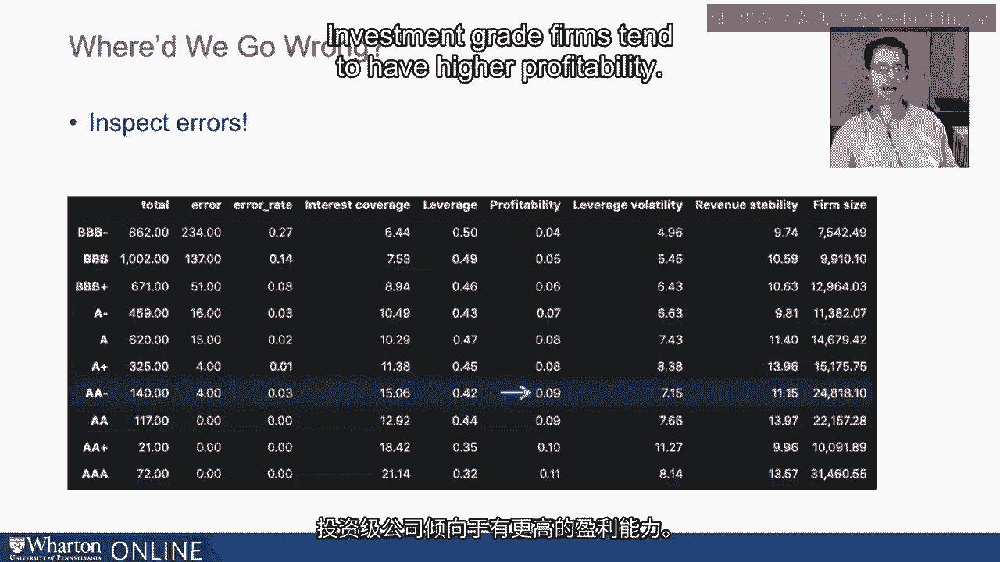

 So this is a bit puzzling so far。 Perhaps it's volatility is very， it's a volatility。

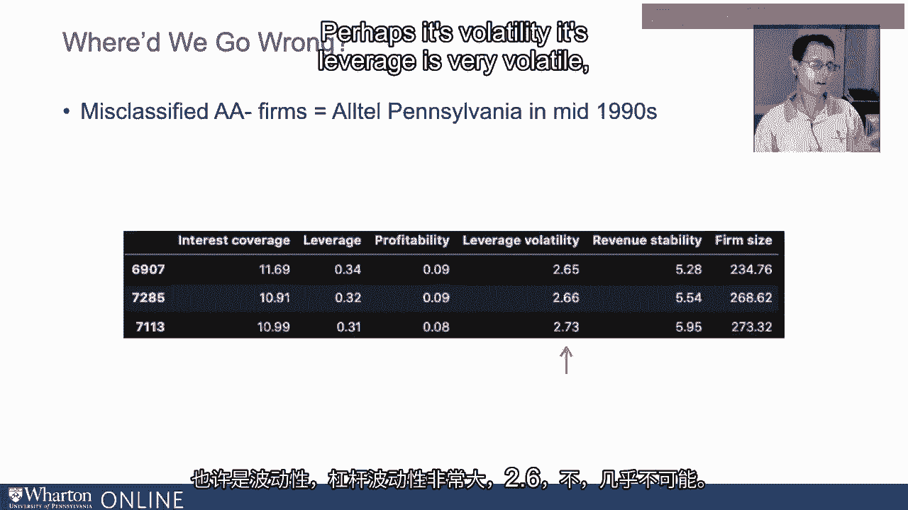

 It's leverages very volatile。 2。6。 No， hardly， hardly。 Although。

 leverage volatility almost seems to be quite a bit higher for the more highly， rated firms。

 I'd want to compare that against the leverage volatility of speculative grade firms， but。

 that could be one reason right there。

 It seems to be a little bit low。 Resolute stability， 5。5。

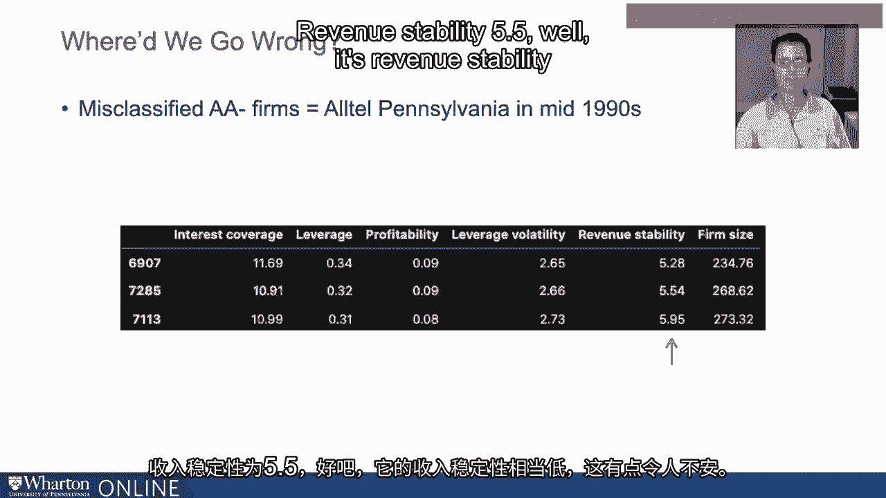

 Well， its revenue stability is quite low， so that's a little bit disconcerting。

 However， what really stands out， look at the size of the firm。 All tell its firm size。

 and I think this is total assets in millions of dollars。 We're looking at about $234 million。 $275。

 $274 to $275， let's say。

 When I look at the size of investment grade firms， they're big。

 The assets are in the billions of dollars。 You can see that there's almost a monotonic relationship in terms of size。

 It's certainly loosely speaking increasing as we move from riskier or lower investment。

 grade rated firms to higher investment grade rated firms。

 But when you compare the $250 million of assets， let's say， to $7 billion， this just looks。

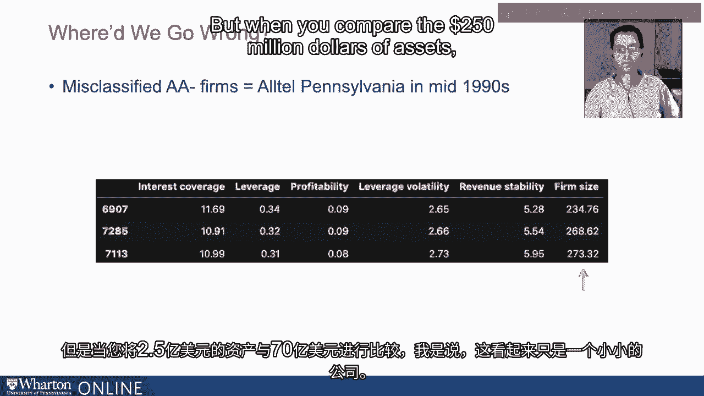

 like a tiny little firm。 And I'm pretty sure that， and to a lesser extent。

 the revenue stability and maybe leverage stability， is what's throwing things off here。

 That's what's throwing things off。

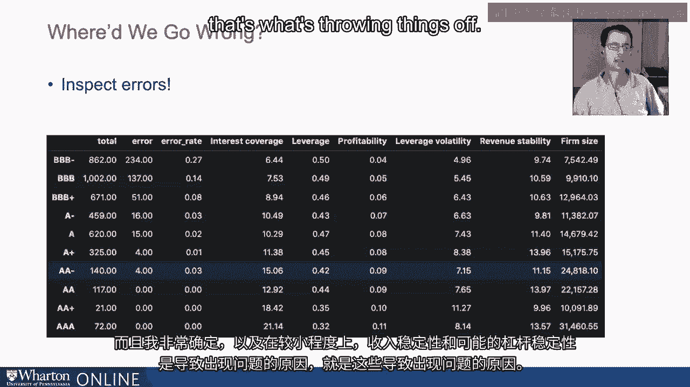

 Now， the goal， just to be clear here， is not to get every single firmier observation or。

 correctly classified。 We can do it with the most highly parameterized and complicated model that will get every single。

 observation correct， but as soon as we take it out of sample， it's just going to choke。

 It's going to do terribly。

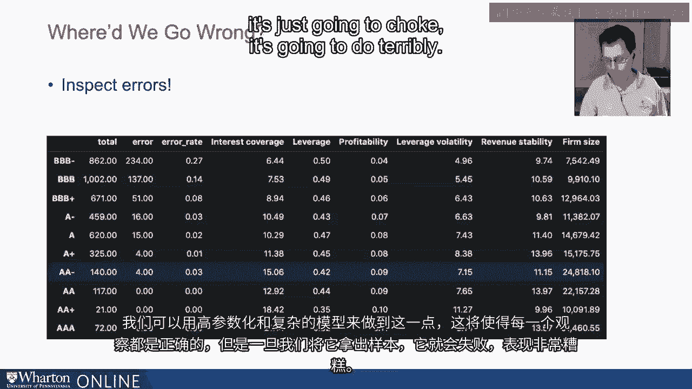

 So we're naturally going to miss some。 But what we do want to do is we want to understand why our model is making mistakes。

 because if， it's making mistakes in a systematic manner。

 we want to be able to incorporate some measure， into the model that will capture that variation。

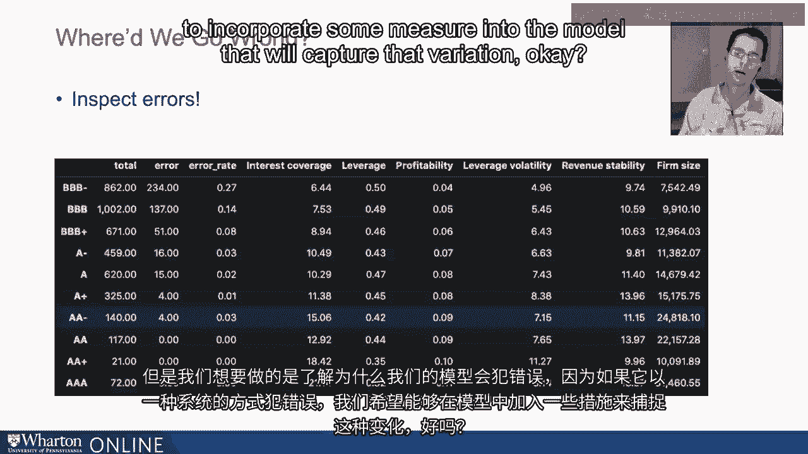

 And so if I look at these other errors， if I print out the data， which I should， and look。

 at why I'm mis-classifying some of these firms' speculative grade， if I see that it keeps。

 on coming up as firm size and revenue stability， maybe I want to move to a more flexible。

 functional。

 form for firm size， for example。 Or maybe firm size isn't important。 I happen to know it is。

 but I want to try and tease out some common theme among my errors。

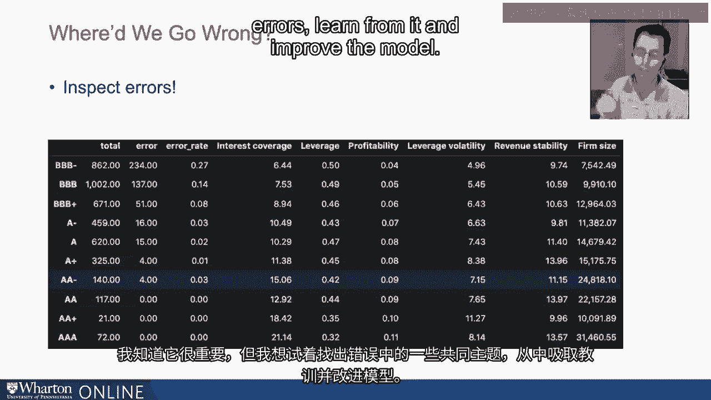

 learn from it， and improve the model。 In fact， that's exactly what the process of boosting a model does。

 is it learns from its， mistakes。 Okay？ All right。 So。

 another important element of the modeling process is error analysis， so we can understand。

 why the model is making mistakes， learn from those mistakes， and improve the model to improve。

 the classification accuracy。

 Thank you。 [BLANK_AUDIO]。

