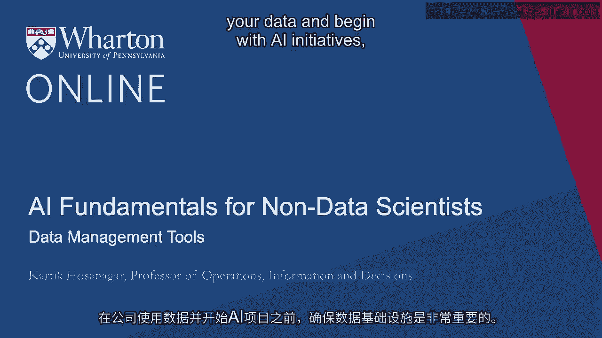

# 沃顿商学院《AI For Business（AI用于商业：AI基础／市场营销+财务／人力／管理）》（中英字幕） - P5：4_数据管理工具.zh_en - GPT中英字幕课程资源 - BV1Ju4y157dK

 Before your company can use your data and begin with AI initiatives。

 it is important to have the data infrastructure in place。 In this lecture。

 I'm going to talk about data management tools that are necessary for companies to have in place before they can embark on large-scale AI initiatives。

 First， we'll talk a little bit about data warehousing。 To begin。

 many of you are likely familiar with the concept of a database。

 A database is quite simply a structured collection of data。 Quite simply。

 an Excel spreadsheet can be thought of as a type of database。 Now， in practice。

 we need usually better tools to manage data。 So database management systems or DBMSs are systems that allow users to better access and manage the database。

 So Excel， again， provides some simple functionality。

 but more advanced databases from Microsoft and Oracle and many other companies really help companies better manage their data。

 And sometimes we refer to database management systems quite simply as a database。

 A data warehouse is a particular kind of database management systems。 It's specialized in two ways。

 First， it's specialized in terms of the type of data a data warehouse stores。

 Usually that is historic data from many sources in the enterprise。

 A data warehouse is also specialized in terms of the purpose it serves， and that is analytics。

 A usual database might serve operations。 For example。

 when a customer of a bank logs into the website and wants to look up their current account information。

 then you actually interact or that customer is interacting with an operational database。

 that is able to pull data very fast and respond to customer queries like their current balance。

 In contrast， analytics needs access to all of the data that a company might have or most of it。

 And the purpose there is usually not speed， but it's the ability to have a more comprehensive。

 and more of a bird's eye view of all the data in the company。

 And a data warehouse serves that purpose。 It's not necessarily the fastest database。

 but it's specialized for the function of analytics。

 and thus provides a more complete picture of the data in an organization。

 Examples of data warehouses include Microsoft's Azure SQL data warehouse， Google BigQuery。

 Snowflake， and Amazon Redshift。

 Now， let's talk a little bit about how data warehouses work。 Usually in most companies。

 operational data is sitting in many different places。 For example。

 customer data might be sitting in a CRM system。 Some other enterprise information。

 including information about partners and supply chain， may be sitting in an ERP system。

 Customer billing information might be sitting in another separate database。 Now。

 if we want a unified view of all the data in the company。

 we first need to pull all of that data into a data warehouse。 ETL tools are useful for that。

 ETL stands for extract， transform， and load。 These tools pull the data out of the different individual databases。

 For example， they'll pull the customer data out of the CRM system。

 the customer's billing data out of the billing system， and so on。 All of that data is pulled out。

 it's transformed as needed， and then loaded into the data warehouse。

 Popular ETL tools include tools built by companies like Informatica and Stitch。

 which is now part of a company called Talon and many others。

 The data warehouse now has all of the data from all these different sources。

 Once we have this data in one place， you can now build reporting and data visualization tools。

 on top of that。 For example， business intelligence tools like Tableau sit on top of the data warehouse。

 and when an analyst enters a query， these systems can then go into the data warehouse。

 and pull the necessary information。 Next， let's talk about the value of a data warehouse。

 The main purpose or value of a data warehouse is that it serves as a single point of access。

 for all data in the company。 And it's where a history of all the data is stored。

 And as I mentioned earlier， a data warehouse helps separate operations from analytics。

 Usually the operations data is meant to be fast so that when a customer logs in。

 you can pull the data fast and respond to information such as the customer's balance。

 On the other hand， certain analytics queries might require a more comprehensive access to。

 historical data and an assurance of data quality。 For example， if an analyst wants to know。

 how much revenue has each product line brought in， over the last 10 years？

 And we want that data broken out by month and by city and state。

 That kind of a query requires access to a lot of historical data over the last 10 years。

 and the data warehouse provides that assurance of data quality and that single point of access。

 to all of that data。 Now， so that's a little bit about data warehouses。

 As part of data infrastructure， we should also talk about big data tools such as， Hadoop and Spark。

 Now， big data tools like Hadoop serve two main purposes， storage and processing。 Now。

 storage of big data usually has some unique challenges。 If we want to store a little bit of data。

 a few files， we can typically store that in our computers。

 But what if there's massive amounts of data？ Data for millions or hundreds of millions of customers over the last 10。

 20 years。 That kind of data cannot be stored in a single computer。

 And so one of the things that a big data tool like Hadoop does is that it stores it in a。

 distributed fashion across multiple computers or multiple nodes。 Next， these systems also take。

 care of processing that data。 And usually that processing again involves distributed processing。

 of that data across multiple nodes or across multiple machines and also parallelizing。

 the computations or data processing as much as possible， which helps increase speed。

 Hadoop is an open source tool that is offered by the Apache Foundation， which is a non-profit。

 foundation that provides open source software。 The most popular distribution of Hadoop is by a。

 company called Cloudera， although there are several others。 And Spark is a more recent version。

 or in fact， I would say a more dominant replacement for Hadoop， which serves similar purposes。

 but solves some of the problems that Hadoop had faced in the past。 Data bricks is the most。

 dominant company that is built around Spark。 We'll next talk a little more about data where。

 houses and also big data tools like Hadoop and Spark in our discussion with an executive from Snowflake。

 [BLANK_AUDIO]。