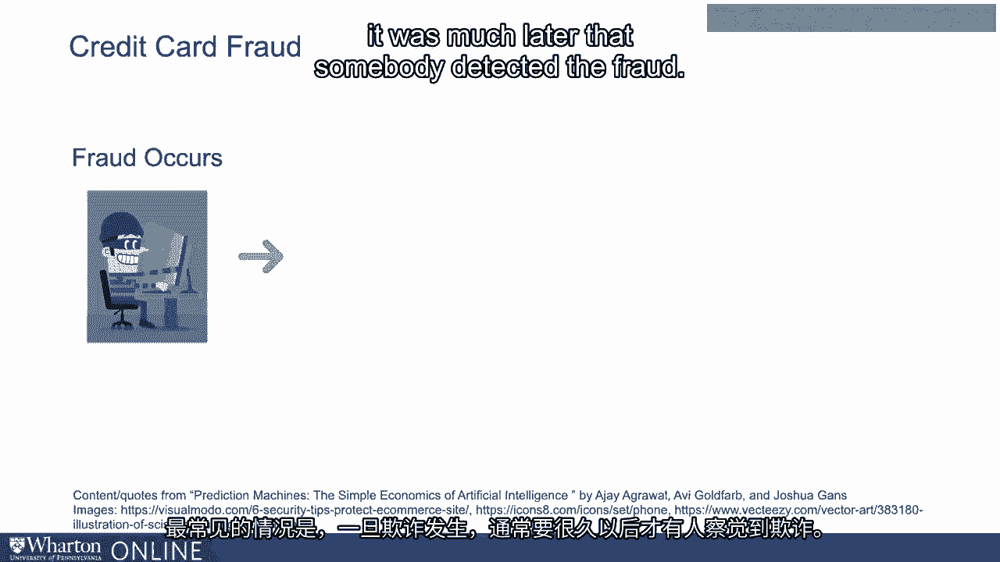
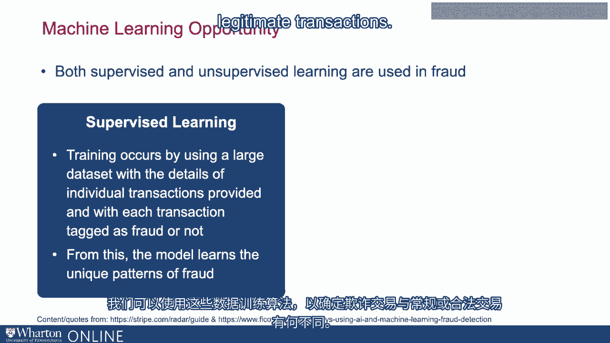
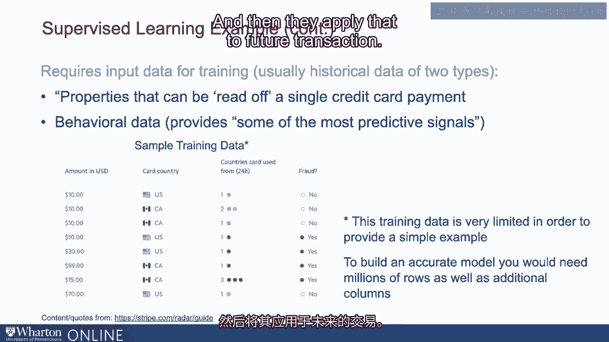
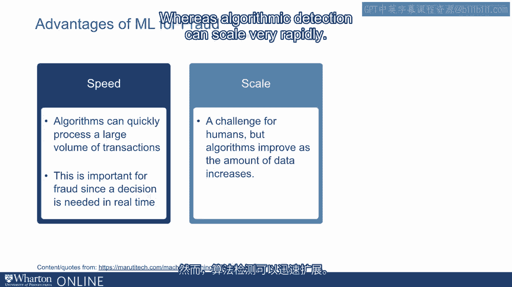

# 沃顿商学院《AI For Business（AI用于商业：AI基础／市场营销+财务／人力／管理）》（中英字幕） - P60：26_金融欺诈检测中的机器学习.zh_en - GPT中英字幕课程资源 - BV1Ju4y157dK

 In this lecture， we are going to explore some of the applications of machine learning in。

 finance in greater detail。 So in our conversation with APUR。

 we talked about several applications of machine learning。

 in the front office and also in the back office。 So we will start with an application in the back office that APURVE mentioned which is。

 fraud detection。 Now let's start with credit fraud detection。 Now in the past。

 credit fraud detection was something that could not have been done in， real time。

 The most common situation or scenario was that once fraud occurs， it was much later that。

 somebody detected the fraud。 Most commonly it was detected by the customer when they are perhaps reviewing their credit。

 card bill and they notice a transaction that is not legitimate。

 And they might in turn then call the company and the company might then reverse that transaction。

 and then send a new card。

 But in this instance， the customer has been impacted and this has perhaps created a lot。

 of consumer angst。 And furthermore， the transaction has already occurred。

 So even though the customer might be reimbursed， there is a loss either to the credit card。

 company or to the merchant。 Now the way this world of credit card fraud detection has been transforming is that machine。

 learning algorithms are evaluating transactions as and when they occur。

 So right when a customer uses a credit card， whether it's online or whether it is at store。

 in person， an algorithm might evaluate that transaction and then detect potential fraud。

 And if it determines that the transaction is likely to be fraudulent， then the customer。

 is alerted and if needed， a new card is issued to the customer。

 What this achieves is that we are able to detect fraud before the customer experiences。

 any dissatisfaction or angst and also it helps avoid the fraudulent transaction in the first， place。

 thereby saving either the merchant or the credit card company money。

 Now machine learning when it's applied to fraud detection is certainly very valuable。

 And the accuracy of these algorithms is extremely important because false positives or false。

 negatives can be costly。 Now a false negative occurs when a business does not detect a transaction as fraudulent。

 and it allows the fraudster to make the purchase。

 In this case， the actual card holder discovers the charge， disputes it and is perhaps repaid。

 by the bank but the merchant or the bank is responsible for the cost of the item sold。

 to the fraudster and therefore there is a loss to either one of them。

 The other possibility is a false positive。 This occurs when a transaction is flagged as fraudulent and is blocked even though the。

 potential purchase was actually not fraudulent。

 In this case， the challenge is that it affects the customer experience because the transaction。

 was blocked even when it was not fraudulent and it might affect customer retention in the， long run。

 So in short， it is very important for companies to make sure that their machine learning algorithms。

 for fraud detection are highly accurate with low false positives and low false negatives。

 Now if we open up the black box and look under the hood and see what kinds of algorithms。

 are being used by companies， they use both supervised learning algorithms and unsupervised。

 learning algorithms。

 The supervised learning algorithms are trained based on historical data which is essentially。

 passed data on transactions which were either subsequently labeled as fraudulent or which。

 were not flagged as fraud at all。 And we might use this data to train an algorithm to determine what makes fraudulent transactions。

 look different than the regular or legitimate transactions。

 Unsupervised learning algorithms essentially will look at any transaction and will essentially。

 do anomaly detection。 They will look at what makes this transaction different than other transactions that is。

 in the database including other transactions by the same customer。

 And therefore a flag of transaction that just looks different。

 So let's look at each of these ideas。 So first， supervised learning。 For supervised learning。

 we need a lot of training data。 And given the training data。

 the algorithms are looking at certain properties of the transactions。

 Some of these are properties that are based on that specific transaction。 For example。

 what country is this card being used in and what country was the card issued。

 in or what is the IP address of the website where a payment is being made and things like， that。

 And they might also use behavioral data。 For example。

 in how many different countries was the card used？

 How many transactions have been made on this card in the last one hour relative to what。

 is the usual rate at which transactions are made around this time？

 So these are the kinds of data that might be used。

 And a supervised learning algorithm might essentially use a large data set which is。

 all kinds of past transactional data on the customer on past transactions。 And with the knowledge。

 remember， supervised learning algorithms need clearly labeled output。

 So they will need data on whether those past transactions were fraudulent or not。

 And based on that data， they essentially try and identify a unique signature or a unique。

 set of features or identifiers of fraudulent transactions。

 And then they apply that to future transaction。

 Based on this past data， one might learn， for example， a decision tree like what I've。

 shown here on this graph， on this decision tree， essentially the algorithm is looking at certain。

 attributes of the transaction。 For example， it starts by looking at whether the transaction amount is greater than or less。

 than $20。 If it is greater than $20， it next asks whether the transaction is in Canada。

 If it's less than $20， it asks whether the card has been used in over two countries。

 And so it looks at this kind of data in order to make the decision of whether it thinks a。

 transaction is fraudulent or not。 This kind of decision tree would be learned based on historical data。

 So the accuracy of the tree depends on having lots of data and recollect our conversation。

 on machine learning algorithm。 You need lots of rows of data and lots of columns in each row。

 So lots of rows of data implies we need millions and perhaps billions of past transactions。

 And lots of column implies for each of these past transactions， we need to know a lot of。

 information。 Not just the simple information that was shown in the table in a couple slides back。

 but rather， very rich data on each transaction， on where the transaction is occurring。

 what is the amount， of the transaction， what is the IP address， all kinds of information。

 And that is when we can build accurate supervised machine learning algorithms。 Now。

 as I mentioned earlier， this would be paired with unsupervised learning algorithms。

 that are doing anomaly detection。 You might say the transaction is for an exceptionally high amount relative to past transaction。

 And furthermore， it's in a country where this person has not transacted before。 And in the past。

 foreign transactions were preceded by flight purchases to that country。

 and we don't see it this time。 And so all of these factors make this transaction look like an anomaly and that might cause the。

 transaction to be labeled as fraudulent。

 So machine learning is actually being used quite extensively in banks these days。

 We are still in early days of applying machine learning to do fraud detection and it can。

 add immense value。 First of all， algorithms can detect fraudulent transactions faster than any human being。

 So speed of detection is extremely important because it helps prevent fraud rather than。

 detect fraud after the fact。

 The scale of the solution is extremely important here because human intervention or human detection。

 of fraudulent transactions simply doesn't scale well， whereas algorithmic detection can。

 scale very rapidly。

 And finally， there is the efficiency of using machine learning and perhaps the ability to。

 detect fraud at greater or higher levels of accuracy than is feasible with human beings。

 So given that banks today lose billions of dollars in fraudulent transactions， the value。

 of applying machine learning to reduce those fraud rates is actually very significant to。

 banks and other financial institutions。 At the same time。

 there are some limitations of using machine learning for fraud detection。

 One of it is that some of the most advanced machine learning algorithms today tend to。

 be more opaque like a deep learning algorithm or gradient boosting and things like that。

 And so they become hard to interpret。 If they are hard to interpret。

 then sometimes it might be hard to catch issues with the algorithms。

 if we don't understand how exactly the algorithm works。 Also。

 there might be biases potentially in the algorithm where it's rejecting transactions。

 in certain zip codes where minorities might live and someone has to worry about that， as well。

 This is why there's a lot of interest in the idea of interpretable machine learning also。

 known as explainable AI。 The idea is how can we have machine predictions come with explanations。

 We'll talk more about that in module four。

 And lastly， another limitation of applying machine learning for fraud detection is that。

 machine learning works if you have high volume of data。

 So small organizations with very limited amount of data will not be able to get the best。

 out of machine learning as a result。 [BLANK_AUDIO]。

