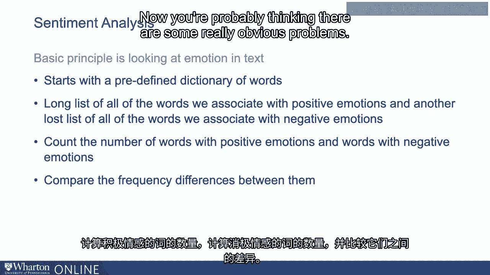
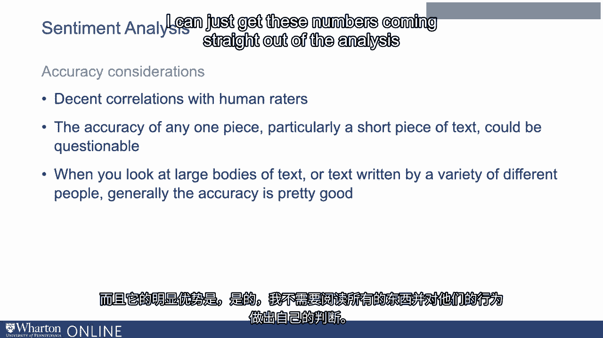
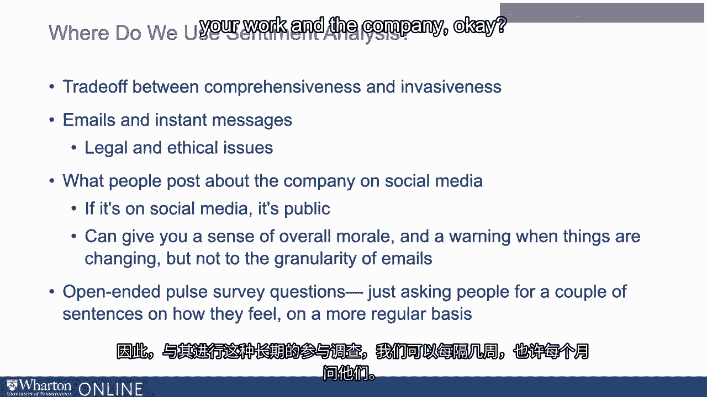

# 沃顿商学院《AI For Business（AI用于商业：AI基础／市场营销+财务／人力／管理）》（中英字幕） - P74：11_AI与员工参与度.zh_en - GPT中英字幕课程资源 - BV1Ju4y157dK

 Companies care a lot about engagement because they think more engaged employees are likely。

 to be more motivated and work harder， perform better， and they're more likely to stand。

 So this has been something companies focus a lot of attention on managing and therefore。

 trying to measure。 And so I pointed out kind of the key way organizations have done this in the past is。

 using annual surveys。 Are there other approaches that we can take to do this？ Yes。

 this is one of the areas where people are starting to explore using machine learning。

 How does that work？ Well， in order to understand how these algorithms work。

 I actually think it's quite useful to， think about how we might do it。

 So suppose you're a manager and you want to assess the engagement of each of your subordinates。

 without using a survey。 Basically just figure out in a good mood or in a bad mood who's excited。

 How would you do it？ One of the first things you do and the most obvious is just listen to them when they're。

 talking。 Are they complaining a lot？ Are they saying that work's exciting and they're pleased by it？

 Or are they kind of a little bit more withdrawn as most of what they're talking about the。

 downsides of their work？ Just by tracking that， that's probably the first way that you would try and figure out。

 are people engaged。 It turns out that these sorts of things are things that machine learning does very well。

 And so what I want to talk about in terms of tracking engagement is using machine learning。

 to in a systematic way， work through what employees are saying， talk about two approaches。

 So one is sentiment analysis and the second is topic modeling。

 So let's start with sentiment analysis。 The basic principle of sentiment analysis is taking text。

 any text and trying to figure， out the emotional content of that text。

 Is it text that talks about people being happy？ Is it text that talks about people being sappy？

 So again， before thinking about the computer， suppose you needed to train a friend to do， this。

 Suppose you collected a whole bunch of descriptions of your employees of their work where they。

 talk about how they're feeling about it。 And you want your friend to tell you how many of them are pleased with their work and how。

 many of the disengages。 Now， suppose also that your friend had literally zero emotional intelligence。

 right？ Maybe they're an academic， right？ So they find it hard to do this without really explicit instruction。

 How could you get somebody who really doesn't have this emotional intelligence to figure， it out？

 Well， what you'll probably end up telling them to do is just。 Okay。

 let's look at all of the words in their descriptions that describe emotions。

 Some of those words are going to be about positive emotions。

 They're going to talk about being happy or excited。 Other words are going to be negative。

 They're going to talk about being frustrated or disappointed。

 And so we could just even just count all of these words and then compare their frequencies。

 where people are using a lot more happy words。 You know， they were using words like， "Please。

 excited， engaged。"， If they're American， probably they'll describe themselves as stoked。

 If they're using those sorts of words， then we're pretty sure that they're feeling engaged。

 And this is the basis of sentiment analysis。 So what it does is it starts with a predefined dictionary of words。

 So it has a long list of all of the words that we associate with positive emotions and。

 another long list of all of the words that it associates with negative emotions。

 And so any piece of text， any answer to a question that you want to code in this way。

 it will just go through， count the number of words， positive emotions。

 the number of words with negative emotions and look at the differences between them。 Now。

 you're probably thinking， there are some really obvious problems with doing this。

 What if somebody says they're not happy？ How do you code that？

 So usually these algorithms are sophisticated enough that， you know， things like if there's。

 not before it， either we ignore the word or we reverse its meanings。 Obviously that's not perfect。

 You can imagine there might be some contorted examples。 You know， if I say I'm inadequately excited。

 you know， is it going to catch that's a negative， thing or not？ Hard to tell。 So yeah。

 there's going to be some error there。 We can also imagine there are differences in how people express themselves。

 You know， if you're British and you say the works fine， you're actually quite excited。

 If you're American and you say the works great， it basically means here。 It's okay。 And so kind of。

 you know， not only do you see these national differences， but obviously， kind of between people。

 there are differences。 Some people are always exuberant and say， you know。

 being able to control for those people， is hard。 And so that's also going to lead to inaccuracies。

 And then the third thing， just with the surveys， we can imagine people might be strategic。

 particularly if they know that we're going to be looking at what they say to figure out。

 how engaged they are。 The question may be less how engaged at my and more how engaged do I want people to think。

 I am？ I say， there are definitely problems with this。 I mean， when you look at it。

 people have tried to validate these kind of analyses， basically。

 use these algorithms to code the sentiment of text and then get human raters to do the。

 same sort of coding。 Actually， when you do that， you do see quite good correlations between what the computer。

 says and what people say。 You know， my sense with this is that ultimately， you know， any one piece。

 particularly a fairly， short piece of text， there could be all sorts of errors in it。

 But when you look at large bodies of text， when you look at， you know， what's been written。

 across people， generally the accuracy that you get by these methods is really pretty good。

 And the obvious advantage of it is， yeah， I don't need to read everything and make my。

 own judgment about what they're doing。 I can just get these numbers coming straight out of the analysis from the computer。

 So sentiment analysis is just a tool。 It's a way of coding text for emotions。

 The obvious question we want to ask ourselves is if we're planning to use this to understand。

 how engaged our people are， what text are we going to use？

 It could be anything that they've written， but where are we going to find it？

 In thinking about where to use sentiment analysis， I think that there's kind of a trade-off。

 between say， comprehensiveness and sense of invasiveness by the employer。 So， yeah。

 if I really want to know when people are excited or not， probably the best thing。

 I could look at is their emails and instant messages， right？ I mean。

 these days within the organization， a huge amount of our communication happens。

 electronically and to mediate it， right？ And so all of that data is there。

 We could easily run sentiment analysis through everything that people have written to kind。

 of get a sense of， you know， how excited are they feeling？ How is that changing day-to-day？

 Which groups are exhibiting more engagement？ Which groups are exhibiting less engagement？

 You do see there are some tools out there， for example， to look at Slack messages and。

 develop these kinds of analyses。 Should we do it？ Next。 I mean， certainly， I think。

 on a legal standpoint， within the US， we're fine。 I think there's no expectation of privacy around emails。

 other things that people work， right on work technology。 So we ought to be okay。 Ethically。

 I think in some organizations， they would have no trouble doing this。 In other organizations。

 people might see it as a big violation of privacy。 And so it is certainly， I think。

 once you start going through what people are writing， at this kind of level。

 making sure people understand what you're doing with their data。

 and making sure people are comfortable with it， I think it's important to maintain their， trust。

 So you can do this whether you should， probably organizations specific。

 There are other ways that we can use it。 So you can also use it to think about what people are posting about the company on social。

 media。 Now， I think this is more fair game， right？ I mean， if it's on social media， by definition。

 it's public。 And so looking through what people are posting about the company can give you a decent sense。

 of overall morale。 Obviously， you're getting less information。

 We don't have the kind of granularity of emails of being able to see across different。

 groups and across time。 We just have less data。 But it's a sensible thing to look at。

 Another place where people often use this is actually just asking people how are you feeling。

 about your job。 And so rather than doing these kind of long engagement surveys。

 we could ask people every， few weeks， maybe every month， but you know， some writers。

 a couple of sentences about， how you're feeling about your work and the company。

 Okay， that open text， it's easier for them。 It provides us much richer information。

 And one of the first things we can do is just do a quick coding of all of it。 So， you know。

 what's the overall satisfaction that we're seeing here？ One of the nice things about this text。

 it doesn't just lend itself to sentiment analysis， though。 But asking people how they're feeling。

 it also gives us more leverage to try and figure， out why they're feeling。 I'll say。

 what are the themes that come out of this？ The downside is now we may have thousands and thousands and thousands of these sentences。

 from which we're trying to extract those themes。 So that is a great task for a second tool that I want to talk about。

 which is topic modeling。 [BLANK_AUDIO]。

