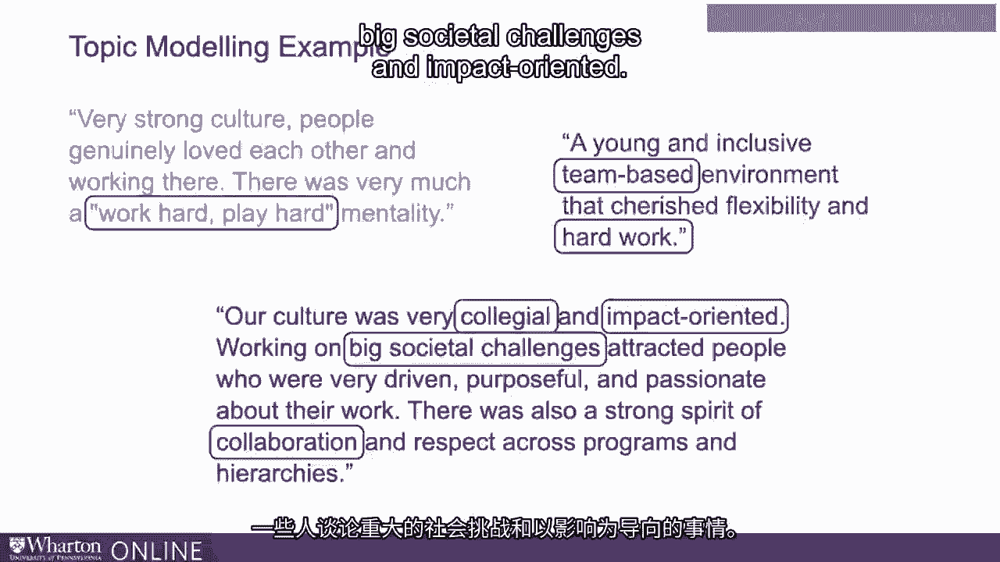
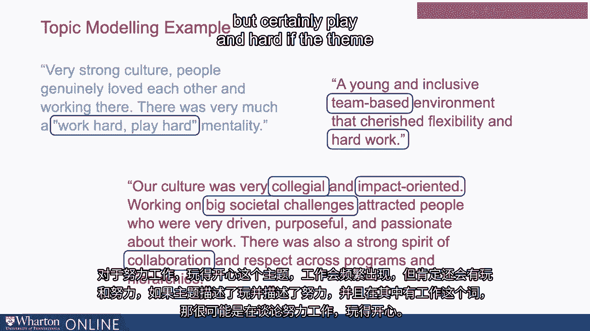
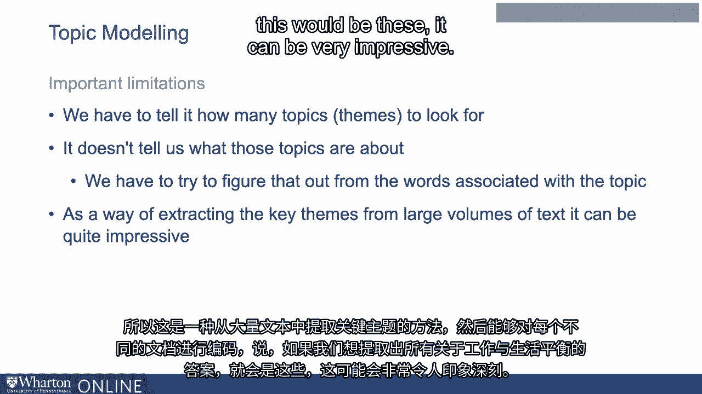

# 沃顿商学院《AI For Business（AI用于商业：AI基础／市场营销+财务／人力／管理）》（中英字幕） - P75：12_主题建模.zh_en - GPT中英字幕课程资源 - BV1Ju4y157dK

 Topic modeling is a second technique for extracting meaning from text data。

 With sentiment analysis just gives you a kind of value， positive versus negative。

 topic modeling is about trying to figure out what are the different themes being talked about。

 in large bodies of text and being able to code each of the different pieces of text。

 to tell you which theme is present。 How do we do this？

 I think to understand again it's useful to think about if you were just telling a friend。

 who was zero emotionally intelligent academic， we're trying to explain to them， how do you do this？

 How do you go through all this text and extract the key themes？ What might you do？ Actually。

 as a nice example here， in one of my classes I asked my students to write a very。

 short description of the culture of the last organization that they worked at。

 So I've got a few of them here。 So imagine that our task was to figure out what are some of the main dimensions。

 along which people describe organizational culture？

 What are the things that come up frequently when they describe the culture？ What would we do？ Well。

 we can read through these。 And after reading through them we can start to see are there some common themes that emerge？

 I think there are。 So for example， a couple of them talk explicitly about work hard play hard。

 so that seems to be a dimension。 Another thing that came up a lot was kind of collegiality。

 so people talk about being collegial， collaborative， one of those sorts of things team based。

 you know， maybe impact。 It would be another one， someone talks about big societal challenges and impact oriented。

 So you start to see some themes emerge。

 So what we do is we start to list those themes。 Now， our friend is wondering， okay。

 but I see those in a few。 I've got to go through like 500 or 1000 of these。

 and I've got to figure out， you know， how many of them are talking about collaborativeness。

 how many of them are talking about work hard play hard。 How do I do that？ Let's say to them， well。

 let's take each of these themes。 And for each of these themes。

 what we can do is we can build a little dictionary。 Okay。

 we can identify words that are associated with it。 So for the work hard play hard， well， you know。

 work is going to appear a lot， but certainly play and hard。

 If the theme describes play and it describes hard and it has the word work in there as well。

 that's probably about work hard play hard。 For collaborative。

 we're going to use words like collaborative， collaborate， team， collegial。

 all of those sorts of things。 Okay， and so for each theme。

 we can create a set of words that are associated with it。

 So that's the basic of what topic modeling does。 So what it does。

 it assumes that when we've got lots of different documents and lots of descriptions of the culture。

 or their work or something， the people described， each of those documents will contain a finite number of topics。

 So there's a few themes that occur in each of them。

 So one person describing the culture will talk about work， life。

 balance and impact somebody else might talk about it being collegial and hard work。

 Each document has only a couple of topics， small number of topics。

 and each of those topics is associated with a number of words。 And so again， if it's collegial。

 those words are things like team， collaborate， collegial and so on。 Okay。

 now we don't actually see the topics， right？ If you think about what the computer sees。

 it sees all the texts。 So it sees， you know， here's each document。

 and each of those documents has a set of words associated with it。

 But it then tries to figure out what a set of associations between topics and documents。

 and between words and topics， would be most likely to lead to this distribution of words across topics。

 Okay， and so it uses just all of the words in the documents to try and figure out which words belong together in topics。

 and in which of these topics is present in each text。 Okay， so that's all that it's really doing。

 It does have a couple of important limitations， so I said that， you know， we have to。

 the computer doesn't see the topics， it figures them out。 Actually。

 it can do that for an infinite number of topics。 And so what the computer doesn't do a good job of telling us is how many topics are present。

 And so one thing we usually have to do is tell it， okay。

 let's say there are 15 ways of describing culture。 If there are 15 ways of describing culture。

 what words would be associated with each of those different themes。

 and which document would contain each of those different themes。 So that's one limitation。

 We have to tell it how many topics to look for。 The second limitation is。

 doesn't actually tell us what those topics are about， right？

 So it just tells us there is a topic that appears in these documents and has these words associated with it。

 So what we end up doing is looking at all of the words associated with the topic， saying， okay。

 these are all the words， this has to be what the topic is about。

 So it's a little fussy to do it in practice。 But I have to say， I've tried it a few times。

 sometimes it works well， particularly in large documents。

 And so it's a way of extracting kind of key themes from large volumes of text and then being able to code each of those different documents。

 and say， okay， this aren't， you know， if we want to just pull out all the answers that talk a lot about work-life balance。

 this would be these。 It can be very impressive。

 There's a nice example of this that was done in a study by some people at Stanford， and Berkeley。

 when they try to measure culture across organizations。

 I don't know how many of you have come across the website Glassdoor。 So what Glassdoor is。

 is it's a website where you can go and basically write about your company's culture。

 what it's like to be employed there。 And so the idea is that it's mainly for job seekers。

 so you can find out about every different organization。

 because in order to learn about other organizations， it encourages you to describe your employer。

 Which is really cool because what it means is suddenly we have millions of people who've written about their employers。

 And so we can start to see what do they write。 And so in this study。

 what they did was they basically just pulled out every sentence that contained the word culture to try and understand。

 Again， when people write about culture， what are they writing about？ They， I think。

 used about a hundred topics。 They said there were probably a hundred different dimensions of culture。

 And what I've got here is some examples of the topics that they came up with and the words associated with them。

 And we can see some of them work really well。 So for example。

 if you have a topic on hostile management， what are the words associated with it？ Well。

 obviously management and employee， that appears quite a lot with them。 It's like hostile。

 unprofessional， abusive， favoritism， bullying， bad， horrible， rude disrespect。

 It seems like this is picking up a very clear theme。 If you look at work-life balance。

 work-life balance， good， healthy， flexible， personal， some of the other seem a little stranger。

 But again， you kind of see it throughout， it's picking up similar words。

 And so you were able to start to pull out a bunch of these themes from different texts。

 And so this is how we can use topic modeling in practice。

 So we can ask our employees in pulse surveys and other kind of short questions。

 Just tell us a little bit about what you're liking and what you're not liking。

 What would you like us to know？ Get fairly short answers from them。

 Then we can end up with multiple thousands of these in an organization。 By running topic modeling。

 we can very quickly identify for all of those thousands what are the themes that appear？

 How common are those themes？ By looking at it over time。

 we can look at things like how are themes changing？

 Which themes are becoming more common and less common？

 Which themes do we see kind of being more common in each department？

 And so not only can we kind of talk about the sentiment。

 but even get a sense of what people are worried about。

 and do this at scale over time in a way that yes， we could pay somebody to go through and read all of them。

 But we can do it so much more quickly and so much more effectively。

 And so when it comes to how we track engagement， machine learning has opened up some really interesting possibilities。

 particularly when it comes to finding different ways to get a sense of what people are feeling。

 So with sentiment analysis， we have a great way of taking any form of text that people are writing。

 and getting a very quick pulse check on what's the overall level of positivity。 With topic modeling。

 we can go way beyond that when people are filling out surveys， doing other things。

 giving us open text and give us a great way to analyze that text and very quickly pick out the key themes。

 that are most common and see how those are changing。

 These applications I would say are still kind of in the early days you're seeing a number of companies starting to employ them。

 particularly when it comes to things like topic modeling to analyze text。 But in the future。

 I think there can be a very valuable tool when it comes to tracking engagement。

 and a nice compliment I would say to some of these kind of more arduous annual surveys that we continue to see。

 [ Silence ]。

