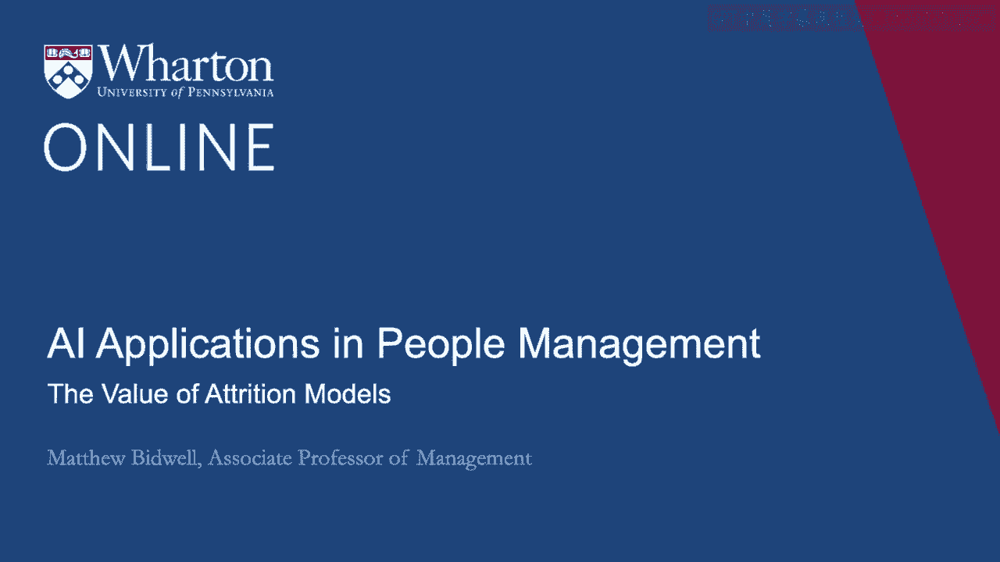
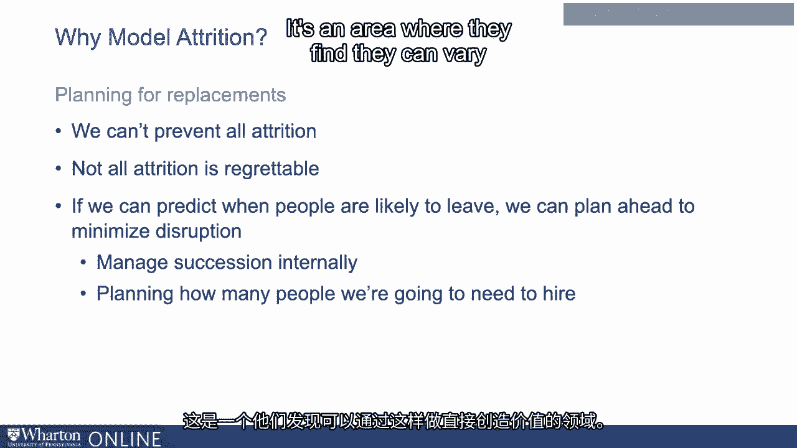

# 沃顿商学院《AI For Business（AI用于商业：AI基础／市场营销+财务／人力／管理）》（中英字幕） - P78：15_流失模型的价值.zh_en - GPT中英字幕课程资源 - BV1Ju4y157dK

 So there's an awful lot of interesting data that we can use to build these attrition models。

 It's probably worth spending a couple of minutes， just talk about， okay。

 you built your fancy attrition model。 What do you do with it？ Is it worth the effort？ Yes， I mean。

 I think a lot of organizations have done this， and they see it as one of the most valuable uses of machine learning in the field of managing people。

 Why？ Kind of three things that it allows them to do。

 So the first is just giving more insight about the levers that affect turnover。

 When we know more about the factors that really do predict attrition versus those that don't。

 we can start to see what are some of the things that we can do。 So， for example。

 I think a number of organizations that have used these approaches have found it's really started to focus their attention on the experiences of employees right at the beginning of their employment。

 It's one organization， for example， that did some of this analysis and found that whether or not a manager scheduled a one-on-one with a new subordinate in their first week was a pretty strong predictor of whether that person would stay。

 obviously。 Those managers that weren't scheduling the one-on-one that had people then go on to leave。

 A second similar insight from a different organization。

 they found that when somebody's new team sent someone down to collect them from new hire orientation。

 that hire was more likely to stay than when the new hire was expected to find their own way to the group。

 How much of that is exactly about those activities versus kind of a broader signal of how welcoming the team is。

 Either way， it's strongly suggested to organizations that thinking seriously about how they onboard people。

 what they do in the early stages， is important for attrition。

 Tell us more about the levers that we can pull。 The second thing that these tools do is they allow for early intervention。

 If we know more about who's a flight risk， then we know more about who we really need to focus on to make sure they stay。

 The idea here is that our models tell us whether people are at risk of leaving。

 A lot of those people actually have made up their mind to go。

 so we may be able to persuade them to stay。 Particularly if we flag somebody。

 this person we see is kind of having a higher than average probability of attrition。

 If there's a manager， we look at that and we say， "I don't want to lose this person。

 This person is going to be costly to lose。"， That's a good time to take action。

 A lot of organizations talk about doing a stay interview。

 The idea I mentioned earlier when people leave often。

 we do an exit interview to understand why they're left。

 The idea of a stay interview is we do this earlier to understand what would it take to make that person stay。

 Understanding their needs， understanding how they're feeling about the organization。

 what we can do to make it more attractive for them can often be effective。 IBM， for example。

 used a nutrition model combined with a program of really reaching out to managers。

 have them proactively work with people to retain them。

 They claim that they saved over $300 million from doing this。

 These proactive interventions based on flight risk models can be effective。

 The third thing that you can do is obviously planning for replacements。

 We can't prevent all attrition。 And to be honest， it's not clear we want to prevent all attrition yet。

 Most attrition is bad for the organization， but some people will look at some people leaving and say。

 "Yeah， that's not necessarily regrettable。 I'm okay with that person leaving。

 I'm maybe okay with them leaving， but it's still going to be disruptive。"。

 If we understand more about when people are likely to leave， we can start planning ahead。 And hence。

 when we start thinking about things like managing success internally or even planning how many people are going to hire。

 being able to understand what the likelihood is of different people leaving。

 how many people we expect to leave can also help us with staffing plans。

 Help us figure out how many people we need to bring in and reduce some of the gaps that would otherwise occur when that attrition takes place。

 A lot of organizations are working on the machine learning models of attrition。

 and it's an area where they find they can very directly create value by doing so。

 [silence]。

