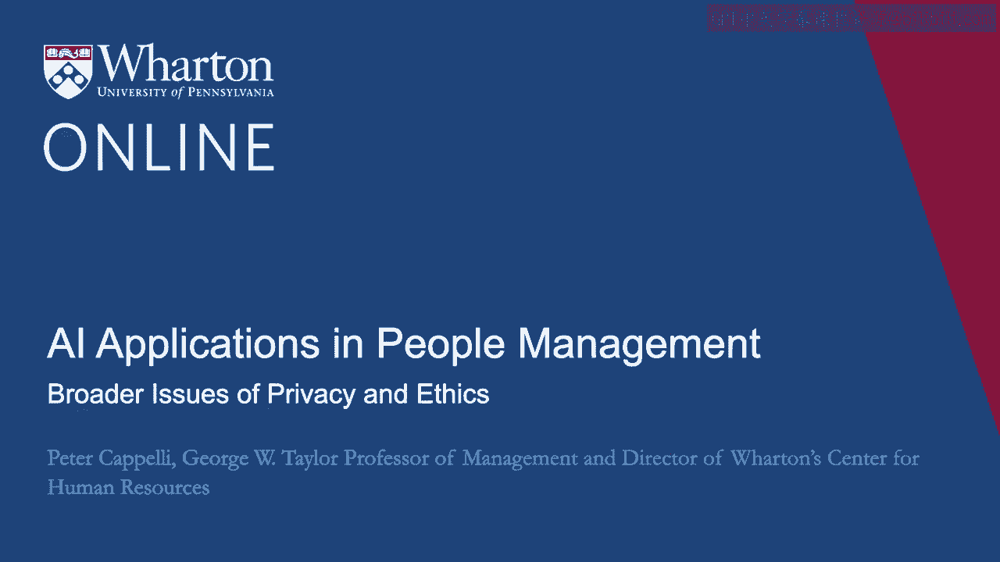
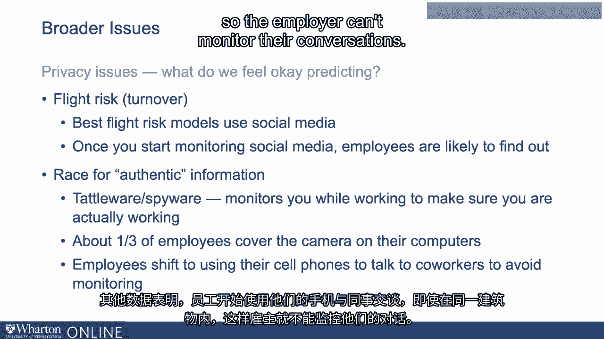
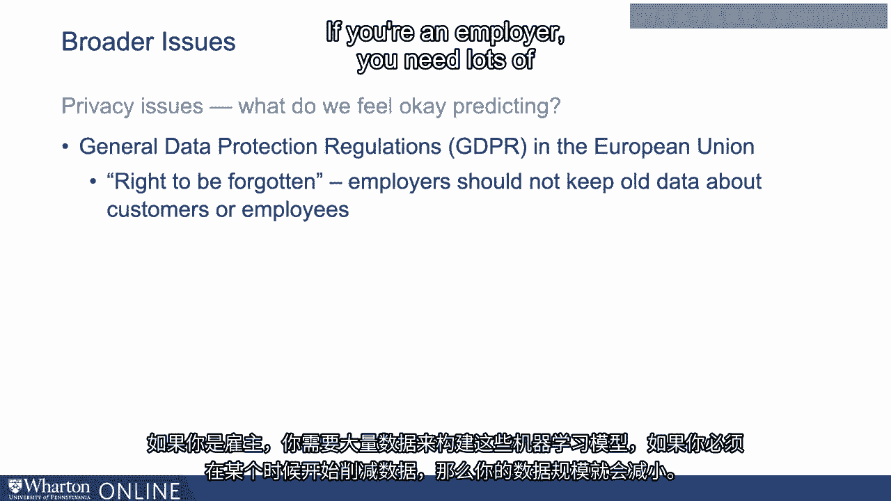

# 沃顿商学院《AI For Business（AI用于商业：AI基础／市场营销+财务／人力／管理）》（中英字幕） - P82：19_更广泛的隐私和伦理问题.zh_en - GPT中英字幕课程资源 - BV1Ju4y157dK

 So let's talk about some of the broader issues around using data science and artificial intelligence。

 generally in the workplace with managing people。 These are issues of ethics， also issues of privacy。

 So let's talk about some of these and what they look like。

 So let's take a simple one and go back to our hiring example before。

 And this is a little story that I borrowed from our colleague， Jeff Poulter。 And this is it。

 So let's say you're making a hiring decision in your organization and this is somebody。

 to work for you， your vice president， this person's going to be a director。

 And you have an internal candidate， somebody who works in your unit and you like this person。

 quite a bit。 You think they're pretty good。 Human resource people have said， you know。

 there's another candidate for this position， who does the same job as your candidate。

 but in another part of the organization。 So you don't know this person。

 But their experience base is kind of the same。 So there's your person is the other person。

 So you interview the other person and they interview well and you're aware that you might。

 have a bias toward the person who works with you a little more now， your candidate。

 You think the other person seems to be good， but you still like this， your first person。

 And you recognize maybe this is just because you are familiar with it。

 Then human resource calls you and they say， you know， we got this algorithm to predict。

 who will succeed in this job。 And your candidate is an 82% fit with the algorithm that is the best performers。

 And this other candidate we want you to look at is a 92%。 How are you going to decide？

 You got your candidate who you know already and you like them a little better， but you。

 know that's probably a bias。 The other candidate who looks roughly identical。

 you've interviewed them， they seem fine as， well， but they have a higher score in the algorithm。

 Which one you going to pick？ Well I've asked this a lot to lots of different people。

 And one of the things that I've learned is almost everybody picks their own candidate。

 So then I twist it a little bit and say what if it isn't 82 to 92。

 Because it's 80 to 95 and almost everybody makes the same decision。

 They go with the candidate that they already know。 So what's the punchline of this？

 I ratcheted it up， you know， to like 100%。 You know。

 this is like a perfect fit and people still want to go。

 Almost everybody wants to go with the candidate they know the best。

 And I think the lesson from this is it's a reflection of the fact that people want， to have a say。

 And they feel that they ought to be able to pick the person that they want。

 If on the other hand you're the CEO of the company and you're leading it， you might say。

 what we want is the best person for the job here and not somebody that you personally like。

 Well this is an example of the kind of fight that we are going to have if we introduce data。

 science。 We have situations where people have had a say before and maybe they feel that they should。

 have a say and you're going to take that away from them。

 When we look at issues like for example promotion or assignment to jobs or schedules， one of。

 the things that this bites the most on are the decisions that supervisors have。

 This is the point where supervisors otherwise have a great deal of control。

 And one of the things we've learned before about management is that good relationships。

 with supervisors are built around kind of a exchange。

 Supervisors says if you help me out on this thing， I'll see what I can do for you on the。

 promotion or I'll see what I can do for you on wage increases， et cetera。

 If you turn decisions over to the algorithms， they might optimize on some dimension but you。

 start to erode that relationship between supervisors and subordinates and in that context maybe。

 you're weakening the whole system， at least the way things have worked before。

 There's some other issues as well， let's talk about some of those。

 One of them is that algorithms generate a score based on the entire sample that they're， looking at。

 But if you broke the sample up a bit by some demographic attribute， you might find that。

 the algorithm gives systematically different scores to different groups。 So for example。

 algorithms that are used to make parole decisions， I didn't know this。

 until about a year ago but a lot of locations in the US now， a lot of governments are using。

 algorithms to try to decide who should get parole and who shouldn't。

 So the measure there is recidivism。 Does the parolee make it successfully into normal society or do they stumble back。

 violate， their parole and end up back in jail？ Which is something that you would think an algorithm would be really good at because。

 the measure of outcome is pretty clear here。 When they looked at these measures though。

 in these algorithms， one of the things they， discovered was the scores were systematically different for African Americans and for whites。

 And so you might say， "All right， we know that， we'll deal with it。

 We need a separate model for African Americans and a separate model for whites。"。

 The problem is the law doesn't allow you to do that because you're treating people differently。

 based on race。 And so at least at this point， the courts and the law have said， "Can't do that。"。

 And this is a more general issue and that is that the law lags practices by quite a bit。

 and in this case， most of these issues about what algorithms might do that confront what。

 the law says or conflict in various ways have not been adjudicated。 But right now。

 and maybe at some point the law will say， "Yeah， it's fine to have different。

 algorithms but at this point you can't do them。"， So there's a number of these issues where we bump up against how the algorithms work。

 and things that we might believe are reasonably objectively more fair。

 Now the thing that we hear maybe the most about are privacy issues because in order to use。

 data science， we need data and we need lots of it。 So let's think about examples here。

 One of the things in data science or a particular tool that's been quite popular is to measure。

 what's known as flight risk or we used to call this just turnover。 When will people quit？

 And you can estimate using data science the probability that a person will quit。 By the way。

 this is not new back in the 1960s。 There was software that used to do roughly the same thing inside companies。

 But you can do it better now。 And the best of these flight risk models use social media。

 What does that mean？ Well， if you've updated your LinkedIn profile， for example。

 that is a proxy for people who， are starting to look for a new job。 What you post on social media。

 on Facebook or other places， if you start posting information。

 that suggests you're starting to look， flight risk goes up。 Looking at your email traffic。

 for example， and seeing where it's going， your sentiment， analysis。

 if we start listening to you or reading your emails and see negative things， about the company。

 we could probably get a pretty good measure of your flight risk， building。

 a machine learning model from that。 The problem is a lot of people find that creepy。 To do that。

 we're listening to your email， maybe listening to your phone calls， we're。

 reading your social media， all that stuff。 Well， maybe it is。 If you look， for example。

 at reading email， this seems to be something that companies， are quite sensitive about。

 Although about， I think some of the data I've seen say about 40% of employers admit that。

 they're reading it。 In fact， virtually all of them are monitoring email。

 They're looking for keywords that started years ago when they were looking at offensive。

 email and keeps changing what the definition of offensive is。 So they're scanning it。

 literally reading it。 Well， probably not。 Many doing that。

 But if 40% say that they are monitoring the email traffic， when you ask the IT people， in companies。

 two-thirds of them say that their companies are reading email。

 So this is a bit of a quibble as to what counts as reading。

 One of the complications as well is once you start using something for employment purposes。

 like social media， I'm quite likely to find that out。

 So one of the things that the internet has done is that it's made employee screening reasonably。

 transparent in the sense that as soon as I finish my interviews with your company， I。

 go online and I tell people what the questions were， all that sort of stuff。

 So people are going to learn this。 And once I realize that you're looking at my Facebook pages and some employers ask to。

 access， ask you to friend them so they can see what's on your Facebook pages。

 Once I know that's coming， I just change what's on my Facebook page。

 Down go my spring break pictures， up go the pictures of me tutoring kids。

 And then it's no longer very useful， or at least it's not useful in quite the same way。

 So there's kind of a race that's going on with respect to authentic information as。

 employers and vendors continue to try to find revealing information about you that you're。

 not kind of gaming。 But as soon as I learn that that's what you're trying to do。

 I start to try to game it as， well。 So all this relates to these questions of privacy。

 We've gotten a boost these issues during this period here， during the pandemic， where lots。

 of companies have people working from home。 And some of those companies have made big investments in what's known as Tattleware or。

 Spyware， which basically is kind of monitoring you while you're working to make sure that。

 you're actually working。 They're probably counting your keystrokes and things like that。

 They can see where you're going。 Really they're seeing whether you're goofing off on your computer or not。

 Well， other data says that about a third of employees cover their cameras on their computers。

 so that the employer cannot see if they're actually sitting at their desk。

 Other data suggests that employees shift to using their cell phones to talk to their， co-workers。

 even in the same building so the employer can't monitor their conversations。

 So it's this kind of little game that's going on as each side tries to get privacy on the。

 part of the employee ease trying to monitor based on the employer's。 This privacy issue， of course。

 has led to regulations the best known of these are the。

 general data protection regulations in the European Union。

 They have a series of rights that employees have。 Employers confront these especially with trying to move data about employees across jurisdictions。

 So if you have employees around the world， some of them in the EU and you want to take。

 the data from them to build a general model about your employees and things like turnover。

 and things like that， you bump into those regulations。

 The one that is maybe the most popular in terms of discussion is one called the right。

 to be forgotten。 And the right to be forgotten basically says that employers should not keep old data around。

 particularly about customers， but also about employees。

 And if you're an employer， you need lots of data to build these machine learning models。

 And if you have to start shedding it at some point， it reduces the size of your data。

 California now has its own version of basically the European Union's data protection rights。

 And it won't be long until we start seeing state by state。 In the United States。

 these regulations popping up。 Illinois has already got some。

 So the privacy issues matter for ethics issues， but they also matter now for legal issues。

 And this is maybe the most stark situation where data science confronts the complexity。

 of the workforce， where these questions of fairness are embedded in laws and regulations。

 [ Silence ]。

