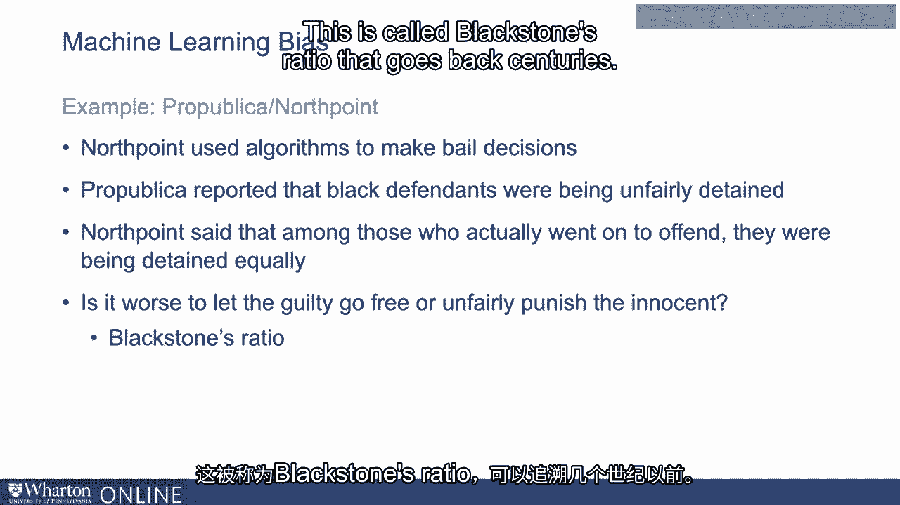

# 沃顿商学院《AI For Business（AI用于商业：AI基础／市场营销+财务／人力／管理）》（中英字幕） - P88：25_偏见很难管理.zh_en - GPT中英字幕课程资源 - BV1Ju4y157dK

 It's relatively easy to understand why bias can arrive in algorithmic systems， but it。

 can be quite difficult to manage bias that arises in these systems。

 The reason for this is that when thinking about how to deal with bias， it often involves。

 value judgments which require a holistic view。 It's not clear that it's a technology problem or a data problem。

 When you think about how we want to address the problem of bias that's arising in an。

 organizational context， it often really requires a holistic view of the organization and thinking。

 deeply about organizational priorities。 This， of course。

 can span multiple different decision-makers， not just a single developer， or data scientist。

 This is why it becomes complicated to deal with。 One example that's fairly high-profile was the example of ProPublica and Northpoint。

 This was an example where an algorithm was developed by Northpoint where you were being。

 used to make bail decisions。 The algorithm in this case was being used to predict whether somebody was likely to。

 re-offend or not。 ProPublica， which is a journalistic organization。

 looked at this algorithm and alleged that， black defendants were being unfairly detained in this case。

 Northpoint said that among those who actually went on to offend， they were being detained。

 at equal rates。 It turns out if you look at these two different statements that black defendants are being。

 unfairly detained and that among those who offend， they were being detained equally， it。

 turns out that both were correct in their statements， but they're basically saying different。

 things about values。 What they're asking fundamentally was the question of is it worse to let the guilty。

 go free or to unfairly punish the innocent？ This is of course a very old problem。

 This is called Blackstone's ratio that goes back centuries。

 It's a deep philosophical problem and if we ask a hundred people how they feel about this。

 we'll get a variety of different examples。 What it illustrates though is that this isn't a data scientist problem or an algorithm。

 problem。 It's really a much deeper problem that requires prioritizing some of our values in terms of。

 society or in terms of business。 In the HR example。

 we may be thinking about how a machine learning algorithm evaluates。

 candidates or evaluates people within the organization and it may have implications for productivity。

 It may have implications for bias and for inequality， but weighing the costs and benefits。

 of these different things has really deep organizational implications and requires a number of trade。

 offs that again require a fairly holistic view of organizational priorities。 [BLANK_AUDIO]。

