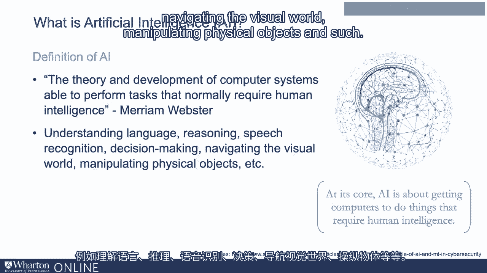
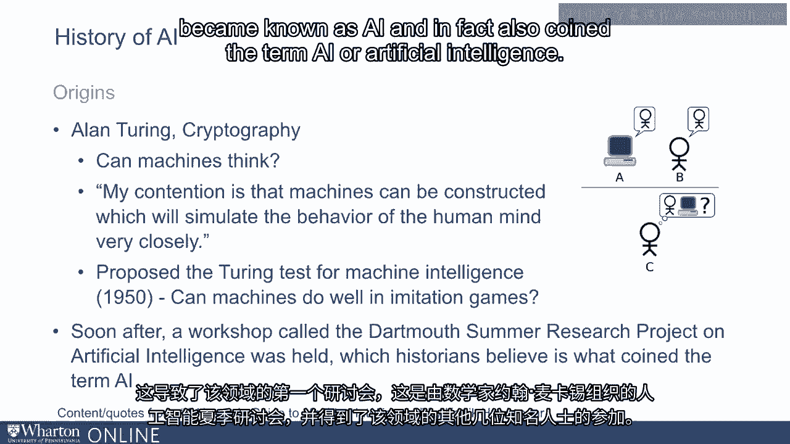

# 沃顿商学院《AI For Business（AI用于商业：AI基础／市场营销+财务／人力／管理）》（中英字幕） - P8：7_人工智能简介.zh_en - GPT中英字幕课程资源 - BV1Ju4y157dK

 In this module， we'll talk about artificial intelligence。

 We'll begin with a brief overview of AI。 We'll then dive into a subfield of AI known as machine learning。

 We'll start with a high-level view of what exactly is machine learning and then we'll。

 dive into some specific machine learning methods。 With that。

 let's start by talking about what exactly is artificial intelligence。

 Artificial intelligence or AI is a term that refers to。

 the development of computer systems that are able to perform tasks that normally require。

 human intelligence， such as understanding language， reasoning， speech recognition， decision making。

 or navigating the visual world， manipulating physical objects and such。

 When we talk about artificial intelligence， there are many kinds of AI。 For example。

 one can think about weak AI and strong AI。 Weak AI， also known as artificial narrow intelligence。

 is the kind of AI that is very good at a very specific task。 For example。

 you might have a chess playing AI that can probably beat the world's best， chess grandmaster。

 but it is only good at that one task。 The same AI probably cannot converse with us。

 It probably cannot recognize images and so on。 Similarly。

 you might have AI that is good at product recommendations， but is not good。

 at chess or recognizing images。 In short， these are AI that are good at one narrow task。

 Most of the AI around us tend to be weak AI， but the goal of the field is eventually to。

 build what is known as strong AI or artificial general intelligence。

 This is a computer program that could do all intelligent things that a human can do。

 And so this kind of AI would be truly intelligent and would be close to a human being at a wide。

 range of tasks。 And finally， you have the notion of artificial super intelligence。

 This is an AI system that is a strong AI。 It's as good as humans at a lot of tasks。

 but it has the ability to leverage its computational， resources to store more data。

 to analyze the data faster and make decisions faster， and。

 therefore can perhaps beat humans at many tasks。 And that is the idea of super intelligence or AI that is better at humans at most tasks。

 The history of AI is very recent。 The field owes its origins to a paper written by mathematician Alan Turin。

 who asked the， question， can machines think？ Having had the contention that machines can be constructed which can simulate human mind。

 very closely。 In fact， he proposed a test which is known as an imitation game or also popularly known。

 as the Turing test for machine intelligence。 In the test。

 a human judge interacts with two computer terminals。

 One of the computer terminals is controlled by a computer and the other terminal is controlled。

 by a human being。 The judge interacts and has a conversation with each of these through the computer terminal。

 If the judge cannot distinguish between the human being and the computer system， then。

 that computer system is said to have passed the Turing test。

 Now when Alan Turin proposed the Turing test and posed the question， can machines think？

 It created a lot of interest in the field and it led to one of the first workshops in。

 the field which was a summer workshop on artificial intelligence that was organized by mathematician。

 John McCarthy and was attended by several other luminaries of the field。 At this workshop。

 the scientists laid the foundations for a field that became known as。

 AI and in fact also coined the term AI or artificial intelligence。

 The scientist Pedro Domengo's believes that calling this field AI made it very ambitious。

 but it also helped inspire many people to enter the field and that has been responsible。

 for a lot of progress that the field has made。

 Now a lot of the early attention in AI often was focused on whether AI could beat human。

 beings at games。

 For example in 1997 IBM created a chess playing computer called Deep Blue which ended up beating。

 the world number one chess player at the time Gary Kasparov， three and a half points to two。

 and a half points。 This system had no machine learning in it meaning it was not capable of learning on its。

 own without being programmed。 Its edge relative to human players came from its brute computing power。

 its ability to analyze， more than 200，000 moves per second and figure out the best possible move。

 In 2011 IBM created IBM Watson which beat Ken Jennings and Brad Rutter who were two of。

 the best all-time players of jeopardy。 IBM's Watson had machine learning in it which was capable of understanding language meaning。

 understand the question that's being asked that was able to retrieve information from。

 a large database of information and then answer the question that was supposed to it。

 More recently Google created software known as AlphaGo to play the game of Go。

 Go is a strategy game like chess but is much more complex than chess which implies that。

 brute computing power alone is not sufficient to beat a human being。

 You require something more than brute computing power and you require the ability to learn。

 and is a better yardstick for intelligence。 Google used some of the latest machine learning techniques in creating AlphaGo and AlphaGo。

 had great success in playing human beings and in fact beat the world go champion lease， error。

 There are many ways to build artificial intelligence。

 The old way of building AI is an approach known as knowledge engineering or also referred。

 to as expert systems。 This is the idea of programming knowledge or capturing and transferring knowledge to the。

 computer system。 For example if we wanted to build software to diagnose diseases we might interview doctors。

 and codify the rules they use to diagnose diseases。

 For example a doctor might tell us that if a person or a patient has had fever for over。

 a week and they have body aches and chills then they might start to consider antibiotic， treatment。

 Now that's a rule that they might give us and we might program many such rules to diagnose。

 diseases。 Similarly if we wanted to drive cars we might interview thousands of drivers and ask them。

 what are the rules they use to drive cars and they might give us rules such as when the。

 car in front of us slows down we might apply the brake and slow down ourselves。

 If the car in front of us is going very slow we might change lanes and so on。

 Now ultimately we can create reasonably intelligent systems using these kinds of techniques and。

 in fact we have found over time that expert systems do reasonably well。

 But over time we have also observed that expert systems are often not able to beat human beings。

 at complex tasks that require intelligence。 For example a system used to diagnose diseases can do reasonably well but it cannot often。

 beat doctors in terms of diagnosing diseases as well。

 This is because of a limitation that's referred to as Polani's paradox。

 Polani was a mathematician who came up with the idea of tacit knowledge which is the idea。

 that we have a lot of knowledge that we are not aware of。

 For example when you ask a person what are the rules they use to drive a vehicle they。

 might be able to give us a number of the rules that they can think of and those rules are。

 useful but at the same time they are not sufficient because there is a lot of knowledge we all。

 have that we implicitly apply when we are driving but we are simply not aware of some。

 of these principles that we apply with driving。 And so as a result asking people to give us all the knowledge they have gets us a good。

 amount of information but because of tacit knowledge it doesn't give us all the information。

 This is why an expert system to diagnose diseases often cannot beat real world experts。

 This is why a driverless car created using knowledge engineering or through an expert。

 system approach ultimately cannot drive as well as human beings。

 This has led to the emergence of an alternative approach which is known as machine learning。

 which is the idea that instead of explicitly programming computers with knowledge from experts。

 we can instead give them the ability to learn from data and hopefully they can observe the。

 action taken by experts and mimic that action over time。

 And that is what we will turn to in the next lecture。 [BLANK_AUDIO]。

