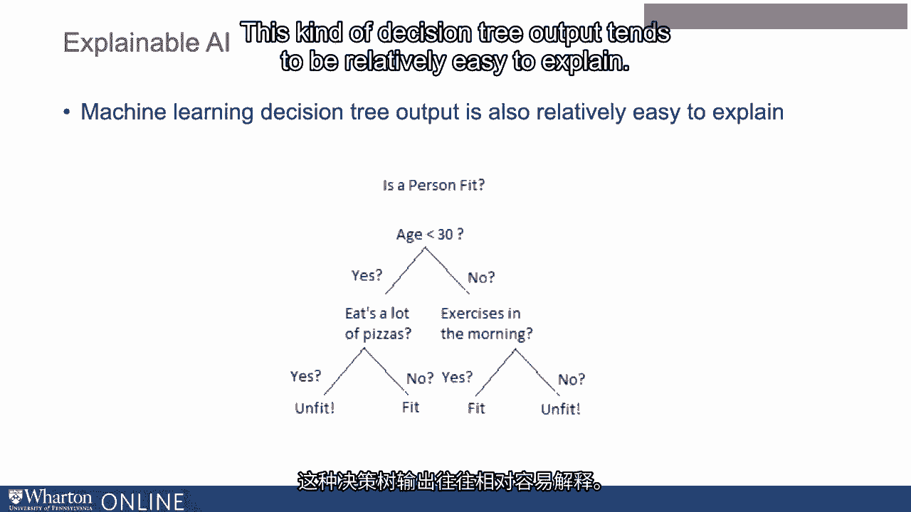
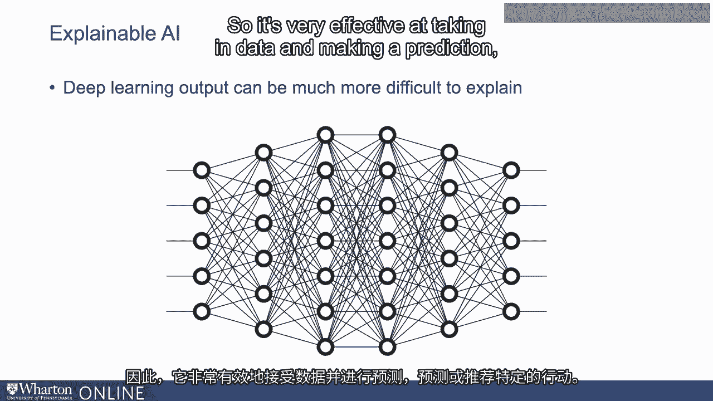

# 沃顿商学院《AI For Business（AI用于商业：AI基础／市场营销+财务／人力／管理）》（中英字幕） - P91：28_什么是可解释的AI.zh_en - GPT中英字幕课程资源 - BV1Ju4y157dK

 Another class of potential challenges and solutions arising around AI when applied to HR involves explainable AI。

 So what is explainable AI？ Explainable AI relates to methods where how and why the algorithm arrived at its decision can be understood by human experts。

 And this contrasts with some types of machine learning that operate more like a black box。

 So some types of machine learning you're going to put in the data and arrives at decisions。

 We've talked about this， but reverse engineering this and trying to understand or explain， okay。

 well I see this decision being made by the algorithm。

 Why did it come to that decision and not another one？ Sometimes that can be very difficult to trace。

 And in a lot of industries a lot of context this causes some pretty significant problems。

 We'll contrast this with some other types of approaches we've talked about。

 We talked about rule based systems which are when expertise from a human is put into an algorithm or a piece of software by a developer。

 This looks like a tree many times and these kinds of systems tend to be relatively easy to explain。

 If you think about a decision tree， if you think about how you ended up in a particular bottom point on the decision tree。

 it's pretty easy to trace through the different points in the tree to figure out exactly how it arrived at that decision。

 This kind of decision tree output tends to be relatively easy to explain。

 By contrast， once you get into the world of deep learning which involves a technology called neural networks。

 deep learning output can be much more difficult to explain。

 So it's very effective at taking in data and making a prediction。

 predicting or recommending a particular action。

 But if we want to go back and understand why that system made that particular recommendation。

 that can be a pretty significant barrier。 It's always possible with these kinds of deep learning systems。

 In the next video we'll talk about why this matters in a lot of contexts。 [BLANK_AUDIO]。

