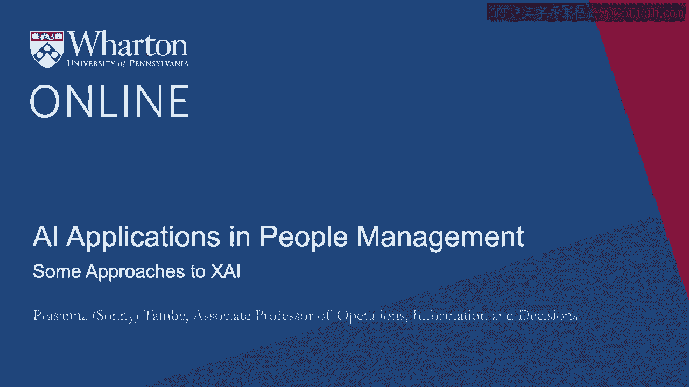

# 沃顿商学院《AI For Business（AI用于商业：AI基础／市场营销+财务／人力／管理）》（中英字幕） - P94：31_一些可解释AI的方法.zh_en - GPT中英字幕课程资源 - BV1Ju4y157dK

 We've talked about explainable AI being very important in some business context， HR being。

 one of them， and again companies， government are all putting resources into developing。

 approaches that are more explainable。 So let's talk about a few of these。

 just to give you a flavor of how people are thinking， about some of these problems。

 So we'll talk about a few。 One of them is called SHAP。

 and what this method does is it looks at the different pieces。

 of information that are going into the predictive model， the different features that are being。

 used to make the prediction。 And the output it will tell you essentially how much each feature is contributing to the。

 prediction。 So imagine you have a bunch of pieces of information about an applicant you're making or an employee。

 in the firm trying to make a decision about that employee， and it makes a decision。

 It can then tell you how much each of the things， each of the pieces of information that have。

 access to matters for the final decision that it made。 Another example called LIME。

 what this basically does is it can start with a model that's very。

 complex and very difficult to interpret or explain。

 But what it can do is generate a simpler comparison that's accurate for people that look similar。

 to the candidate in question。 So this type of approach might say。

 it might be for a very complex model that as a whole。

 is not interpretable across all of the people that is being used on。

 But it might say that if I compare employee X to employee Y who's actually very similar。

 but differ in this way， then we can create a simpler explanation that can work to explain。

 what the differences are between these two that led to a decision for one versus another。

 So it creates a simpler model that's locally accurate even if the whole model， the global。

 model is relatively difficult to explain。 Another approach using surrogate trees。

 this approach generates a simpler model that mimics。

 the performance of the more complex model but is easy to interpret。

 We talked about the idea that there are some types of models like decision trees that are。

 fundamentally easy to interpret。

 And so a surrogate tree approach might do is use a simpler model that behaves much like。

 the more complex model in most， along most dimensions。

 Maybe not 100% but along most dimensions but it's much easier to interpret。

 So these two can be used in tandem to achieve some of the benefits of prediction but also。

 some of the benefits of explanation。 And then there are new techniques emerging like auto encoders that basically take the。

 data and boil them down to a smaller set of features that make the model output easier。

 to interpret in terms of what it's using to make forward predictions。

 These are just a number of different approaches that companies are investing in learning more。

 about building up better technologies and tools that kind of achieve that sweet spot。

 or try to achieve that sweet spot between having a model that's highly predictive but。

 also that is explainable。 And so a number of initiatives from companies like IBM。

 Microsoft and others， they're putting， in a lot of energy into developing solutions and platforms that allow companies to use。

 AI in a more explainable way。 Thank you。 [BLANK_AUDIO]。

