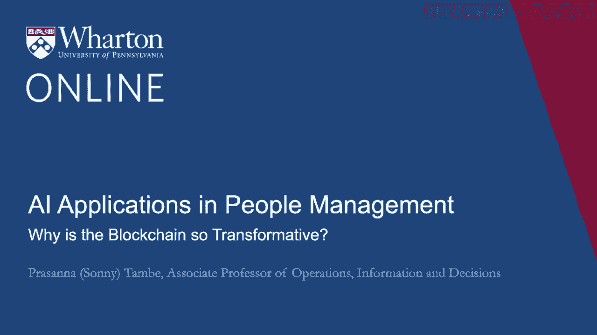
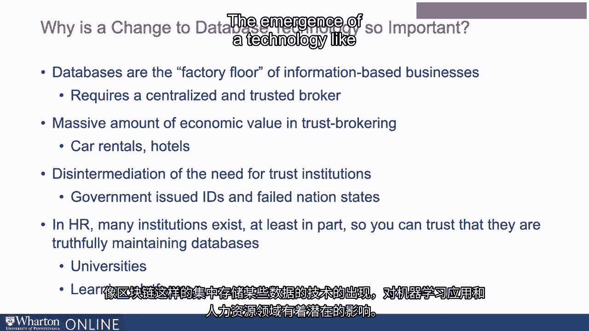

# 沃顿商学院《AI For Business（AI用于商业：AI基础／市场营销+财务／人力／管理）》（中英字幕） - P96：33_区块链为何如此颠覆性.zh_en - GPT中英字幕课程资源 - BV1Ju4y157dK

 Generally， why is the blockchain such a potentially transformative technology？

 Let's talk first about the problem that the blockchain is attempting to solve。

 We have good data storage technologies。 Databases have been around for a long time。

 They are really one of the most important technologies for our modern information-based， economies。

 Why do we need an alternative？ There are various limitations to how a database works。

 One of the key limitations that the blockchain starts to address is that digital bits， of， course。

 in a database can be written and rewritten。 When I say "limitation，" of course。

 that's a feature as well。 That's what databases are designed to do。

 But a characteristic or one feature of a database is that these digital bits can be written。

 and rewritten。 They can be changed。 You can go back retrospectively and change information in a database。

 The validity of any information you see in a database requires trust between counter-parties。

 which requires you to trust the owner of this database。

 It requires you to have a centralized trusted broker that stores this information like a。

 financial institution， for example， where you know that the data are valid because one of。

 the institution's purposes that they serve is to provide this level of trust。

 This means that we need to rely on these institutions to hold highly personal data。

 In some contexts， this might not be acceptable。 We may want a way to store highly personal data in a way that we know can be verified。

 but that doesn't necessarily rely on institutions to be the ones holding this data。

 This is kind of at the center of this discussion that we're having socially on data privacy。

 and what it means for individuals and for various stakeholders in the economy。

 The blockchain is a software protocol that achieves trust algorithmically。

 It basically tries to solve this problem。 It achieves trust algorithmically so that you don't need a centralized institution or。

 broker to step in and say， "Hey， you can trust this information because I say you can trust， it。

 You don't need that kind of level。 You don't need the institution to play that particular role。

 The blockchain can achieve that level of trust in an algorithmic sense。

 What this means is that individuals could use the blockchain to store personal data。

 Companies could tap into the blockchain to use it for HR analytics。

 There's no central third party involved and the entire time the data can be trusted。

 We know because it's in the blockchain， because of the way the blockchain is designed， we know。

 that the data can be trusted。 It turns out this is a really potentially big change。

 We're talking in some ways just about a change to data technology or how data is stored。

 Why is that such a big deal？ Well， again， databases are in many ways the factory floor of most information-based businesses。

 Having a change to how data is stored can have really large implications for the organization。

 of various economic institutions。 There is， for instance。

 a massive amount of economic value in just being an intermediary， related to trust。

 Think about car rental agencies or hotels。 A lot of times one of the central roles that they play is to be an institution that you。

 can trust when you're thinking about renting a car or looking for a place to stay。

 Being able to step around in some institutions that play the central role of trust can have。

 very big implications。 One example that's sort of been popular in the past with this type of blockchain application。

 is government-issued IDs。 We think about government-issued IDs。

 The government stands in as basically saying this is a citizen of our country and you can。

 trust us because we as a government are backing this。 This presents many problems sometimes。

 for instance， for citizens of failed nation states。

 who really struggle with having an ID that can be used around the world。

 Having a technology that can allow us to trust the data given to one another without relying。

 on a centralized institution has potentially major implications。 In HR。

 there are lots of institutions that exist at least in part so that you can trust。

 that they are truthfully maintaining data。 Universities， for instance， provide credentials。

 they provide degrees and they provide verification， of degrees。

 Learning platforms provide information about skills and certificates and so on。

 A lot of these institutions exist in part so you can trust what you know about a potential。

 employee at the firm。

 The emergence of a technology like the blockchain as a centralized place to store some of this。

 data has implications for the way machine learning applications in HR can access data without。

 running a foul of other problems that we might be concerned about if there's a centralized。

 broker that are providing these data。 The big win here potentially is as we get into more and more fine-grained data。

 For instance， think about data that might detail the personal productivity of an employee。

 maybe daily tasks or very fine-grained data on how someone goes about working on a piece， of code。

 check-ins to open source code bases， very fine-grained data that can be quite informative。

 about people's performance。 That's the kind of data that we may be reluctant as workers to give up to a third party。

 We may not trust a third party with that kind of data but it may be useful for HR reasons。

 So the blockchain is a potential intermediary that can be used to hold these data while。

 still being used for machine learning applications in a way that still protects privacy and data。

 ownership rights。 [ Silence ]。

