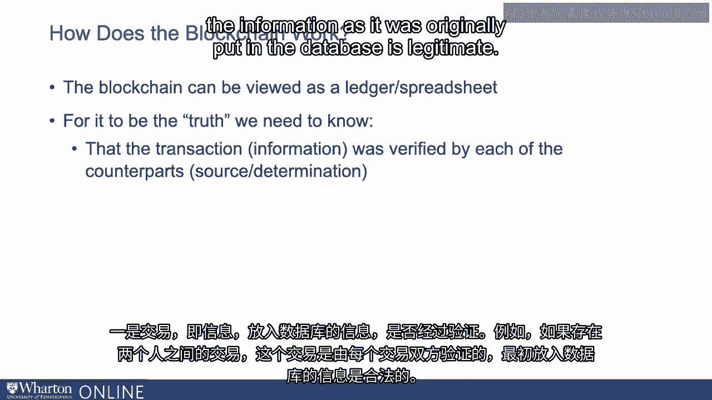
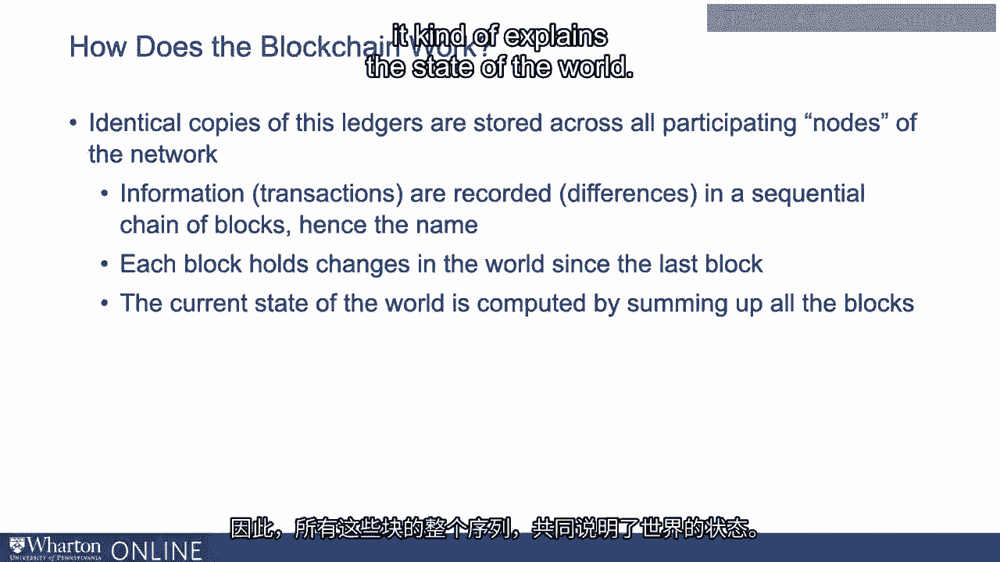

# 沃顿商学院《AI For Business（AI用于商业：AI基础／市场营销+财务／人力／管理）》（中英字幕） - P97：34_区块链如何工作.zh_en - GPT中英字幕课程资源 - BV1Ju4y157dK

 We've been talking about the blockchain in pretty abstract terms as a technology that。

 can allow people to store data in a way that's trusted without requiring a third party intermediary。

 It's useful at a high level at least to talk a little bit about how it works just to give。

 you a flavor of what's actually happening in the blockchain where it's providing value。

 The blockchain can be viewed as a ledger or a spreadsheet。

 If we think about storing data in this kind of a format and we want it to be trusted。

 we want to be able to look at the data and trust it completely， we need to know essentially。

 two things and only two things。

 One is that the transaction， the piece of information that's put into the database was， verified by。

 if there's a transaction between two people for example， that the transaction。

 is verified by each of the two parties， that the information that was originally put in。

 the database is legitimate。 Then number two that it was never。

 we'd never gone back and changed falsified， updated， or deleted that piece of information。

 If we know these two things， we can be sure that the information we're seeing in the blockchain。

 is correct。 So number one that the original information was valid and verified in number two that nobody。

 went back and changed that information。 This is what the blockchain achieved。

 The first one actually the verification we've been doing for a long time but the blockchain。

 the second one is what the blockchain achieves。 Making sure。

 making sure that we can be sure that no one has gone back and falsified， updated， or deleted data。

 So the blockchain again is ledger spreadsheets， a little bit different though than a single。

 spreadsheet。 It's essentially identical copies of spreadsheets or ledgers that are stored all across。

 the network。 These are called nodes。 So all across participating nodes of the networks。

 of these networks and information is recorded， in a sequential chain of blocks and this is where it gets the name blockchain from。

 And each of these blocks holds changes in the world that have happened since the last， block。

 And so the current state of the world is kind of computed by looking at the entire sequence。

 of blocks， not just the last block。 And so the whole sequence of blocks together kind of explains the state of the world。

 So it's got this system where it uses a bunch of spreadsheets all around the network and。

 records information in a sequence of blocks， all of which together express the state of， the world。

 And we have design points to know to understand how the blockchain is providing value。

 One is that any transaction， any information that is put in the blockchain is verified using。

 a form of encryption。 So let's say we're using the blockchain to keep information about skills。

 about some， skill that I obtain online。 So the transaction might be between me and the provider of that skill based education。

 So that transaction itself is verified using a form of encryption， both counterparties。

 meaning myself and the platform might say this person has the skills， this transaction。

 is then confirmed by the network and stored in a chain of blocks。 So that's design point one。

 All these transactions are verified when they're first put in。

 And then design point two is that the blockchain itself is designed in a way that is exceedingly。

 difficult to try to fake data or cheat the system by going back and changing data。

 So unlike a database where it's fairly easy to change data， the blockchain， the design。

 of the blockchain is such that's actually very expensive， prohibitively expensive in。

 most cases to go back and try to falsify or fake or change data in the past。

 And so the second design point is really what provides that verification that the data。

 is authentic and it stays authentic all the way through。 So because of this。

 the blockchain is a data storage technology finally that prevents any。

 of the spaking or rewriting of entries。 And so if the information is verified in the first place。

 it's never been changed。 Therefore， we know that it must be true。

 And we don't again need a third party to say， hey， this is a valid piece of information。

 We know that because of the design of the system， the information that is being presented。

 to us within reason at least must be true。

 It turns out again that this solves a number of problems。

 So information in a blockchain can inherently be trusted。

 So it doesn't therefore require a third party to hold the data。 And as we talked about last time。

 this is going to potentially provide a number of changes。

 to different industries in terms of what the role of trust brokers are and what value they。

 provide at various different points in the workflow。 [ Silence ]， [BLANK_AUDIO]。

